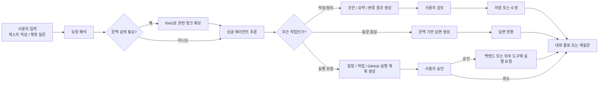

# AI Board

AI를 활용해 글을 정리하고, 분류하고, 프로젝트 실행까지 이어갈 수 있는 프로젝트 협업형 AI 보드 서비스.

프론트엔드는 `React`, 백엔드는 `FastAPI`를 사용하며, 데이터베이스는 `PostgreSQL`, 인증은 `JWT` 방식으로 구현한다.
LLM 기능이 필요해지면 `GPT`를 붙일 예정이다.

## Stack

- Language: Python
- Frontend: React
- Backend: FastAPI
- Database: PostgreSQL
- Auth: JWT
- LLM: GPT

## Tech Plan

### Base App

- `React`: 사용자 화면 구현
- `FastAPI`: API 서버 구현
- `PostgreSQL`: 사용자, 프로젝트, 게시글, 멤버십, 분류 결과 등 데이터 저장
- `JWT`: 회원 인증 처리
- `Postman`: API 직접 테스트

### AI Writing And Classification

- `GPT`: 게시글 초안 작성, 회의록 정리, 문서 요약, 카테고리 추천, 태그 추천, 프로젝트 문맥 기반 답변 생성에 사용
- `Structured Output`: 카테고리, 태그, 저장 방식, 액션 아이템, 일정/작업 초안 같은 결과를 일정한 형식으로 받기
- `Single Agent`: 사용자 요청을 해석하고, 필요한 경우 문맥을 참고한 뒤, 초안 작성 또는 실행 계획 제안까지 이어지는 단일 에이전트 흐름으로 시작
- 초기에는 단순한 AI 호출부터 구현하고, 기능이 늘어나면 단계별 흐름으로 확장

### AI Workflow

- `LangGraph`: 여러 단계의 AI 흐름을 연결할 때 사용
- 예: 글 읽기 -> 요약 -> 카테고리 추천 -> 저장 방식 추천 -> 일정/작업 등록 여부 판단 -> GitHub 연동 여부 판단
- 처음에는 단순 GPT 호출로 시작하고, 흐름이 복잡해지면 LangGraph를 붙인다

### Search And Memory

- `RAG`: 회의록, 기존 문서, 과거 게시글을 다시 찾아서 AI가 참고하도록 할 때 사용
- 초반에는 없어도 되지만, 문서가 많아지면 필요해질 가능성이 높다
- 회의 기록 정리, 중복 작업 방지, 과거 결정사항 참고, 프로젝트 단위 맥락 유지에 유용하다

## Data Storage Strategy

- `PostgreSQL`은 사용자가 실제로 보고 수정하는 원본 데이터 저장소로 사용한다.
- 프로젝트, 게시글, 회의록 원문, AI가 정리한 결과, 멤버 정보는 모두 PostgreSQL에 저장한다.
- `ChromaDB` 같은 벡터 저장소는 RAG를 위한 보조 저장소로 사용한다.
- 벡터 저장소에는 검색에 필요한 문서 청크와 메타데이터를 저장하고, AI는 검색된 청크를 바로 문맥으로 사용한다.
- 원문이 바뀌면 PostgreSQL과 ChromaDB를 함께 업데이트해 검색 결과와 실제 문서가 어긋나지 않게 유지한다.
- 사용자는 앱에서 PostgreSQL에 저장된 문서를 열어보고 수정할 수 있고, AI는 필요할 때 벡터 저장소의 관련 청크를 참고해 답변한다.

### GitHub Integration

- `GitHub MCP` 또는 `GitHub API`: 팀 저장소, 이슈, 프로젝트 정보를 읽고 연결할 때 사용
- 초반에는 읽기 중심으로 시작
- 나중에는 이슈 생성, 프로젝트 업데이트 같은 실행 기능으로 확장 가능

### Future Expansion

- `Vector Store`: RAG용 문서 검색 인덱스
- `Background Jobs`: 긴 AI 작업이나 GitHub 동기화를 비동기로 처리
- `Logging / Tracing`: AI 응답과 실행 흐름 추적

## Main Features : 추상화 필요! 작업 단위 분리하기

| 우선순위 | 기능                                           | 설명                                                       |
| -------- | ---------------------------------------------- | ---------------------------------------------------------- |
| 상       | 회원가입 / 로그인 / JWT 인증                   | 사용자 인증과 기본 접근 제어                               |
| 상       | 프로젝트 생성                                  | 협업 공간의 기본 단위 생성                                 |
| 상       | 프로젝트 멤버 추가                             | 프로젝트 생성자가 다른 사용자를 프로젝트에 추가            |
| 상       | 프로젝트별 게시글 작성 / 조회 / 수정 / 삭제    | 기본 게시판 기능                                           |
| 상       | 댓글 기능                                      | 게시글 단위 커뮤니케이션                                   |
| 상       | 페이징                                         | 게시글 및 댓글 목록을 나눠서 조회                          |
| 상       | 검색                                           | 프로젝트 안에서 필요한 글을 빠르게 찾기                    |
| 상       | 태그 기능                                      | 글을 주제별로 분류하고 탐색                                |
| 상       | 프로젝트 단위 문서 관리                        | 회의록, 아이디어, 작업 요청, 계획 문서를 프로젝트별로 관리 |
| 중       | 프로젝트 안에서 폴더형 또는 카테고리형 글 관리 | 글을 목적에 맞게 구조화                                    |
| 중       | AI 게시글 초안 작성                            | 사용자의 요청을 바탕으로 글 초안 생성                      |
| 중       | AI 카테고리 분류 추천                          | 글 내용을 읽고 적절한 분류 추천                            |
| 중       | AI 태그 추천                                   | 글 내용을 바탕으로 태그 자동 제안                          |
| 중       | AI 저장 방식 추천                              | 어떤 방식으로 정리하고 보관할지 제안                       |
| 중       | 프로젝트 문맥 기반 AI 챗봇                     | 저장된 문서를 바탕으로 질문 응답                           |
| 중       | 회의록 / 게시글 / 계획 문서 기반 질의응답      | 과거 결정사항, 중복 작업, 다음 액션 확인                   |
| 중       | 프로젝트 멤버 공동 작성 및 수정                | 멤버가 함께 문서를 편집                                    |
| 하       | 챗봇을 통한 일정 및 작업 등록 제안             | 대화 중 할 일을 구조화해 제안                              |
| 하       | GitHub 프로젝트 관리 연동                      | GitHub 이슈, 프로젝트와 연결                               |

## Product Direction

사용자는 프로젝트 공간 안에서 직접 글을 쓰거나 AI에게 글 작성을 시킬 수 있다.
프로젝트를 만든 사용자는 다른 사용자를 멤버로 추가할 수 있고, 추가된 멤버는 모두 동일한 권한으로 협업한다.
AI는 작성된 글을 읽고 어떤 성격의 문서인지 파악한 뒤, 적절한 카테고리와 정리 방식을 추천한다.
사용자는 프로젝트 문맥 기반 챗봇에게 과거 결정사항, 남은 작업, 중복 여부 같은 질문을 할 수 있다.
장기적으로는 챗봇이 일정 등록, 작업 등록, GitHub 프로젝트 관리까지 도와주는 흐름을 목표로 한다.

## AI Tech Mapping

| 기능                                | RAG 필요 여부    | MCP 필요 여부 | AI Agent 필요 여부 | 메모                                  |
| ----------------------------------- | ---------------- | ------------- | ------------------ | ------------------------------------- |
| 회원가입 / 로그인 / JWT 인증        | 아니오           | 아니오        | 아니오             | 일반 웹 백엔드 기능                   |
| 게시글 CRUD                         | 아니오           | 아니오        | 아니오             | 일반 게시판 기능                      |
| 댓글 / 페이징 / 검색 / 태그         | 아니오           | 아니오        | 아니오             | 기본 서비스 기능                      |
| AI 게시글 초안 작성                 | 아니오           | 아니오        | 낮음               | 단일 GPT 호출로 시작 가능             |
| AI 카테고리 / 태그 / 저장 방식 추천 | 아니오           | 아니오        | 낮음               | 구조화된 출력으로 충분히 가능         |
| 회의록 정리 및 계획 초안 생성       | 경우에 따라 필요 | 아니오        | 중간               | 여러 단계로 나뉘면 Agent 흐름이 유리  |
| 프로젝트 문맥 기반 챗봇             | 예               | 아니오        | 중간               | 저장된 문서를 검색해 답변해야 함      |
| 일정 / 작업 등록 제안               | 선택적           | 아니오        | 예                 | 질문 이해 + 구조화 + 실행 제안이 필요 |
| GitHub 연동 조회                    | 아니오           | 예            | 낮음               | GitHub MCP 또는 API로 읽기 중심 연결  |
| GitHub 이슈 / 프로젝트 업데이트     | 아니오           | 예            | 중간               | 외부 도구 실행이 포함됨               |

## Single Agent Workflow

이 워크플로우는 초기에는 `싱글 에이전트` 기준으로 설계한다.
필요한 경우에만 `RAG`, `GitHub MCP/API`, `일정/작업 실행 제안` 분기를 사용한다.
나중에 흐름이 복잡해지면 이 구조를 `LangGraph` 노드로 나눠서 구현할 수 있다.

## Big Plan

### 1. 기본 협업 보드 만들기

- 회원가입, 로그인
- 프로젝트 생성
- 프로젝트별 게시글 작성, 조회, 수정, 삭제
- 프로젝트 멤버 추가
- 프로젝트 멤버 단일 권한 모델 적용
- 프로젝트 안에서 공유 가능한 글 묶음 구조 만들기

### 2. AI 글쓰기 보조 붙이기

- 사용자가 키워드나 요청을 입력하면 AI가 글 초안 작성
- 초안 수정 후 게시글로 저장

### 3. AI 분류 추천 기능 붙이기

- 게시글 내용 분석
- 카테고리 추천
- 저장 방식 또는 정리 방식 추천
- 필요하면 태그 추천

### 4. 기록 정리 기능 확장하기

- 프로젝트별 회의록 정리
- 프로젝트별 아이디어 정리
- 해야 할 일 추출
- 계획 초안 생성

### 5. 프로젝트 문맥 챗봇 붙이기

- 저장된 회의록, 게시글, 계획 문서를 바탕으로 질문 응답
- 과거 결정사항, 중복 작업, 다음 액션 찾기
- 프로젝트 단위 문맥 기반 대화 지원

### 6. 실행형 AI 기능 확장하기

- 챗봇을 통한 일정 등록 제안
- 챗봇을 통한 작업 등록 제안
- 사용자 확인 후 실제 저장 또는 연결 수행

### 7. GitHub 연동 확장하기

- GitHub 프로젝트나 이슈와 연결
- 프로젝트 게시글 내용을 기반으로 개발 작업과 연결
- 프로젝트 진행 관리를 도와주는 흐름 확장

## Notes

처음에는 프로젝트, 멤버 추가, 게시글 기능부터 만들고, AI 기능은 단계적으로 붙인다.
초기 구현은 단순하게 시작하고, 필요할 때 `LangGraph`, `RAG`, `GitHub MCP`를 순차적으로 붙인다.
