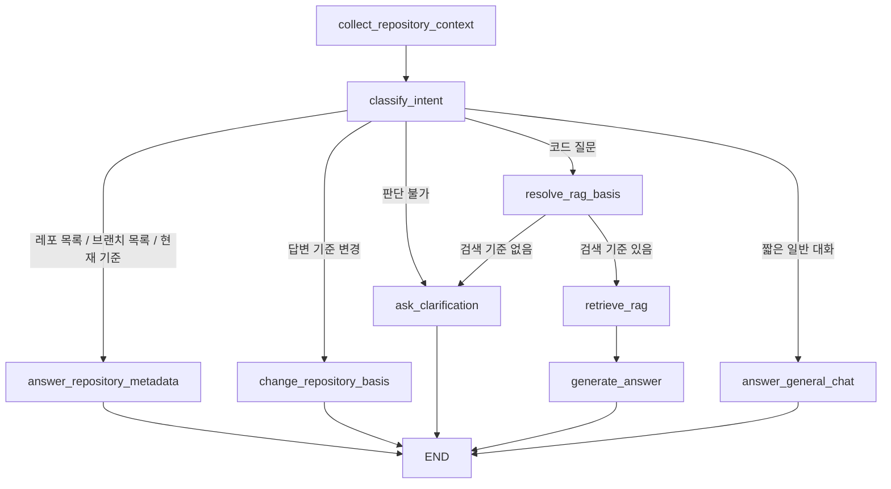

# Agent Ask Flow

이 문서는 현재 코드 기준으로 `/agent/chat` 질문이 어떻게 처리되는지 설명한다.

핵심부터 말하면, 현재 agent는 모든 판단을 긴 프롬프트에 맡기지 않는다. 먼저 `AgentGraph.classify_intent()`가 질문 종류를 코드 분기로 나누고, 코드 근거가 필요한 질문일 때만 RAG evidence를 검색한다.

다만 사용자가 오타, 별칭, `3` 같은 짧은 후속 선택을 입력하면 deterministic 규칙만으로는 후보를 안정적으로 고르기 어렵다. 그래서 기준 해석은 아래 순서로 처리한다.

```text
deterministic 해석
-> 실패하거나 짧은 후속 선택이면 LLM fallback resolver
-> resolver는 SQL run 후보 안에서만 선택
```

## 현재 결론

```text
사용자 메시지
-> ChatSendMessageRequestDTO
-> AgentChatService
-> AgentGraph
-> SQL metadata 질문이면 즉시 답변
-> 답변 기준 변경이면 refs 갱신
-> 코드 질문이면 RAG evidence 검색
-> evidence가 있으면 LLM 최종 답변 생성
```

현재 구조에서 제거된 것:

```text
AGENT_SYSTEM_PROMPT
build_agent_tools
run_agent_tools
LangChain StructuredTool 기반 tool loop
ToolMessage 반복 호출
```

현재 남아 있는 LLM 호출은 세 곳이다.

```text
1. SQL run 후보 중 답변 기준을 고르는 fallback resolver
2. RAG 근거가 있는 질문의 최종 답변 생성
3. "야", "안녕" 같은 일반 대화 응답
```

## 파일 읽는 순서

```text
backend/app/agent/api/router.py
  create_chat_session()
  get_chat_session()
  send_chat_message()

backend/app/agent/api/schema.py
  ChatSendMessageRequestDTO
  AgentRepositoryRefRequestDTO
  ChatSendMessageResponseDTO

backend/app/agent/service/chat_service.py
  AgentChatService.send_message()
  AgentChatService.run_queue()

backend/app/agent/domain/chat.py
  ChatTurn
  InferredRepositoryRef
  AgentTurnResult
  TurnQueue

backend/app/agent/service/graph_responder.py
  GraphAgentResponder.answer()

backend/app/agent/service/agent_graph.py
  AgentGraph
  classify_intent()
  answer_repository_metadata()
  change_repository_basis()
  resolve_rag_basis()
  retrieve_rag()
  generate_answer()

backend/app/agent/service/agent_intent.py
  의도 판별 helper

backend/app/agent/service/repository_context.py
  SQL run 해석과 답변 기준 helper

backend/app/agent/service/repository_planner.py
  deterministic으로 못 고른 후보를 LLM이 SQL 후보 안에서만 고르는 fallback resolver

backend/app/agent/service/rag_answer_prompt.py
  RAG evidence를 최종 답변 메시지로 바꾸는 helper
```

## 요청 DTO

파일:

```text
backend/app/agent/api/schema.py
```

채팅 메시지 요청은 아래 형태다.

```json
{
  "content": "이 레포 기준으로 다음 구현 계획을 제안해줘",
  "repository_refs": [
    {
      "run_id": 25,
      "repository_full_name": "Jungle-303-04/warm-up",
      "branch": "minjeong",
      "commit_sha": "842d49559f83cd89d0500049efe80909500d99f5"
    }
  ]
}
```

`content`는 필수이고 빈 문자열은 거절된다.

`repository_refs`는 선택값이다. 프론트가 사용자가 고른 답변 기준을 알고 있으면 이 배열에 넣어서 보낸다.

`run_id`는 보조 식별자다. 실제 RAG 검색 기준은 `repository_full_name`, `branch`, `commit_sha`다.

## 응답 DTO

응답은 세션과 메시지 목록에 더해 이번 turn에서 계산된 답변 기준 정보를 포함한다.

```json
{
  "session": {},
  "messages": [],
  "processed_turns": 1,
  "repository_basis_changed": true,
  "inferred_repository_refs": [
    {
      "run_id": 25,
      "repository_full_name": "Jungle-303-04/warm-up",
      "branch": "minjeong",
      "commit_sha": "842d49559f83cd89d0500049efe80909500d99f5"
    }
  ]
}
```

`repository_basis_changed`는 이번 turn에서 답변 기준이 바뀌었는지 알려준다.

`inferred_repository_refs`는 agent가 다음 답변 기준으로 들고 있는 분석 결과 목록이다.

프론트는 이 값을 챗봇 기준 chip이나 선택 상태에 반영할 수 있다.

## ChatService

파일:

```text
backend/app/agent/service/chat_service.py
```

`AgentChatService.send_message()`는 채팅 저장과 에이전트 실행을 조율한다.

```text
session 확인
-> 사용자 메시지 저장
-> ChatTurn 생성
-> TurnQueue에 enqueue
-> run_queue()
-> responder.answer()
-> assistant 메시지 저장
-> ChatSendMessageResponseDTO 반환
```

`TurnQueue`는 지금은 한 turn만 처리하지만, 나중에 agent가 여러 단계 작업을 큐에 추가하는 구조로 확장할 수 있게 둔 자리다.

## ChatTurn

파일:

```text
backend/app/agent/domain/chat.py
```

`ChatTurn`은 이번 사용자 입력을 agent graph에 넘기는 내부 작업 단위다.

```python
class ChatTurn:
    session_id: str
    user_message_id: str
    user_input: str
    repository_refs: tuple[InferredRepositoryRef, ...] = ()
```

프론트가 넘긴 `repository_refs`는 `to_domain_repository_refs()`에서 `InferredRepositoryRef` tuple로 바뀐다.

## AgentGraph 전체 흐름

파일:

```text
backend/app/agent/service/agent_graph.py
```

현재 graph는 아래 노드로 구성된다.

```text
collect_repository_context
-> classify_intent
-> answer_repository_metadata | change_repository_basis | resolve_rag_basis | answer_general_chat | ask_clarification
-> retrieve_rag
-> generate_answer
-> END
```

Mermaid로 보면 아래와 같다.



## collect_repository_context

이 노드는 SQL에서 최근 인덱싱 run 후보를 가져온다.

```text
sql_repository.list_runs(db, limit=100)
-> get_latest_unique_runs_by_repository_branch()
```

같은 `repository_full_name + branch` 조합이 여러 번 분석되어 있으면 최신 run 하나만 후보로 남긴다.

## classify_intent

파일:

```text
backend/app/agent/service/agent_intent.py
```

이 단계는 LLM을 호출하지 않는다. 키워드 기반 helper로 질문 종류를 먼저 나눈다.

| 질문 유형 | 판별 helper | 다음 노드 |
| --- | --- | --- |
| 레포 목록 | `is_repository_list_question()` | `answer_repository_metadata` |
| 브랜치 목록 | `is_branch_list_question()` | `answer_repository_metadata` |
| 현재 답변 기준 | `is_current_basis_question()` | `answer_repository_metadata` |
| 짧은 일반 대화 | `is_general_chat()` | `answer_general_chat` |
| 앞으로 참고할 레포 변경 | `is_basis_change_request()` | `change_repository_basis` |
| 나머지 코드 질문 | 기본값 | `resolve_rag_basis` |

이렇게 나눈 이유는 단순 메타데이터 질문을 LLM/RAG로 보내면 답이 흔들리기 때문이다.

예를 들어 `Jungle-303-04/warm-up 브랜치 목록`은 vector 검색이 아니라 SQL run 목록으로 답해야 한다.

## answer_repository_metadata

이 노드는 RAG를 호출하지 않는다.

처리하는 질문:

```text
레포 목록
브랜치 목록
현재 답변 기준
```

답변 생성은 `repository_context.py`의 helper가 맡는다.

```text
build_repository_list_answer()
build_branch_list_answer()
build_current_basis_answer()
```

## change_repository_basis

이 노드는 사용자가 말한 레포 이름을 SQL run 후보에 매핑하고, 다음 답변 기준 refs를 만든다.

파일:

```text
backend/app/agent/service/repository_context.py
```

흐름:

```text
사용자 입력
-> resolve_target_runs()
-> deterministic resolve_runs_from_text()
-> 필요하면 AgentRepositoryPlanner fallback
-> detect_basis_mode()
-> build_next_basis_refs()
-> build_basis_changed_answer()
```

지원하는 변경 모드:

| 모드 | 예시 | 결과 |
| --- | --- | --- |
| replace | 앞으로 A 레포를 참고해 | 기존 기준을 A로 교체 |
| add | B도 참고해 | 기존 기준 + B |
| remove | B는 빼줘 | 기존 기준 - B |
| clear | 기준 초기화해 | 기준 비우기 |

레포 이름을 찾지 못하면 기존 기준을 유지하고 다시 물어본다.

단, `다시 빼`, `그거 빼`, `기준 빼`처럼 대상 이름 없이 현재 선택만 제거하라는 짧은 명령은 LLM resolver를 호출하지 않는다. 프론트가 넘긴 현재 `repository_refs`를 그대로 비우고 바로 응답한다.

`AgentRepositoryPlanner`는 LLM을 쓰지만 자유롭게 답을 만들지 않는다. 프롬프트에 SQL run 후보를 JSON으로 넣고, LLM은 `selected_run_ids`만 반환한다. 따라서 오타나 별칭을 해석하더라도 최종 선택은 반드시 이미 DB에 저장된 run 중 하나다.

예를 들어 직전 답변이 아래처럼 레포 목록을 보여준 상태라고 하자.

```text
1. Jungle-303-04/warm-up
2. minmings111/github.io
3. local/codex-vector-id-check
```

사용자가 다음 turn에 `3`이라고만 답하면 deterministic 규칙은 의미를 확정하기 어렵다. 이때 fallback resolver는 최근 대화와 SQL 후보를 함께 보고 `3번 후보`에 해당하는 run_id를 고른다.

## resolve_rag_basis

이 노드는 RAG 검색 전에 질문이 어떤 분석 run을 기준으로 하는지 확정한다.

우선순위는 아래와 같다.

```text
1. ChatTurn.repository_refs가 있으면 그 기준을 우선 사용
2. 질문 텍스트에 나온 레포 이름/브랜치 이름을 SQL run 후보에서 deterministic으로 찾음
3. `3`, 오타, 별칭처럼 규칙으로 확정하기 어려우면 LLM fallback resolver가 SQL 후보 안에서 선택
4. 분석된 레포가 하나뿐이면 그 run을 fallback으로 사용
5. 그래도 못 찾으면 ask_clarification
```

확정된 run은 `RagAskRepositoryRefDTO`로 바뀌어 RAG에 전달된다.

현재 기준 해석은 아래 표현도 지원한다.

```text
1번 레포
1번 레포의 브랜치 목록
1번 브랜치
2번 브랜치
3
3번
오타가 섞인 레포/브랜치 이름
```

`1번 레포`는 `레포 목록`에서 보여주는 순서와 같은 SQL run 요약 순서를 따른다.

레포 이름이 생략된 브랜치 요청은 먼저 이전 대화에서 마지막으로 언급된 레포를 기준으로 deterministic 해석을 시도한다. 그래도 브랜치를 못 고르면 LLM fallback resolver가 최근 대화와 SQL 후보를 보고 후보 run_id만 고른다. 이 resolver는 `민정 -> minjeong` 같은 별칭을 코드에 하드코딩하지 않는다.

## retrieve_rag

이 노드는 내부적으로 `RagAnswerService.answer()`를 호출한다.

```text
target_runs
-> RagAskRepositoryRefDTO 목록
-> RagAskRequestDTO(question, repository_refs, limit=5)
-> rag_answer_service.answer(db, request)
```

중요한 점은 RAG가 여기서 최종 자연어 답변을 만들지 않는다는 것이다. RAG는 `sources`를 포함한 evidence DTO를 반환한다.

## generate_answer

파일:

```text
backend/app/agent/service/rag_answer_prompt.py
```

RAG 근거가 있으면 이 노드에서만 LLM을 호출한다.

```text
rag_response.sources 있음
-> build_answer_messages()
-> tool_calling_llm.invoke(messages, tools=[])
-> 최종 assistant 답변
```

`tools=[]`로 호출하는 이유는 이 단계가 tool 선택 단계가 아니라 최종 답변 생성 단계이기 때문이다.

현재 시스템 프롬프트 변수는 `ANSWER_SYSTEM_PROMPT`이고, 내용은 짧다.

```text
You answer in Korean for a code-analysis workspace.
Use only the provided repository evidence.
If the evidence is insufficient, say what is missing instead of inventing details.
```

분기 판단용 사족은 프롬프트에 넣지 않는다. 분기는 graph node와 conditional edge가 담당한다.

## ask_clarification

검색 기준을 확정할 수 없으면 가능한 레포 예시를 보여주고 다시 묻는다.

예:

```text
어떤 레포지토리 기준으로 답할지 정하지 못했습니다.
예: Jungle-303-04/warm-up, minmings111/github.io 중 하나를 질문에 포함해 주세요.
```

## Agent와 RAG의 관계

현재 역할은 이렇게 나뉜다.

```text
AgentGraph
  질문 의도 분기
  답변 기준 변경
  SQL metadata 답변
  RAG evidence 호출
  최종 LLM 답변 생성

RagAnswerGraph
  SQL에서 확정된 코드 스냅샷 기준으로 vector evidence 검색
  RagAskResponseDTO 반환
```

즉 RAG graph는 agent의 하위 검색 흐름이다.

나중에 더 큰 agent workflow가 생기면, 그 graph 안에서 현재 RAG 흐름은 하나의 노드 또는 하위 graph처럼 호출될 수 있다.

## Container 조립

파일:

```text
backend/app/container.py
```

현재 조립 구조는 아래와 같다.

```text
rag_vector_repository
-> RagAnswerGraph
-> RagAnswerService
-> AgentGraph
-> GraphAgentResponder
-> AgentChatService
```

`RagAnswerGraph`는 vector repository만 받는다.

`AgentGraph`는 아래 세 가지를 받는다.

```text
rag_answer_service
sql_repository
tool_calling_llm
```

여기서 `tool_calling_llm`이라는 이름은 LangChain 모델 래퍼 이름이지만, 현재 최종 답변 생성에서는 `tools=[]`로 호출한다.

## 현재 구현되지 않은 것

아래는 아직 구현된 agent 기능이 아니다.

```text
MCP action 실행
보드 생성/수정/삭제 action
사용자 승인 workflow
SQL keyword 검색과 vector 검색 결합
검색 실패 시 자동 재검색
채팅 세션 DB 영속화
장기 메모리 캐시
답변 품질 평가 노드
```

특히 모든 문제를 프롬프트로 해결하는 방향은 피해야 한다. 앞으로는 아래처럼 graph node를 늘리는 편이 맞다.

```text
classify_intent
-> retrieve_sql_metadata
-> retrieve_vector_evidence
-> evaluate_evidence
-> ask_user_approval
-> execute_action
```

## 짧은 요약

현재 agent ask 흐름은 이렇게 이해하면 된다.

```text
메타데이터 질문은 SQL로 바로 답한다.
답변 기준 변경은 코드 분기로 refs를 계산한다.
코드 질문만 RAG evidence를 검색한다.
최종 LLM 답변은 검색 근거가 있을 때만 생성한다.
```
