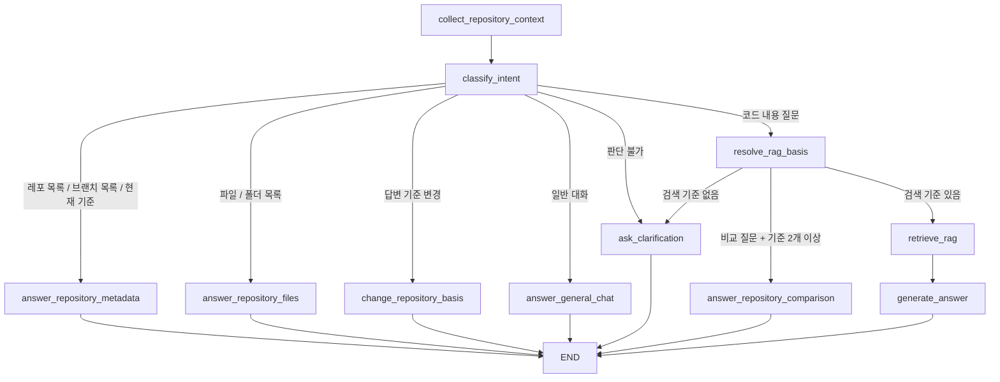

# Agent Ask Flow

이 문서는 현재 코드 기준으로 `/agent/chat` 요청이 어떻게 처리되는지 설명한다.

핵심은 하나다.

```text
사용자의 자연어 입력
-> AgentGraph가 의도를 나눈다
-> SQL 메타데이터로 답할 수 있으면 SQL만 본다
-> 코드 내용 근거가 필요하면 RAG 검색을 실행한다
-> RAG 근거가 있으면 agent LLM이 최종 답변을 만든다
```

즉, 현재 agent는 모든 문제를 프롬프트 하나로 해결하지 않는다.
레포 목록, 브랜치 목록, 파일 목록, 폴더 목록, 선택 기준 변경, 스냅샷 비교처럼 구조가 분명한 일은 LangGraph 노드와 SQL helper가 처리한다. LLM은 자연어 해석이 필요한 지점에서만 보조로 사용한다.

## 현재 결론

현재 agent ask 흐름은 아래 역할로 나뉜다.

```text
AgentChatService
  채팅 세션, 메시지 저장, turn 실행을 담당한다.

AgentGraph
  사용자 입력을 어떤 처리 흐름으로 보낼지 결정한다.

AgentIntentResolver
  자연어 문장을 intent JSON으로 분류한다.

AgentRepositoryTargetPlanner
  사용자가 말한 레포/브랜치 대상을 SQL run 후보 중에서 고른다.

AgentPathTargetResolver
  사용자가 흐릿하게 말한 폴더/경로를 실제 SQL path 후보 중 하나로 고른다.

RagAnswerService
  확정된 레포/브랜치/커밋 기준으로 RAG 검색 run을 찾는다.

RagAnswerGraph
  vector DB에서 근거 chunk를 검색한다.

AgentGraph.generate_answer()
  검색 근거가 있을 때 LLM으로 최종 답변을 생성한다.
```

현재 agent에서 중요한 기준은 아래와 같다.

```text
레포/브랜치/파일/폴더 목록
-> SQL 메타데이터와 파일 스냅샷으로 답한다.

두 브랜치/레포의 차이
-> SQL 파일 스냅샷의 path, content_hash로 MVP 비교한다.

코드 내용, 구현 방식, 버그 추정, 계획 질문
-> RAG evidence를 찾고 LLM이 답한다.

대상 해석이 애매한 자연어
-> LLM resolver가 후보 안에서만 고른다.
```

## 파일 읽는 순서

처음 읽을 때는 아래 순서가 가장 이해하기 쉽다.

```text
backend/app/agent/api/router.py
  /agent/chat 라우터와 인증, 세션 id를 받는 지점

backend/app/agent/api/schema.py
  요청/응답 DTO

backend/app/agent/service/chat_service.py
  채팅 메시지 저장과 agent 실행 조율

backend/app/agent/domain/chat.py
  ChatTurn, InferredRepositoryRef, TurnQueue 같은 내부 도메인 객체

backend/app/agent/service/graph_responder.py
  ChatService와 AgentGraph 사이의 얇은 연결 객체

backend/app/agent/service/agent_graph.py
  실제 LangGraph workflow

backend/app/agent/service/agent_intent.py
  intent, basis mode, 짧은 키워드/명시 표현 helper

backend/app/agent/service/intent_resolver.py
  LLM 기반 intent 분류기

backend/app/agent/service/repository_target_planner.py
  LLM 기반 레포/브랜치 대상 선택기

backend/app/agent/service/path_target_resolver.py
  LLM 기반 폴더/path 대상 선택기

backend/app/agent/service/repository_context.py
  SQL run, 파일 목록, 폴더 목록, 비교 답변 helper

backend/app/agent/service/rag_answer_prompt.py
  RAG evidence를 최종 LLM 답변 메시지로 바꾸는 helper

backend/app/rag/service/answer_service.py
  RAG 검색 기준을 SQL run으로 확정하는 use case

backend/app/rag/service/answer_graph.py
  vector DB에서 evidence chunk를 검색하는 RAG graph

backend/app/container.py
  위 객체들을 실제로 조립하는 지점
```

## 요청 DTO

파일:

```text
backend/app/agent/api/schema.py
```

프론트가 `/agent/chat/sessions/{session_id}/messages`로 보내는 핵심 요청은 아래 형태다.

```json
{
  "content": "우녕 브랜치의 폴더 목록",
  "repository_refs": [
    {
      "run_id": 25,
      "repository_full_name": "Jungle-303-04/warm-up",
      "branch": "woonyong",
      "commit_sha": "70097c55b15230dd8323b590704078b450764595"
    }
  ]
}
```

`content`는 사용자가 입력한 자연어 질문이다. 빈 문자열은 DTO validation에서 거절된다.

`repository_refs`는 현재 대화에서 고정된 답변 기준이다. 프론트가 이전 turn에서 받은 기준을 다시 보내면, 백엔드는 그 기준을 우선 사용한다.

`run_id`는 사용자가 직접 외워야 하는 값이 아니다. SQL에 저장된 인덱싱 실행 row를 추적하기 위한 내부 id다.

실제 검색 기준은 아래 세 값이다.

```text
repository_full_name
branch
commit_sha
```

## 응답 DTO

응답은 assistant 메시지와 함께 다음 답변 기준을 내려준다.

```json
{
  "session": {
    "id": "session-1",
    "title": "새 대화",
    "created_at": "2026-06-18T10:00:00"
  },
  "messages": [
    {
      "id": "message-1",
      "session_id": "session-1",
      "role": "assistant",
      "content": "앞으로 사용할 답변 기준을 설정했습니다.",
      "created_at": "2026-06-18T10:00:01"
    }
  ],
  "processed_turns": 1,
  "repository_basis_changed": true,
  "inferred_repository_refs": [
    {
      "run_id": 25,
      "repository_full_name": "Jungle-303-04/warm-up",
      "branch": "woonyong",
      "commit_sha": "70097c55b15230dd8323b590704078b450764595"
    }
  ]
}
```

`repository_basis_changed`는 이번 turn에서 답변 기준이 바뀌었는지 알려준다.

`inferred_repository_refs`는 다음 turn에서 프론트가 다시 넘겨야 하는 기준이다. 이 값이 있어야 사용자가 “그럼 폴더 목록”, “민정도 추가해”, “다시 빼”처럼 짧게 말해도 맥락을 이어갈 수 있다.

## ChatService

파일:

```text
backend/app/agent/service/chat_service.py
```

`AgentChatService.send_message()`는 채팅 저장과 agent 실행을 담당한다.

```text
세션 확인
-> 사용자 메시지 저장
-> ChatTurn 생성
-> TurnQueue에 enqueue
-> run_queue()
-> responder.answer()
-> assistant 메시지 저장
-> ChatSendMessageResponseDTO 반환
```

`TurnQueue`는 현재는 한 번에 하나의 사용자 입력만 처리한다.
다만 나중에 agent가 “질문 해석 -> 도구 호출 -> 사용자 승인 대기 -> 후속 작업”처럼 여러 작업을 큐에 추가할 수 있도록 구조만 열어둔 상태다.

## ChatTurn

파일:

```text
backend/app/agent/domain/chat.py
```

`ChatTurn`은 agent graph에 넘기는 내부 작업 단위다.

```python
class ChatTurn:
    session_id: str
    user_message_id: str
    user_input: str
    repository_refs: tuple[InferredRepositoryRef, ...] = ()
```

`user_input`은 현재 사용자가 입력한 문장이다.

`repository_refs`는 현재 대화가 기준으로 삼는 레포/브랜치/커밋 목록이다.

예를 들어 사용자가 먼저 `웜업 우녕`이라고 말하면 `woonyong` 브랜치 ref가 생긴다. 그 다음 `웜업 민정도 추가해`라고 말하면 기존 ref에 `minjeong` 브랜치 ref가 추가된다.

## AgentGraph 전체 흐름

파일:

```text
backend/app/agent/service/agent_graph.py
```

현재 graph는 아래 노드로 구성된다.

```text
collect_repository_context
classify_intent
answer_repository_metadata
answer_repository_files
answer_repository_comparison
change_repository_basis
resolve_rag_basis
retrieve_rag
generate_answer
answer_general_chat
ask_clarification
```

Mermaid로 보면 아래와 같다.



## collect_repository_context

이 노드는 SQL에 저장된 최근 인덱싱 run을 가져온다.

```python
self.sql_repository.list_runs(state["db"], limit=100)
```

그 다음 같은 레포/브랜치가 여러 번 분석되어 있으면 최신 run만 남긴다.

```python
get_latest_unique_runs_by_repository_branch(...)
```

예를 들어 `Jungle-303-04/warm-up`의 `minjeong` 브랜치를 여러 번 분석했다면, agent 질문 처리에서는 가장 최근 분석 결과만 후보로 사용한다.

## classify_intent

이 노드는 사용자의 질문이 어떤 종류인지 정한다.

현재 순서는 아래에 가깝다.

```text
1. AgentIntentResolver가 LLM으로 intent JSON을 만든다.
2. 명시적인 키워드가 LLM 판단과 충돌하면 코드 helper로 보정한다.
3. LLM resolver가 실패하면 코드 fallback helper로 최소 동작을 보장한다.
```

여기서 intent는 아래 값 중 하나다.

```text
list_repositories
list_branches
list_files
show_basis
change_basis
rag_answer
general_chat
clarify
```

예시는 아래와 같다.

```text
"레포 목록", "ㄹㅍㅁㄹ"
-> list_repositories

"1 ㅂㄹㅊ", "Jungle-303-04/warm-up 브랜치 목록"
-> list_branches

"우녕 브랜치의 폴더 목록", "백엔드에 앱에 어스에 있는 파일"
-> list_files

"웜업 우녕", "민정도 추가해", "민정 브랜치 빼"
-> change_basis

"우녕 브랜치의 버그가 뭐야?"
-> rag_answer
```

중요한 점은 `우녕 브랜치의 폴더 목록` 같은 문장은 `브랜치`라는 단어가 있어도 브랜치 목록 요청이 아니다.
`폴더 목록`이 더 명확하므로 `list_files`로 보정되어야 한다.

## AgentIntentResolver

파일:

```text
backend/app/agent/service/intent_resolver.py
```

이 객체는 사용자의 자연어를 intent JSON으로 바꾼다.

출력 형태는 내부적으로 아래 dataclass에 담긴다.

```python
class AgentIntentPlan:
    intent: AgentIntent
    basis_mode: BasisMode | None = None
    reason: str | None = None
```

`basis_mode`는 답변 기준 변경일 때만 의미가 있다.

```text
replace
  기존 기준을 버리고 새 기준으로 바꾼다.

add
  기존 기준에 새 기준을 추가한다.

remove
  기존 기준에서 특정 기준을 제거한다.

clear
  모든 기준을 비운다.
```

이 resolver가 필요한 이유는 사용자가 항상 정확한 명령어로 말하지 않기 때문이다.

```text
"무슨 레포들이 있지?"
"리포지토리 목록 좀"
"ㄹㅍㅁㄹ"
"1의 ㅂㄹㅊ"
"워ㅓㅁ어ㅓㅂ 민정도 추가해"
```

이런 입력은 단순 문자열 조건만으로 계속 늘리면 코드가 지저분해진다. 그래서 LLM이 먼저 의도를 구조화하고, 코드는 그 결과를 graph node로 보낸다.

단, LLM이 후보 밖 값을 만들어내면 안 되므로 실제 레포/브랜치 선택은 다음 단계에서 SQL 후보에 다시 매핑한다.

## answer_repository_metadata

이 노드는 SQL 메타데이터만으로 답할 수 있는 질문을 처리한다.

처리 대상은 아래 세 가지다.

```text
list_repositories
list_branches
show_basis
```

레포 목록은 `build_repository_list_answer()`가 만든다.

브랜치 목록은 `build_branch_list_answer()`가 만든다.

현재 답변 기준은 `build_current_basis_answer()`가 만든다.

이 질문들은 vector DB나 LLM 최종 답변 생성이 필요 없다. SQL에 이미 저장된 `repository_full_name`, `branch`, `commit_sha`, `indexed_at`만 보면 되기 때문이다.

## change_repository_basis

이 노드는 “앞으로 어떤 레포/브랜치를 기준으로 답할지”를 바꾼다.

예시는 아래와 같다.

```text
"웜업 우녕"
-> woonyong 기준으로 설정

"웜업 민정도 추가해"
-> 기존 기준에 minjeong 추가

"민정 브랜치 빼"
-> 기존 기준에서 minjeong 제거

"기준 다 비워"
-> 모든 기준 제거
```

실제 기준 계산은 `build_next_basis_refs()`가 담당한다.

```text
replace
  target_refs만 남긴다.

add
  current_refs + target_refs를 합치고 중복 제거한다.

remove
  current_refs에서 target_refs와 같은 key를 제거한다.

clear
  빈 목록으로 만든다.
```

짧은 선택문은 현재 기준 유무에 따라 동작이 다르다.

```text
현재 기준 없음 + "웜업 우녕"
-> replace

현재 기준 있음 + "웜업 민정"
-> add
```

그래서 새 채팅에서 아래처럼 말하면 둘 다 기준에 들어간다.

```text
사용자: 웜업 우녕
AI: Jungle-303-04/warm-up · woonyong 기준 설정

사용자: 웜업 민정
AI: 기존 woonyong에 minjeong 추가
```

## AgentRepositoryTargetPlanner

파일:

```text
backend/app/agent/service/repository_target_planner.py
```

이 객체는 사용자가 말한 레포/브랜치 대상을 SQL run 후보 중에서 고른다.

현재 LLM 출력의 기본 형태는 아래다.

```json
{
  "selected_targets": [
    {
      "repository_full_name": "Jungle-303-04/warm-up",
      "branch": "woonyong"
    }
  ],
  "reason": "user mentioned warm-up and woonyong"
}
```

현재 기본 선택 단위는 아래 두 값이다.

```text
repository_full_name
branch
```

그 다음 코드가 SQL 후보에서 가장 최신 matching run을 고른다.

```text
LLM selected_targets
-> pick_runs_by_targets()
-> build_inferred_repository_ref()
```

## answer_repository_files

이 노드는 파일 목록, 폴더 목록, 특정 경로 아래 파일 질문을 처리한다.

예시는 아래와 같다.

```text
"우녕 브랜치의 폴더 목록"
"백엔드/app/auth 안에 있는 파일만"
"백엔드에 앱에 어스에 있는 파일만 달라고"
"도메인 폴더가 뭐가 있지?"
```

흐름은 아래와 같다.

```text
target_runs 확정
-> sql_repository.list_file_snapshots()
-> sql_repository.list_skipped_files()
-> available_paths 생성
-> 필요하면 AgentPathTargetResolver로 path focus 선택
-> build_file_list_answer()
```

파일/폴더 목록은 RAG로 찾지 않는다.
이미 SQL에 파일 스냅샷이 path 단위로 저장되어 있으므로 SQL이 더 정확하다.

## AgentPathTargetResolver

파일:

```text
backend/app/agent/service/path_target_resolver.py
```

이 객체는 사용자가 흐릿하게 말한 폴더 표현을 실제 저장된 path 후보 중 하나로 고른다.

예를 들어 SQL에 아래 path들이 있다고 하자.

```text
backend/app/auth
backend/app/rag
backend/app/agent
frontend/src
```

사용자가 아래처럼 말할 수 있다.

```text
"백엔드에 앱에 어스에 있는 파일"
"배ㅐㄱ에드 appp 엇스에 잇는 것 좀"
```

이때 path resolver는 마음대로 새 경로를 만들지 않고, 실제 후보 목록 중 하나만 고른다.

```json
{
  "selected_path": "backend/app/auth",
  "reason": "user refers to backend/app/auth with typos"
}
```

코드는 이 `selected_path`가 실제 후보에 있는지 다시 검증한다. 후보에 없으면 버린다.

`repository_context.py`에도 기본 path helper가 있다.
예를 들어 `백엔드`, `앱`, `어스`처럼 자주 나오는 직접 표현은 먼저 path 후보로 복원한다. 그러나 오타가 심하거나 표현이 애매한 경우는 `AgentPathTargetResolver`가 SQL 후보 안에서 선택한다.

## answer_repository_comparison

이 노드는 두 개 이상의 기준 사이의 차이를 SQL 파일 스냅샷으로 비교한다.

예시는 아래와 같다.

```text
"두 레포 사이의 차이가 뭐지?"
"민정이랑 우녕 브랜치 비교해줘"
"두 브랜치에서 달라진 파일이 뭐야?"
```

조건은 아래와 같다.

```text
target_runs가 2개 이상
그리고 질문에 차이/비교/diff 같은 표현이 있음
```

이 경우 `route_resolved_rag_basis()`가 `retrieve_rag`가 아니라 `answer_repository_comparison`으로 보낸다.

현재 비교는 MVP 수준이다.

```text
비교 기준
-> SQL file snapshot의 path
-> SQL file snapshot의 content_hash

알 수 있는 것
-> A에만 있는 파일
-> B에만 있는 파일
-> 경로는 같지만 내용 hash가 다른 파일

아직 하지 않는 것
-> 코드 라인 단위 diff
-> 함수 단위 diff
-> 변경 이유 요약
```

그래서 응답에도 “아직 코드 라인 diff가 아니라 파일 경로와 content_hash 기준의 MVP 비교”라고 표시한다.

## resolve_rag_basis

이 노드는 RAG 검색 전에 어떤 레포/브랜치/커밋 기준으로 검색할지 확정한다.

순서는 아래와 같다.

```text
1. ChatTurn.repository_refs가 있으면 그것을 우선 사용한다.
2. repository_refs가 없으면 현재 질문에서 레포/브랜치 대상을 찾는다.
3. 숫자 후속 입력이면 직전 목록의 순번으로 해석한다.
4. 규칙으로 못 찾으면 AgentRepositoryTargetPlanner가 SQL 후보 안에서 고른다.
5. 분석된 레포가 딱 하나뿐이면 그 레포를 fallback으로 사용한다.
6. 그래도 없으면 ask_clarification으로 간다.
```

`repository_refs`가 가장 우선인 이유는 프론트가 이전 turn에서 받은 기준을 계속 들고 있기 때문이다.

예를 들어 사용자가 아래처럼 말한 상태라면:

```text
사용자: 웜업 우녕
AI: woonyong 기준 설정

사용자: 버그가 뭐가 있지?
```

두 번째 질문에는 `우녕`이라는 단어가 없어도 프론트가 `woonyong` ref를 다시 보내므로, 백엔드는 그 기준으로 RAG 검색을 수행한다.

단, 이 설명은 RAG 답변 기준에 대한 것이다.

파일/폴더 목록처럼 `answer_repository_files()`로 가는 흐름은 조금 다르다. 이 흐름은 `resolve_runs_for_current_question()`을 사용하므로, 사용자가 현재 기준과 다른 브랜치를 질문 안에서 명시하면 질문 안의 대상을 우선한다.

```text
현재 기준: minjeong
사용자: 우녕 브랜치의 폴더 목록
-> woonyong을 target_runs로 사용
```

현재 RAG 답변 질문에서는 `repository_refs`가 있으면 그 기준을 먼저 쓴다. 따라서 기준을 바꿔서 코드 내용 질문을 하고 싶으면 먼저 `웜업 우녕`, `민정 빼`, `우녕 추가해`처럼 기준 변경 turn을 거치거나, 프론트가 새 기준 ref를 요청에 포함해야 한다.

## retrieve_rag

이 노드는 확정된 target run을 RAG 요청 DTO로 바꾼다.

```python
RagAskRepositoryRefDTO(
    repository_full_name=run.repository_full_name,
    branch=run.branch,
    commit_sha=run.commit_sha,
)
```

그 다음 `RagAnswerService.answer()`를 호출한다.

```python
self.rag_answer_service.answer(
    db,
    RagAskRequestDTO(
        question=user_input,
        repository_refs=refs,
        limit=5,
    ),
)
```

여기서 중요한 점은 agent가 vector DB를 직접 뒤지지 않는다는 것이다.
agent는 “이 질문을 이 레포/브랜치/커밋 기준으로 검색해줘”라고 RAG use case에 요청한다.

## RagAnswerService

파일:

```text
backend/app/rag/service/answer_service.py
```

`RagAnswerService`는 RAG 검색 전에 SQL에서 실제 index run을 확정한다.

```text
RagAskRequestDTO.repository_refs
-> find_index_runs()
-> find_index_run_by_ref()
-> sql_repository.find_latest_run()
-> RagAnswerGraph.run()
```

`find_latest_run()`은 아래 기준으로 SQL run을 찾는다.

```text
repository_full_name
branch
commit_sha
```

이 구조 때문에 사용자가 `run_id`를 몰라도 된다.
프론트는 레포/브랜치/커밋 기준을 넘기고, 백엔드가 SQL에서 matching run을 찾는다.

## RagAnswerGraph

파일:

```text
backend/app/rag/service/answer_graph.py
```

현재 RAG graph는 최종 답변을 만들지 않는다.
agent가 사용할 evidence를 찾는 검색 tool 역할만 한다.

현재 노드는 두 개다.

```text
retrieve_vector
-> build_response
```

`retrieve_vector`는 확정된 index run마다 vector DB 검색을 실행한다.

```text
query = 사용자 질문
filter = repository_full_name + branch + commit_sha
```

여러 기준이 있으면 각 기준별로 vector 검색을 수행하고, 결과를 거리값 기준으로 정렬한다.

`build_response`는 검색 결과를 `RagAskResponseDTO`로 감싼다.

```text
sources
  LLM이 최종 답변에 사용할 evidence 목록

repository_refs
  검색에 사용된 레포/브랜치/커밋 기준 목록

answer
  현재는 LLM 답변이 아니라 검색 결과 요약 필드
```

최종 자연어 답변은 `RagAnswerGraph`가 아니라 `AgentGraph.generate_answer()`에서 만든다.

## generate_answer

이 노드는 RAG evidence가 있을 때만 LLM을 호출한다.

```text
rag_response.sources 없음
-> build_no_evidence_answer()

rag_response.sources 있음
-> build_answer_messages()
-> tool_calling_llm.invoke(..., tools=[])
```

현재 `tools=[]`인 이유는 이 노드가 이미 필요한 evidence를 받은 뒤의 최종 답변 단계이기 때문이다.
여기서 추가 도구 호출을 반복하지 않는다.

LLM 호출이 실패하면 `build_evidence_fallback_answer()`로 evidence 요약 답변을 만든다.

## answer_general_chat

이 노드는 레포 분석이 아닌 일반 대화를 처리한다.

예시는 아래와 같다.

```text
"야"
"ㅎㅇ"
"너 누구야?"
"욜"
```

이 질문들은 SQL이나 RAG를 볼 필요가 없다.
짧은 system prompt와 사용자 입력만 LLM에 넘겨 자연스럽게 답한다.

## ask_clarification

이 노드는 어떤 레포 기준으로 답해야 할지 확정하지 못했을 때 실행된다.

분석된 레포가 있으면 예시를 보여준다.

```text
어떤 레포지토리 기준으로 답할지 정하지 못했습니다.
예: Jungle-303-04/warm-up, minmings111/github.io 중 하나를 질문에 포함해 주세요.
```

분석된 레포가 없으면 먼저 분석하라고 답한다.

## 현재 LLM 호출 지점

현재 agent에서 LLM은 아래 지점에서 사용된다.

```text
1. AgentIntentResolver
   자연어 입력을 intent JSON으로 분류한다.

2. AgentRepositoryTargetPlanner
   레포/브랜치 대상을 SQL run 후보 중에서 고른다.

3. AgentPathTargetResolver
   흐릿한 폴더/path 표현을 실제 path 후보 중 하나로 고른다.

4. AgentGraph.generate_answer
   RAG evidence를 바탕으로 최종 답변을 만든다.

5. AgentGraph.answer_general_chat
   일반 대화를 짧게 응답한다.
```

중요한 제한은 아래다.

```text
LLM은 후보를 고를 수는 있지만, 후보 밖 값을 새로 만들면 안 된다.
```

그래서 repository target과 path target은 모두 LLM 응답 후 코드에서 다시 검증한다.

## Container 조립

파일:

```text
backend/app/container.py
```

`container.py`는 실행 객체를 만드는 조립 지점이다.

agent 관련 조립은 현재 아래 흐름이다.

```text
agent_chat_store
agent_tool_calling_llm
agent_text_generator

agent_repository_target_planner
  -> OpenAITextGenerator 사용

agent_intent_resolver
  -> OpenAITextGenerator 사용

agent_path_target_resolver
  -> OpenAITextGenerator 사용

agent_graph
  -> rag_answer_service
  -> rag_sql_repository
  -> tool_calling_llm
  -> repository_target_planner
  -> intent_resolver
  -> path_target_resolver

agent_responder
  -> agent_graph

agent_chat_service
  -> chat_store
  -> agent_responder
```

`container.py`가 직접 질문을 처리하는 것은 아니다.
질문 처리는 `AgentGraph`가 하고, `container.py`는 그 graph를 만들 때 필요한 부품을 넣어준다.

## 현재 검증된 대화 케이스

아래 케이스가 현재 설계에서 의도한 대표 동작이다.

```text
사용자: ㄹㅍㅁㄹ
결과: 분석된 레포 목록

사용자: 1 ㅂㄹㅊ
결과: 직전 레포 목록의 1번 레포 브랜치 목록

사용자: 웜업 우녕
결과: Jungle-303-04/warm-up · woonyong 기준 설정

사용자: 웜업 민정
결과: 기존 woonyong 기준에 minjeong 추가

사용자: 민정 브랜치 빼
결과: minjeong만 제거하고 woonyong 유지

사용자: 우녕 브랜치의 폴더 목록
결과: woonyong 기준 파일 스냅샷에서 폴더 목록

사용자: 백엔드에 앱에 어스에 있는 파일만 달라고
결과: backend/app/auth 아래 파일 목록

사용자: 두 레포 사이의 차이가 뭐지?
결과: 현재 기준 2개 이상의 SQL 파일 스냅샷 비교
```

## 현재 한계

아직 구현되지 않은 것과 MVP 한계는 아래다.

```text
1. 파일 비교는 라인 diff가 아니라 path/content_hash 기준이다.

2. RAG 답변은 현재 agent 내부에서 최종 생성한다.
   나중에 더 큰 agent graph가 생기면 RAG graph를 하위 node/tool처럼 호출하고,
   최종 판단은 상위 agent가 맡도록 분리할 수 있다.

3. MCP 액션, 사용자 승인, 보드 생성/수정/삭제 액션은 아직 graph node로 연결되지 않았다.

4. path 해석은 SQL에 저장된 후보 안에서만 가능하다.
   저장되지 않은 파일이나 분석에서 제외된 파일은 답변할 수 없다.

5. intent resolver가 실패하면 코드 fallback이 동작하지만,
   매우 흐릿한 질문은 여전히 clarification으로 갈 수 있다.
```

## 요약

현재 `/agent/chat`은 아래 구조다.

```text
채팅 저장
-> LangGraph intent 분기
-> SQL metadata 처리
-> 기준 변경 처리
-> 파일/폴더 목록 처리
-> SQL 스냅샷 비교 처리
-> RAG evidence 검색
-> LLM 최종 답변
```

LLM은 모든 일을 혼자 처리하지 않는다.
대신 intent, repository target, path target처럼 자연어 해석이 필요한 부분에서 구조화된 결과를 만들고, 실제 데이터 선택은 SQL 후보 검증을 거친다.
