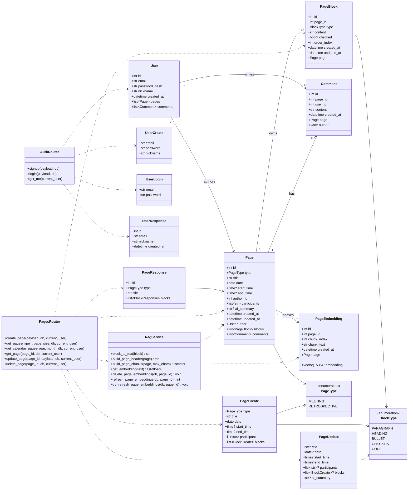

# Teamlog Class Diagram

```mermaid
classDiagram
direction LR

class User {
  +int id
  +str email
  +str password_hash
  +str nickname
  +datetime created_at
  +list~Page~ pages
  +list~Comment~ comments
}

class Page {
  +int id
  +PageType type
  +str title
  +date date
  +time? start_time
  +time? end_time
  +int author_id
  +list~str~ participants
  +str? ai_summary
  +datetime created_at
  +datetime updated_at
  +User author
  +list~PageBlock~ blocks
  +list~Comment~ comments
}

class PageBlock {
  +int id
  +int page_id
  +BlockType type
  +str content
  +bool? checked
  +int order_index
  +datetime created_at
  +datetime updated_at
  +Page page
}

class Comment {
  +int id
  +int page_id
  +int user_id
  +str content
  +datetime created_at
  +Page page
  +User author
}

class PageEmbedding {
  +int id
  +int page_id
  +int chunk_index
  +str chunk_text
  +vector(1536) embedding
  +datetime created_at
  +Page page
}

class PageType {
  <<enumeration>>
  MEETING
  RETROSPECTIVE
}

class BlockType {
  <<enumeration>>
  PARAGRAPH
  HEADING
  BULLET
  CHECKLIST
  CODE
}

class PageCreate {
  +PageType type
  +str title
  +date date
  +time? start_time
  +time? end_time
  +list~str~ participants
  +list~BlockCreate~ blocks
}

class PageUpdate {
  +str? title
  +date? date
  +time? start_time
  +time? end_time
  +list~str~? participants
  +list~BlockCreate~? blocks
  +str? ai_summary
}

class PageResponse {
  +int id
  +PageType type
  +str title
  +list~BlockResponse~ blocks
}

class UserCreate {
  +str email
  +str password
  +str nickname
}

class UserLogin {
  +str email
  +str password
}

class UserResponse {
  +int id
  +str email
  +str nickname
  +datetime created_at
}

class AuthRouter {
  +signup(payload, db)
  +login(payload, db)
  +get_me(current_user)
}

class PagesRouter {
  +create_page(payload, db, current_user)
  +get_pages(type_, page, size, db, current_user)
  +get_calendar_pages(year, month, db, current_user)
  +get_page(page_id, db, current_user)
  +update_page(page_id, payload, db, current_user)
  +delete_page(page_id, db, current_user)
}

class RagService {
  +block_to_text(block) str
  +build_page_header(page) str
  +build_page_chunks(page, max_chars) list~str~
  +get_embedding(text) list~float~
  +delete_page_embeddings(db, page_id) void
  +refresh_page_embeddings(db, page_id) int
  +try_refresh_page_embeddings(db, page_id) void
}

User "1" --> "0..*" Page : authors
User "1" --> "0..*" Comment : writes
Page "1" --> "0..*" PageBlock : owns
Page "1" --> "0..*" Comment : has
Page "1" --> "0..*" PageEmbedding : indexes
Page --> PageType
PageBlock --> BlockType
PageCreate --> PageType
PageCreate --> BlockType
PageUpdate --> BlockType
PageResponse --> Page
AuthRouter ..> User
AuthRouter ..> UserCreate
AuthRouter ..> UserLogin
AuthRouter ..> UserResponse
PagesRouter ..> Page
PagesRouter ..> PageBlock
PagesRouter ..> PageCreate
PagesRouter ..> PageUpdate
PagesRouter ..> PageResponse
PagesRouter ..> RagService
RagService ..> Page
RagService ..> PageEmbedding
```
