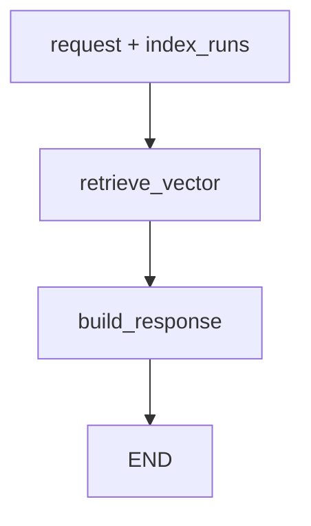

# RAG Ask Flow

이 문서는 현재 코드 기준으로 `/rag/ask`가 어떻게 동작하는지 설명한다.

핵심부터 말하면, 현재 RAG ask는 최종 대화형 LLM 답변을 직접 완성하는 흐름이 아니다. 저장된 코드 chunk를 vector DB에서 찾고, 그 근거를 `RagAskResponseDTO`로 반환하는 evidence 검색 흐름이다. 최종 자연어 답변은 agent 쪽 `AgentGraph.generate_answer()`가 이 근거를 받아 생성한다.

## 현재 결론

```text
사용자 질문
-> RagAskRequestDTO
-> RagAnswerService
-> SQL에서 실제 인덱싱 run 확정
-> RagAnswerGraph
-> Vector DB 검색
-> RagAskResponseDTO(answer 요약 + sources + 실제 기준 refs)
```

여기서 `answer` 필드는 LLM 답변이 아니라 검색 결과 요약이다.

```text
RAG 검색 결과 5개를 찾았습니다. 최종 답변은 agent가 이 근거를 바탕으로 생성합니다.
```

근거가 없으면 아래 문장이 들어간다.

```text
저장된 RAG 근거를 찾지 못했습니다. 먼저 레포지토리 분석을 실행해 주세요.
```

## 파일 읽는 순서

```text
backend/app/rag/api/router.py
  ask_repository_rag()

backend/app/rag/api/schema.py
  RagAskRepositoryRefDTO
  RagAskRequestDTO
  RagAskResponseDTO
  RagAskSourceDTO

backend/app/rag/service/answer_service.py
  RagAnswerService.answer()
  find_index_runs()
  find_index_run_by_ref()

backend/app/rag/service/answer_graph.py
  RagAnswerGraph.run()
  retrieve_vector()
  build_response()

backend/app/rag/external/vector_repository.py
  RagVectorRepository.search()
  build_where_filter()
```

## 요청 DTO

파일:

```text
backend/app/rag/api/schema.py
```

현재 `/rag/ask` 요청은 두 가지 방식으로 기준 레포를 받을 수 있다.

첫 번째는 단일 레포 방식이다.

```json
{
  "question": "이 레포의 인증 흐름을 설명해줘",
  "repository_full_name": "Jungle-303-04/warm-up",
  "branch": "minjeong",
  "commit_sha": "842d49559f83cd89d0500049efe80909500d99f5",
  "limit": 5
}
```

두 번째는 여러 레포 기준을 한 번에 넘기는 방식이다.

```json
{
  "question": "두 레포를 참고해서 구현 흐름을 비교해줘",
  "repository_refs": [
    {
      "repository_full_name": "Jungle-303-04/warm-up",
      "branch": "minjeong",
      "commit_sha": "842d49559f83cd89d0500049efe80909500d99f5"
    },
    {
      "repository_full_name": "minmings111/github.io",
      "branch": "main",
      "commit_sha": "dbaf93ad9fc38d3cbf70d3efb03df1ca871b375f"
    }
  ],
  "limit": 5
}
```

`question`은 필수이고 빈 문자열이면 거절된다.

`repository_full_name` 또는 `repository_refs` 중 하나는 반드시 있어야 한다.

`branch`와 `commit_sha`는 선택값이다. 둘 다 주면 가장 정확하다. `commit_sha`가 없으면 SQL에서 해당 레포/브랜치의 최신 인덱싱 run을 찾는다.

`limit`은 vector DB에서 레포 기준마다 가져올 최대 chunk 수다. 현재 기본값은 5다.

## 응답 DTO

응답은 아래 정보를 담는다.

```json
{
  "answer": "RAG 검색 결과 5개를 찾았습니다. 최종 답변은 agent가 이 근거를 바탕으로 생성합니다.",
  "repository_full_name": "Jungle-303-04/warm-up",
  "branch": "minjeong",
  "commit_sha": "842d49559f83cd89d0500049efe80909500d99f5",
  "run_id": 25,
  "repository_refs": [
    {
      "run_id": 25,
      "repository_full_name": "Jungle-303-04/warm-up",
      "branch": "minjeong",
      "commit_sha": "842d49559f83cd89d0500049efe80909500d99f5"
    }
  ],
  "sources": [
    {
      "citation": "backend/app/rag/service/answer_graph.py:63-85@842d495...",
      "path": "backend/app/rag/service/answer_graph.py",
      "chunk_type": "python_function",
      "distance": 0.32,
      "content": "검색된 chunk 원문"
    }
  ]
}
```

`repository_full_name`, `branch`, `commit_sha`, `run_id`는 대표 기준이다. 여러 레포를 검색한 경우 첫 번째 run이 대표값으로 들어간다.

여러 기준 전체는 `repository_refs`에 들어간다.

`sources`는 agent가 최종 답변을 만들 때 사용할 실제 근거 목록이다.

## 라우터

파일:

```text
backend/app/rag/api/router.py
```

`ask_repository_rag()`는 인증 컨텍스트를 확인한 뒤 `RagAnswerService.answer()`로 넘긴다.

```text
request
-> resolve_auth_context
-> auth_context.github_account()
-> answer_service.answer(auth_context.db, request)
```

라우터는 LangGraph, Chroma, SQL 검색 세부 구현을 직접 알지 않는다.

## Answer Service

파일:

```text
backend/app/rag/service/answer_service.py
```

`RagAnswerService`의 책임은 하나다.

```text
사용자가 보낸 레포 기준
-> SQL에 저장된 실제 인덱싱 run
```

현재 흐름은 아래와 같다.

```text
answer(db, request)
-> find_index_runs(db, request)
-> build_repository_refs(request)
-> find_index_run_by_ref(db, ref)
-> answer_graph.run(request, index_runs)
```

`build_repository_refs()`는 요청에 `repository_refs`가 있으면 그대로 쓴다. 없으면 기존 단일 필드인 `repository_full_name`, `branch`, `commit_sha`를 `RagAskRepositoryRefDTO` 하나로 감싼다.

`find_index_run_by_ref()`는 SQL 저장소의 `find_latest_run()`을 호출한다.

검색 기준은 아래 값이다.

```text
repository_full_name
branch
commit_sha
```

해당 기준으로 저장된 인덱싱 run이 없으면 `ValueError`가 발생한다. 즉 질문 전에 먼저 레포 인덱싱이 되어 있어야 한다.

## Answer Graph

파일:

```text
backend/app/rag/service/answer_graph.py
```

현재 `RagAnswerGraph`의 노드는 두 개뿐이다.

```text
retrieve_vector
-> build_response
-> END
```

Mermaid로 보면 아래와 같다.



예전처럼 `generate_answer` 노드나 `llm_client` 호출은 없다. RAG graph는 evidence 검색까지만 담당한다.

## retrieve_vector

`retrieve_vector()`는 SQL에서 확정된 run 목록을 기준으로 vector DB를 검색한다.

여러 레포가 들어오면 각 run마다 검색한다.

```text
for index_run in index_runs:
  vector_repository.search(
    query=request.question,
    limit=request.limit,
    repository_full_name=index_run.repository_full_name,
    branch=index_run.branch,
    commit_sha=index_run.commit_sha,
  )
```

중요한 점은 `commit_sha`가 검색어가 아니라 filter라는 것이다.

사용자가 질문에 적은 말은 신뢰 기준이 아니다. 실제 코드 기준은 SQL에 저장된 `index_run.repository_full_name`, `branch`, `commit_sha`이고, vector DB는 그 범위 안에서만 유사 chunk를 찾는다.

검색 결과는 Chroma 원본 구조에서 `VectorResultRow` 목록으로 변환된다.

여러 레포에서 검색한 row는 `distance`가 작은 순서로 정렬된다. 보통 distance가 작을수록 질문과 더 가까운 근거다.

## build_response

`build_response()`는 graph state를 API 응답 DTO로 포장한다.

```text
rows 있음
-> answer = "RAG 검색 결과 N개를 찾았습니다..."
-> sources = citation/path/chunk_type/distance/content

rows 없음
-> answer = "저장된 RAG 근거를 찾지 못했습니다..."
-> sources = []
```

`sources`에 들어가는 정보는 vector metadata와 document에서 온다.

```text
citation
path
chunk_type
distance
content
```

agent는 이 `sources`를 보고 최종 답변을 만든다.

## Vector Repository

파일:

```text
backend/app/rag/external/vector_repository.py
```

`RagVectorRepository.search()`는 질문을 embedding으로 바꾸고 Chroma collection을 조회한다.

검색 조건은 `build_where_filter()`에서 만들어진다.

```text
run_id
repository_full_name
branch
commit_sha
```

`/rag/ask` 흐름에서는 보통 `repository_full_name`, `branch`, `commit_sha`가 들어간다.

`run_id` filter는 개발용 vector search나 상세 검증에서 쓸 수 있지만, 일반 사용자가 질문할 때 직접 입력하는 기준은 아니다.

## run_id와 commit_sha

`run_id`는 인덱싱 실행 기록 번호다.

용도:

```text
어떤 인덱싱 작업에서 나온 chunk인지 추적
run detail 조회
파일/청크/스킵 파일 목록 확인
프론트에서 선택한 분석 결과를 다시 서버에 넘길 때 보조 식별자로 사용
```

`commit_sha`는 실제 코드 버전 기준이다.

용도:

```text
같은 브랜치가 시간이 지나도 어떤 코드 버전 기준인지 고정
vector DB 검색 범위 제한
LLM 답변의 근거가 어떤 코드 스냅샷인지 설명
```

따라서 질문 정확도를 위해서는 `repository_full_name + branch + commit_sha` 조합이 가장 중요하다.

## Agent와의 관계

agent는 `/rag/ask`를 직접 HTTP로 호출하지 않고, 같은 백엔드 내부에서 `RagAnswerService.answer()`를 주입받아 호출한다.

파일:

```text
backend/app/agent/service/agent_graph.py
```

agent 흐름에서는 아래처럼 사용된다.

```text
AgentGraph.resolve_rag_basis()
-> AgentGraph.retrieve_rag()
-> RagAnswerService.answer(db, RagAskRequestDTO(...))
-> RagAnswerGraph가 evidence 반환
-> AgentGraph.generate_answer()가 LLM 최종 답변 생성
```

이 구조 때문에 RAG는 “최종 답변 생성기”라기보다 “근거 검색 도구”에 가깝다.

## 현재 구현되지 않은 것

아래 항목은 아직 `/rag/ask` 내부 구현이 아니다.

```text
SQL keyword 검색과 vector 검색의 점수 결합
검색 결과 재랭킹
근거 부족 시 자동 재검색
보드 내용과 코드 근거의 신뢰도 비교
MCP action 실행
사용자 승인 workflow
```

이 기능들은 나중에 더 큰 agent graph에서 RAG 결과와 SQL 결과를 함께 보고 판단하는 노드로 추가하는 편이 자연스럽다.

## 짧은 요약

현재 `/rag/ask`는 이렇게 이해하면 된다.

```text
질문 + 레포 기준
-> SQL에서 실제 저장된 코드 스냅샷 확정
-> commit_sha 기준으로 vector DB 검색
-> 근거 chunk 목록 반환
-> 최종 자연어 답변은 agent가 생성
```
