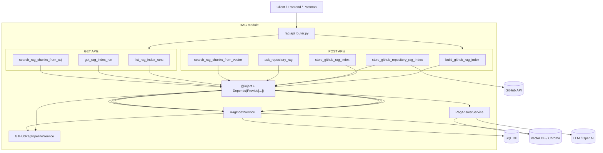
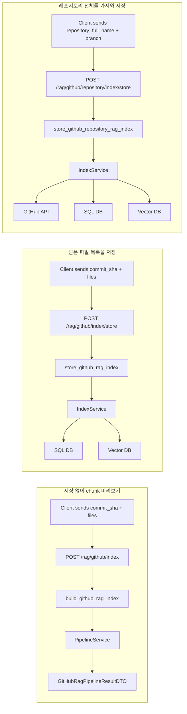
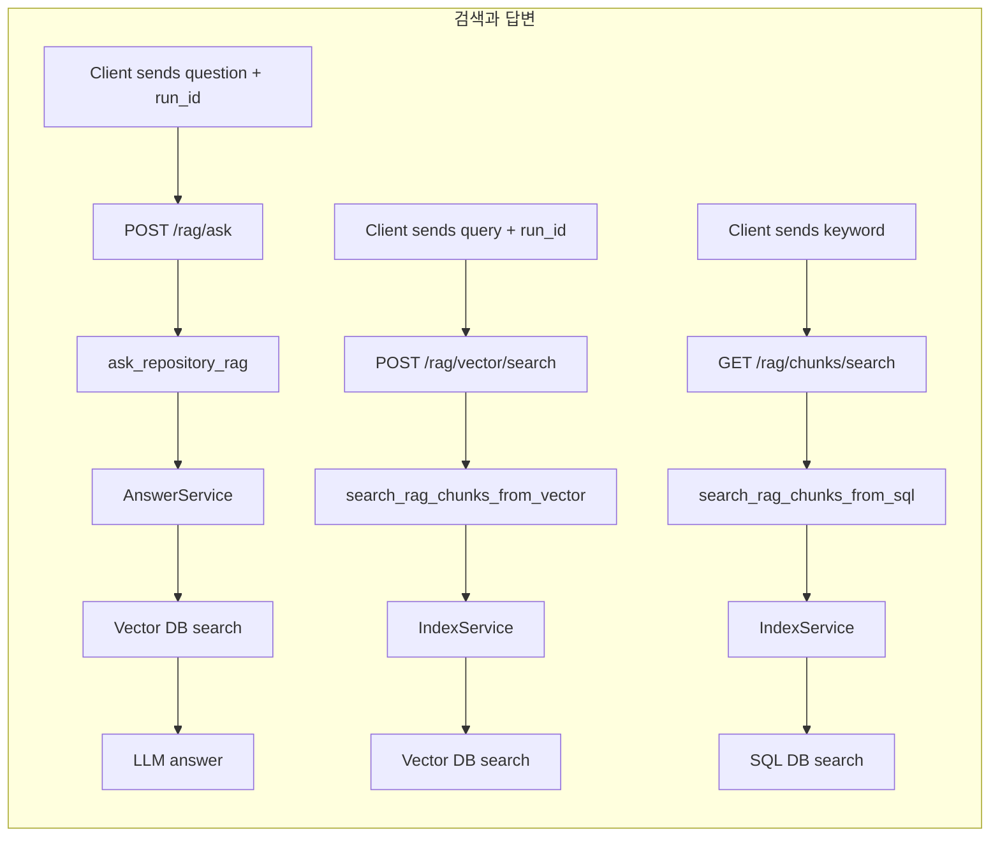
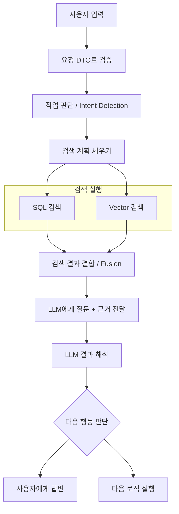

# RAG Study Guide

RAG는 이 순서로 보면 제일 잘 잡힌다.

```text
API 요청
-> 서비스 흐름
-> GitHub 파일 수집
-> snapshot 검증
-> chunk 생성
-> SQL 저장
-> vector 저장
-> 검색
-> LLM 답변
```

## 목표 사고 사이클

사용자가 프롬프트를 입력해서 검색하고 답변을 받는 흐름은 아래 사이클로 이해한다.

```text
사용자 입력
-> 입력을 요청 DTO로 받기
-> 어떤 작업인지 판단
-> 검색 계획 세우기
-> SQL 검색 / Vector 검색
-> 검색 결과 결합
-> LLM에게 질문 + 근거 전달
-> LLM 결과 해석
-> 사용자에게 답변하거나, 다음 로직 실행
```

현재 `/rag/ask` 구현은 이 완성형 사이클 중에서 `Vector 검색 -> LLM 답변 -> 사용자 응답` 흐름을 먼저 구현한 형태다. SQL 검색, SQL/Vector 결과 결합, 후속 로직 실행 여부 판단은 이후 agent workflow로 확장할 수 있는 지점이다.

자세한 코드 매핑은 `docs/rag_ask_flow.md`를 본다.

## 전체 그림

RAG API는 먼저 `router.py`에서 HTTP 요청을 함수로 연결한다. 각 함수는 request DTO, query parameter, path parameter를 받고, `@inject`와 `Provide[...]`를 통해 필요한 service를 컨테이너에서 주입받는다.



`@inject`는 URL을 나누는 장치가 아니다. URL 분기는 `@rag.post(...)`, `@rag.get(...)`가 한다. `@inject`는 함수 안에서 필요한 service 객체를 `AppContainer`에서 꺼내 넣는 장치다.

```text
@rag.post(...)
-> 이 함수를 특정 POST API로 등록한다.

@inject
-> Depends(Provide[...])에 적힌 service를 실제 객체로 바꿔 넣는다.
```

## Endpoint별 역할





## Prompt에서 답변까지의 목표 흐름

사용자가 프롬프트를 입력했을 때 최종적으로 만들고 싶은 흐름은 아래에 가깝다.

```text
사용자 입력
-> 입력을 요청 DTO로 받기
-> 어떤 작업인지 판단
-> 검색 계획 세우기
-> SQL 검색 / Vector 검색
-> 검색 결과 결합
-> LLM에게 질문 + 근거 전달
-> LLM 결과 해석
-> 사용자에게 답변하거나, 다음 로직 실행
```



현재 `/rag/ask` 흐름은 이 목표 흐름 중 일부만 구현한 형태로 보면 된다.

```text
사용자 질문
-> RagAskRequestDTO
-> RagAnswerService.answer()
-> Vector 검색
-> LLM에게 질문 + 근거 전달
-> RagAskResponseDTO
```

## 1. 입구부터 보기

먼저 `backend/app/rag/api/router.py`를 본다.

여기가 RAG 기능의 HTTP 입구다. 어떤 API가 있는지 먼저 알아야 전체 흐름이 잡힌다.

특히 이 엔드포인트들을 찾아본다.

```text
/github/index
/github/index/store
/github/repository/index/store
/vector/search
/ask
/runs
/runs/{run_id}
```

여기서 질문할 것:

```text
이 API가 어떤 service 메서드를 호출하지?
request DTO는 뭐지?
response DTO는 뭐지?
```

## 2. 요청/응답 모양 보기

다음은 `backend/app/rag/api/schema.py`를 본다.

여기는 RAG 세계의 데이터 모양이다.

중요하게 볼 DTO:

```text
GitHubRagPipelineRequestDTO
GitHubRepositoryIndexRequestDTO
GitHubRagPipelineResultDTO
RagStoredIndexResponseDTO
RagVectorSearchRequestDTO
RagAskRequestDTO
RagAskResponseDTO
```

이 파일을 보면 RAG가 뭘 입력받고 뭘 반환하는지 보인다.

## 3. 저장까지의 메인 서비스

그다음 `backend/app/rag/service/index_service.py`를 본다.

여기가 RAG 저장 흐름의 조립자다.

읽을 핵심 메서드:

```text
index_repository_and_store()
index_and_store()
list_runs()
get_run_detail()
search_sql_chunks()
search_vector_chunks()
```

특히 흐름은 이렇다.

```text
GitHub repository 요청
-> GitHubRepositoryClient로 파일 가져옴
-> pipeline으로 chunk 생성
-> SQL repository에 저장
-> vector repository에 저장
```

## 4. RAG Pipeline 본체

그다음 `backend/app/rag/service/pipeline.py`를 본다.

여기가 파일 목록을 RAG evidence chunks로 바꾸는 곳이다.

질문하면서 읽는다.

```text
파일 하나를 어떻게 snapshot으로 만들지?
어떤 파일을 skip하지?
chunking_service는 언제 호출하지?
summary는 어떻게 계산하지?
```

## 5. GitHub 파일 수집

pipeline이 이미 파일 DTO를 받는 흐름도 있고, repository 전체를 직접 가져오는 흐름도 있다.

그 부분은 `backend/app/github/external/repository.py`를 보면 된다.

여기는 GitHub API와 실제 통신한다.

핵심 흐름:

```text
repository 정보 조회
-> branch commit sha 조회
-> git tree 조회
-> .py / .md 파일만 필터링
-> contents API로 파일 내용 가져오기
-> GitHubFileResponseDTO 생성
```

## 6. GitHub 파일을 Snapshot으로 바꾸는 도메인

그다음 이 순서로 본다.

```text
backend/app/github/domain/file_snapshot_builder.py
backend/app/github/domain/content_decoder.py
backend/app/github/domain/language_detector.py
backend/app/github/domain/file_citation.py
```

여기는 GitHub raw 응답을 RAG가 다루기 쉬운 file snapshot으로 바꾸는 부분이다.

## 7. Chunking 핵심

이제 RAG의 심장부다.

이 순서로 본다.

```text
backend/app/rag/domain/chunking_service.py
backend/app/rag/domain/chunker_registry.py
backend/app/rag/domain/python_chunker.py
backend/app/rag/domain/markdown_chunker.py
backend/app/rag/domain/chunk_factory.py
```

논리는 이렇다.

```text
파일 언어 확인
-> 언어에 맞는 chunker 선택
-> Python이면 함수/클래스 단위로 쪼갬
-> Markdown이면 문단/헤딩 기준으로 쪼갬
-> chunk_factory가 최종 EvidenceChunk DTO 생성
```

추가로 Python chunk 의미를 알고 싶으면 `backend/app/rag/domain/python_classifier.py`를 본다.

이 파일은 Python 코드 조각이 API인지, model인지, service인지, test인지 분류하는 쪽이다.

## 8. Chunk ID, Citation, Validation

그다음 보조 도메인을 본다.

```text
backend/app/rag/domain/chunk_identity.py
backend/app/rag/domain/chunk_citation.py
backend/app/rag/domain/snapshot_validator.py
```

각각의 역할:

```text
chunk_identity.py      chunk id/hash 생성
chunk_citation.py      "파일:라인" 같은 출처 문자열 생성
snapshot_validator.py  인덱싱 가능한 파일인지 검증
```

## 9. SQL 저장 구조

그다음 저장소를 본다.

```text
backend/app/rag/external/model.py
backend/app/rag/external/sql_repository.py
```

먼저 `model.py`로 테이블 구조를 보고, 그 다음 `sql_repository.py`를 보면 좋다.

흐름:

```text
RagIndexRun
-> RagFileSnapshot
-> RagChunk
-> RagSkippedFile
```

즉 한 번 인덱싱 실행한 기록 아래에 파일, chunk, skip 파일들이 매달린 구조다.

## 10. Vector 저장/검색

그다음 이 파일들을 본다.

```text
backend/app/rag/external/embedding.py
backend/app/rag/external/vector_repository.py
backend/app/rag/domain/vector_result.py
```

여기서 보는 흐름:

```text
chunk_text
-> embedding vector 생성
-> ChromaDB에 upsert
-> 질문 embedding 생성
-> vector search
-> 비슷한 chunk 반환
```

## 11. 답변 생성

마지막으로 `backend/app/rag/service/answer_service.py`를 본다.

여기는 RAG의 G 쪽이다. 검색된 근거를 LLM에게 넘겨서 답변을 만든다.

흐름:

```text
질문 받음
-> vector_repository.search()
-> 관련 chunk documents/metadatas 꺼냄
-> prompt 구성
-> LLM 호출
-> answer + sources 반환
```

같이 보면 좋은 파일:

```text
backend/app/rag/external/llm_client.py
```

## 추천 읽기 루트

처음 공부할 때는 이 순서만 따라간다.

```text
1. rag/api/router.py
2. rag/api/schema.py
3. rag/service/index_service.py
4. rag/service/pipeline.py
5. github/external/repository.py
6. github/domain/file_snapshot_builder.py
7. rag/domain/chunking_service.py
8. rag/domain/python_chunker.py
9. rag/domain/markdown_chunker.py
10. rag/domain/chunk_factory.py
11. rag/external/model.py
12. rag/external/sql_repository.py
13. rag/external/embedding.py
14. rag/external/vector_repository.py
15. rag/service/answer_service.py
```

## 핵심 관점

RAG는 문서를 잘게 쪼개서 저장하고, 질문과 비슷한 조각을 다시 찾아, 그 조각만 근거로 LLM에게 답하게 하는 구조다.

코드를 볼 때는 계속 이 세 질문을 들고 간다.

```text
1. 이 파일은 chunk를 만들기 전인가, 후인가?
2. 이 파일은 SQL 저장 쪽인가, vector 저장 쪽인가?
3. 이 파일은 검색까지만 하나, LLM 답변까지 하나?
```
