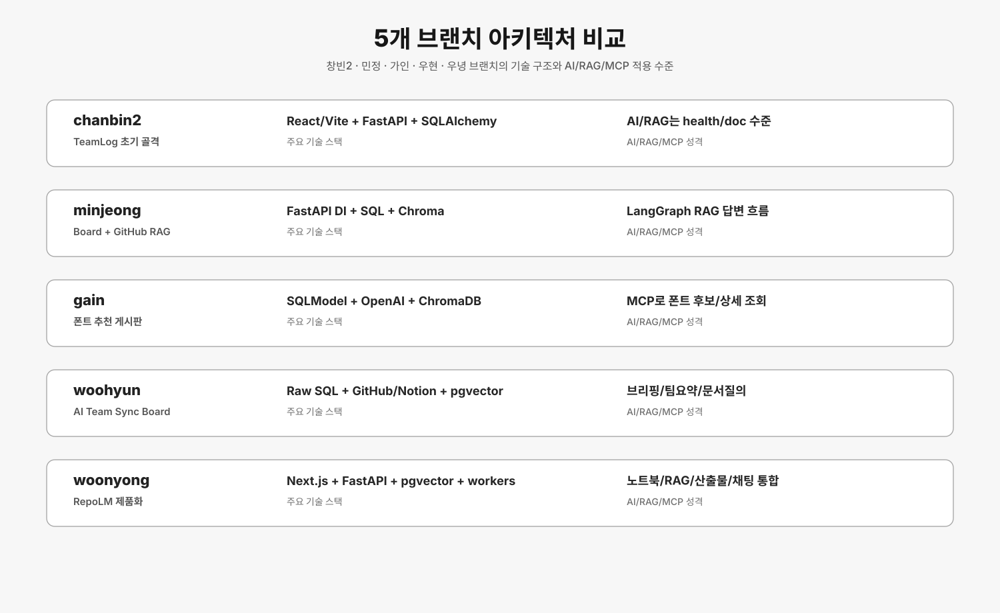

# 5개 브랜치 아키텍처 비교

이 폴더는 `origin/chanbin2`, `origin/minjeong`, `origin/gain`, `origin/woohyun`, `origin/woonyong` 브랜치를 각각 별도 worktree로 펼쳐 실제 파일 기준으로 분석한 결과다.
각 문서는 같은 형식으로 프론트엔드, 백엔드, DB, AI/RAG/MCP, 주요 요청 흐름, 한계를 정리한다.

## 전체 비교 이미지

## 문서 목록

| 브랜치 | 담당 표기 | 핵심 성격 | 문서 | 이미지 |
| --- | --- | --- | --- | --- |
| `chanbin2` | 창빈2 | TeamLog 캘린더/회의록 API 골격 | [chanbin2.md](./chanbin2.md) | [SVG](./diagrams/chanbin2-architecture.svg) |
| `minjeong` | 민정 | GitHub OAuth + Board + RAG/LangGraph 실험 | [minjeong.md](./minjeong.md) | [SVG](./diagrams/minjeong-architecture.svg) |
| `gain` | 가인 | 폰트 추천 게시판 + RAG + MCP | [gain.md](./gain.md) | [SVG](./diagrams/gain-architecture.svg) |
| `woohyun` | 우현 | AI Team Sync Board + Notion/GitHub RAG | [woohyun.md](./woohyun.md) | [SVG](./diagrams/woohyun-architecture.svg) |
| `woonyong` | 우녕 | RepoLM 제품화 브랜치, SQL+RAG+노트북+산출물 | [woonyong.md](./woonyong.md) | [SVG](./diagrams/woonyong-architecture.svg) |

## 한눈에 보는 결론

- `chanbin2`는 FastAPI, SQLAlchemy, React/Vite 기반의 캘린더형 협업툴 뼈대다. AI/RAG는 문서와 pgvector health check 수준이고 실제 agent pipeline은 아직 없다.
- `minjeong`은 GitHub OAuth, 게시판, GitHub repo indexing, SQL 저장, Chroma vector search, LangGraph RAG 답변 흐름까지 갖춘 RAG 실험형 브랜치다.
- `gain`은 폰트 추천이라는 도메인이 명확하다. 게시글/댓글/인증/폰트 DB에 OpenAI 분석, ChromaDB 폰트 가이드 검색, MCP 폰트 조회 도구를 붙였다.
- `woohyun`은 팀 작업 보드에 GitHub/Notion 데이터를 붙이고 OpenAI JSON Schema 응답으로 오늘 브리핑, 팀 요약, 문서 질의를 제공하는 대시보드형 브랜치다.
- `woonyong`은 위 실험들을 RepoLM 제품 구조로 재정리한 브랜치다. 노트북, source, chunk, pgvector, planner, artifact, worker, OAuth, Cloudflare 배포까지 포함한다.

## 분석 기준

- 의존성 파일: `package.json`, `requirements.txt`, `pyproject.toml`, `docker-compose.yml`, `compose.yaml`
- 백엔드 진입점: `main.py`, `app/main.py`, `app/api/router.py`
- API 라우터: `APIRouter`, `@app.get/post/patch/delete`
- 데이터 모델: SQLAlchemy/SQLModel/SQL DDL 모델과 FK 관계
- AI/RAG/MCP: OpenAI 호출, 임베딩, vector DB, LangGraph, MCP server/client 코드
- 프론트 구조: React/Vite/Next 진입점, 라우팅, API client, 주요 화면 컴포넌트

