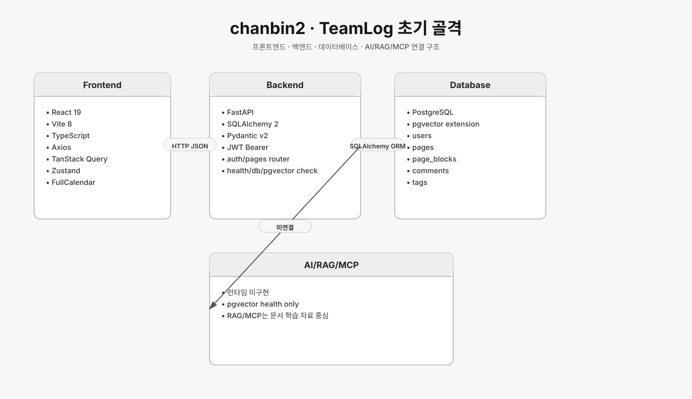
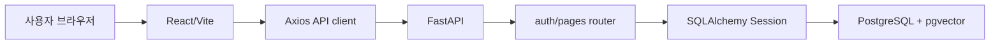

# chanbin2 브랜치 아키텍처



## 기준 커밋

- 브랜치: `origin/chanbin2`
- 커밋: `afd63dc feat: 페이지 생성 api 구현`

## 서비스 성격

`chanbin2`는 `TeamLog`라는 캘린더 기반 회의/회고 협업툴의 초기 골격이다.
프론트는 서버/DB/pgvector 연결 상태를 확인하는 수준이고, 백엔드는 사용자 인증과 페이지 생성 API를 중심으로 확장 중이다.

## 기술 스택

### Frontend

- React 19
- Vite 8
- TypeScript
- Axios
- TanStack Query
- Zustand
- FullCalendar
- lucide-react

### Backend

- FastAPI
- SQLAlchemy 2
- Pydantic v2
- pydantic-settings
- JWT 인증 유틸
- Alembic 설정 파일

### Database

- PostgreSQL
- pgvector 확장 확인
- Docker Compose의 `pgvector/pgvector:pg16`

## 백엔드 구조

```text
backend/app
├── core
│   ├── config.py
│   ├── database.py
│   ├── deps.py
│   └── security.py
├── models
│   ├── user.py
│   ├── page.py
│   ├── page_block.py
│   ├── comment.py
│   └── tag.py
├── routers
│   ├── auth.py
│   └── pages.py
└── schemas
    ├── user_schema.py
    └── page_schema.py
```

핵심 흐름은 `Router -> SQLAlchemy Session -> ORM Model -> Pydantic Response`다.
`main.py`에는 `FastAPI`, CORS, `/health`, `/db-health`, `/pgvector-health`가 있고, 인증/페이지 라우터가 분리되어 있다.

## API 구조

- `POST /auth/signup`: 이메일, 비밀번호, 닉네임으로 사용자 생성
- `POST /auth/login`: 비밀번호 검증 후 Bearer JWT 발급
- `GET /auth/me`: JWT 기반 현재 사용자 조회
- `POST /pages`: 로그인 사용자 기준 페이지와 블록 생성
- `GET /pages`: 페이지 목록 조회 설계 중
- `GET /health`: API 상태 확인
- `GET /db-health`: DB 연결 확인
- `GET /pgvector-health`: pgvector extension 확인

## 데이터 모델

- `users`: 이메일, 비밀번호 해시, 닉네임
- `pages`: 회의/회고 페이지, 날짜, 시간, 참석자, 태그, AI 요약 필드
- `page_blocks`: 페이지 본문 블록
- `comments`: 페이지 댓글
- `tags`: 태그 후보

관계:

- `User 1:N Page`
- `User 1:N Comment`
- `Page 1:N PageBlock`
- `Page 1:N Comment`

## AI/RAG/MCP 상태

런타임 구현은 아직 API 골격 단계다.
`/pgvector-health`로 벡터 확장을 확인하지만, 실제 chunking, embedding, vector search, LLM answer flow는 연결되어 있지 않다.
문서 폴더에는 RAG/MCP 학습 문서가 있으나 제품 코드에는 아직 반영되지 않은 상태로 보는 것이 맞다.

## 요청 흐름



## 평가

- 장점: FastAPI/SQLAlchemy 계층이 분리되어 있고, 인증과 페이지 도메인의 출발점이 명확하다.
- 한계: 프론트가 아직 실제 캘린더/페이지 UI까지 연결되지 않았고, AI/RAG는 health check와 문서 수준이다.
- RepoLM 관점: “소스 수집/검색/답변”보다는 “협업 문서 데이터 모델”의 초안으로 참고할 수 있다.

