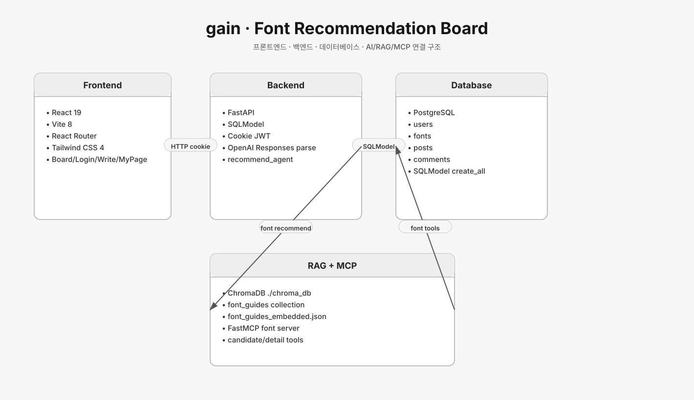
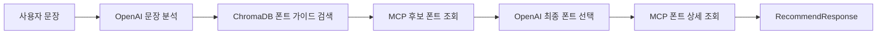

# gain 브랜치 아키텍처



## 기준 커밋

- 브랜치: `origin/gain`
- 커밋: `ca137f9 style: 주요 화면 안내 요소 정리`

## 서비스 성격

`gain`은 “글 내용에 어울리는 폰트 추천”이라는 도메인이 명확한 브랜치다.
게시판과 댓글, 회원 인증, 폰트 DB를 바탕으로 OpenAI 분석, RAG 폰트 가이드 검색, MCP 폰트 조회 도구를 조합한다.

## 기술 스택

### Frontend

- React 19
- Vite 8
- React Router
- Tailwind CSS 4
- 일반 게시판 화면, 로그인/회원가입, 글 작성/수정, 마이페이지

### Backend

- FastAPI
- SQLModel
- SQLAlchemy column type
- bcrypt
- PyJWT
- OpenAI Responses API
- ChromaDB persistent client
- MCP Python SDK

### Database

- PostgreSQL
- `users`, `fonts`, `posts`, `comments`
- SQLModel `create_all` 기반 초기 테이블 생성

### Vector DB

- 로컬 `./chroma_db`
- collection: `font_guides`
- 사전 임베딩된 `data/font_guides_embedded.json`를 upsert

## 백엔드 구조

```text
backend
├── main.py
├── database.py
├── init_db.py
├── models
│   ├── user.py
│   ├── font.py
│   ├── post.py
│   ├── comment.py
│   └── recommend.py
├── routers
│   ├── auth.py
│   └── comments.py
├── agent
│   └── recommend_agent.py
├── rag
│   ├── builder.py
│   ├── embedding.py
│   ├── search.py
│   └── vector_store.py
└── font_mcp
    ├── font_server.py
    ├── font_client.py
    └── font_tools.py
```

## API 구조

- `GET /posts`: 검색/페이지네이션을 포함한 게시글 목록
- `POST /posts`: 로그인 사용자 기준 글 생성
- `GET /posts/{post_id}`: 글 상세
- 댓글 API: `GET/POST /posts/{post_id}/comments`, `DELETE /comments/{comment_id}`
- 인증 API: cookie 기반 access/refresh token 발급/검증/삭제
- 추천 API는 `main.py`에서 `RecommendRequest`, `run_recommend_agent`를 import해 폰트 추천 흐름을 연결하는 구조다.

## AI Agent 흐름

`run_recommend_agent()`는 다음 순서로 실행된다.



핵심 기준:

- 1차 LLM은 문장의 감정, 시각 특성, 글쓰기 스타일, 에너지, 키워드를 JSON으로 분석한다.
- RAG는 분석 결과와 원문을 합쳐 `font_guides`에서 근거 문서를 찾는다.
- MCP 도구는 DB의 폰트 후보와 폰트 상세를 제공한다.
- 최종 LLM은 반드시 후보 목록의 `font_id`만 선택해야 한다.
- 사용자에게 보이는 `display_reason`은 분석/근거/폰트 특성을 자연어로 합친다.

## MCP 구조

`font_mcp/font_server.py`는 `FastMCP("font-recommendation-server")`로 서버를 만들고 두 도구를 제공한다.

- `list_candidate_fonts()`: `fonts` 테이블에서 추천 후보 요약 조회
- `get_font_detail_by_id(font_id)`: 선택된 폰트 상세 조회

`font_mcp/font_client.py`는 stdio로 MCP 서버를 실행하고 tool call 결과 JSON을 읽는다.

## 데이터 모델

- `User`: 닉네임, 비밀번호 해시
- `Font`: 이름, 출처, 유료 여부, 라이선스, 카테고리, 태그, 설명, weight, 다운로드 URL, webfont 정보
- `Post`: 제목, 본문, 추천 이유, font_id, user_id
- `Comment`: 댓글 본문, post_id, user_id

관계:

- `User 1:N Post`
- `Font 1:N Post`
- `Post 1:N Comment`
- `User 1:N Comment`

## 평가

- 장점: 도메인 목적이 선명하고 MCP가 “DB 조회 도구”로 실제 기능에 쓰인다.
- 장점: RAG 근거와 후보 DB를 함께 사용해 LLM이 임의 폰트를 지어내지 않도록 제한한다.
- 한계: ChromaDB가 로컬 파일 경로 기반이고, RAG guide 재생성/동기화 운영 흐름은 약하다.
- RepoLM 관점: “LLM이 선택하고, MCP 도구가 후보/상세 데이터를 제한된 방식으로 제공하는 구조”의 좋은 예시다.

