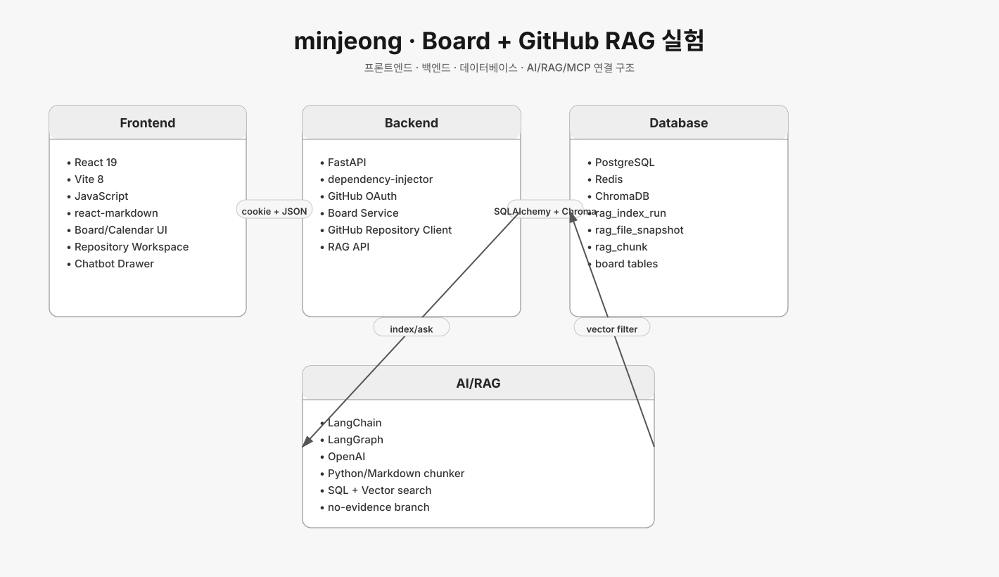
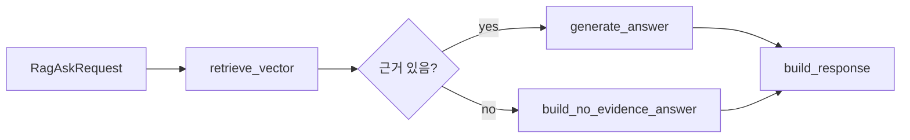

# minjeong 브랜치 아키텍처



## 기준 커밋

- 브랜치: `origin/minjeong`
- 커밋: `ae9c550 fix: show loaded repository branches in selector`

## 서비스 성격

`minjeong`은 게시판/캘린더 앱에 GitHub OAuth와 RAG를 붙인 실험형 브랜치다.
특히 GitHub repository를 index run으로 저장하고, SQL chunk와 Chroma vector DB를 함께 사용하며, LangGraph로 RAG 답변 흐름을 명시한 점이 핵심이다.

## 기술 스택

### Frontend

- React 19
- Vite 8
- JavaScript
- react-markdown
- 직접 작성한 fetch wrapper
- 캘린더/게시판/레포지토리 등록/챗봇 드로어 화면

### Backend

- FastAPI
- SQLAlchemy 2
- dependency-injector
- GitHub OAuth
- LangChain
- LangGraph
- OpenAI
- ChromaDB
- PostgreSQL
- Redis

### Infrastructure

- `docker-compose.yml`에서 app, postgres, redis, chroma를 함께 실행
- FastAPI 앱은 `/app/app` bind mount로 개발 중 reload
- Chroma는 `RAG_CHROMA_HOST`, `RAG_CHROMA_PORT`로 연결

## 백엔드 구조

```text
backend/app
├── auth
│   ├── api
│   ├── domain
│   ├── external
│   └── service
├── board
│   ├── api
│   ├── external
│   └── service
├── github
│   ├── domain
│   ├── external
│   └── service
├── rag
│   ├── api
│   ├── domain
│   ├── external
│   └── service
└── agent
    ├── api
    ├── external
    └── service
```

`container.py`가 조립 지점이다.
HTTP client, OAuth client, JWT service, board repository/service, GitHub repository client, chunker, SQL repository, vector repository, LangGraph answer graph를 한곳에서 연결한다.

## API 구조

- `GET /auth/github/login`: GitHub OAuth authorize URL 발급
- `GET /auth/github/callback`: callback 처리, HttpOnly cookie 설정
- `GET /auth/me`: 현재 사용자 조회
- `POST /board/`: 보드 생성
- `GET /board/`: 보드 목록 검색
- `GET /board/{board_id}`: 보드 상세
- `PUT /board/{board_id}`: 보드 수정
- `DELETE /board/{board_id}`: 보드 삭제
- `POST /rag/github/index`: GitHub 파일 목록을 chunk로 변환만 수행
- `POST /rag/github/index/store`: 전달 파일을 SQL/Vector DB에 저장
- `POST /rag/github/repository/index/store`: 로그인 GitHub 토큰으로 레포 파일 수집 후 저장
- `GET /rag/github/repository/branches`: 브랜치 목록 조회
- `POST /rag/ask`: 저장된 RAG 근거로 답변
- `GET /rag/runs`: 인덱싱 run 목록
- `GET /rag/runs/{run_id}`: run 상세
- `GET /rag/chunks/search`: SQL keyword 검색
- `POST /rag/vector/search`: vector 검색

## RAG/LangGraph 흐름

`RagAnswerGraph`는 다음 노드를 가진다.



중요한 특징:

- SQL에서 먼저 `index_run`을 확정한다.
- vector search는 `repository_full_name`, `branch`, `commit_sha` 필터 안에서만 수행한다.
- 근거가 없으면 LLM을 호출하지 않고 no-evidence 답변을 만든다.
- 답변 아래 citation을 내려주기 위해 chunk metadata의 `citation`, `path`, `chunk_type`, `distance`를 응답 DTO로 옮긴다.

## 데이터 모델

RAG:

- `rag_index_run`: repository, branch, commit, 파일 수, chunk 수
- `rag_file_snapshot`: path, sha, language, source_type, content_hash, citation
- `rag_chunk`: chunk text, symbol, line range, metadata, direct implementation evidence
- `rag_skipped_file`: 스킵 파일과 이유

Board:

- `board`
- `schedule_board_detail`
- `schedule_board_task`
- `proceedings_board_detail`
- `board_carbon_copy`
- `board_assignee`
- `board_participant`

Auth:

- `user`
- `github_oauth_account`

## 프론트 구조

- `App.jsx`가 인증, 보드, 레포 등록, 챗봇 드로어 상태를 중앙에서 관리
- `RepositoryWorkspace.jsx`가 레포 이름/브랜치 입력과 RAG index 실행 UI 담당
- `ChatbotDrawer.jsx`는 아직 실제 `/rag/ask` 연결이 아니라 mock 응답 주석을 포함한 프론트 상태 기반 구현

## 평가

- 장점: RAG 저장, 검색, 답변 흐름이 가장 명시적으로 분리되어 있다.
- 장점: DI container 덕분에 조립 지점이 보이고 LangGraph 노드도 읽기 쉽다.
- 한계: 챗봇 UI가 실제 backend ask API와 아직 완전히 연결되지 않은 부분이 있다.
- RepoLM 관점: chunk metadata, run 단위 확정, no-evidence 분기, LangGraph 최소 흐름은 현재 RepoLM 설계에 직접 참고할 가치가 높다.

