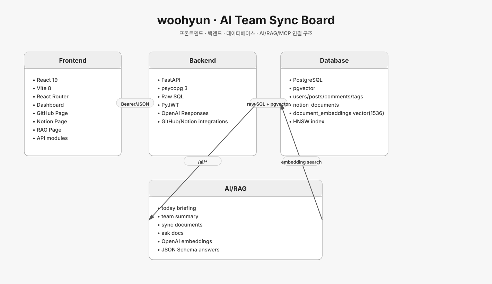
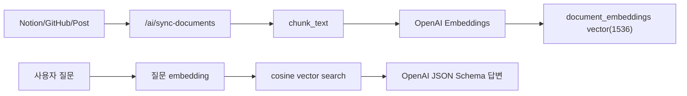

# woohyun 브랜치 아키텍처



## 기준 커밋

- 브랜치: `origin/woohyun`
- 커밋: `1a5fb2b fix: configure vercel services deployment`

## 서비스 성격

`woohyun`은 `AI Team Sync Board`에 가까운 브랜치다.
게시글/댓글/인증을 기본으로 두고 GitHub, Notion, OpenAI, pgvector RAG를 붙여 팀의 작업 현황을 요약하고 질문에 답하는 방향이다.

## 기술 스택

### Frontend

- React 19
- Vite 8
- React Router
- 일반 게시판, 대시보드, GitHub 페이지, Notion 문서 페이지, RAG 페이지, 설정 페이지
- API 파일 분리: `postApi`, `authApi`, `commentApi`, `githubApi`, `notionApi`, `ragApi`, `aiApi`

### Backend

- FastAPI
- psycopg 3
- Pydantic
- PyJWT
- Argon2/Pwdlib 계열 인증 의존성
- OpenAI Responses API
- OpenAI Embeddings API
- requests 기반 외부 API 호출

### Database

- PostgreSQL
- pgvector
- SQL 파일 기반 테이블 생성
- `document_embeddings`에 vector(1536) 저장, HNSW cosine index 사용

## 백엔드 구조

```text
backend/app
├── main.py
├── schemas.py
├── security.py
├── routers
│   ├── ai.py
│   ├── integrations_github.py
│   └── integrations_notion.py
└── services
    ├── ai_service.py
    ├── embedding_service.py
    ├── github_service.py
    ├── notion_service.py
    └── rag_service.py
```

`main.py`는 raw SQL 중심으로 인증, 게시글, 댓글 CRUD를 직접 처리한다.
AI/RAG/외부 통합은 `routers/ai.py`와 `services/*`로 분리되어 있다.

## API 구조

기본 게시판:

- `POST /auth/signup`
- `POST /auth/login`
- `GET /auth/me`
- `GET /posts`
- `POST /posts`
- `GET /posts/{post_id}`
- `PATCH /posts/{post_id}`
- `DELETE /posts/{post_id}`
- `GET /comments/post/{post_id}`
- `POST /comments/post/{post_id}`
- `PATCH /comments/{comment_id}`
- `DELETE /comments/{comment_id}`

AI:

- `POST /ai/today-briefing`: 내 작업, GitHub issue/PR/commit, Notion 문서를 모아 오늘 브리핑 생성
- `POST /ai/team-summary`: 팀 전체 게시글과 GitHub/Notion 정보를 모아 팀 요약 생성
- `POST /ai/sync-documents`: Notion/GitHub/게시글을 embedding source로 저장
- `POST /ai/ask-docs`: 저장된 문서 임베딩을 검색해 답변

통합:

- GitHub issue, PR, commit 조회 API
- Notion 문서 목록/상세 조회 API

## RAG 흐름



중요한 저장 테이블:

- `notion_documents`: Notion 문서 원문과 동기화 시간
- `document_embeddings`: source_type/source_id/title/url/chunk_text/embedding/metadata_json

## AI 요약 흐름

`ai_service.py`는 OpenAI Responses API에 JSON Schema를 넘긴다.
오늘 브리핑과 팀 요약은 LLM 결과가 schema에 맞아야만 파싱된다.
OpenAI 키가 없거나 호출 실패 시 fallback 요약을 제공한다.

## 평가

- 장점: GitHub, Notion, 게시글을 하나의 팀 상황판으로 모으는 제품 방향이 명확하다.
- 장점: SQL DDL과 pgvector index가 명시되어 있어 RAG 저장 구조를 확인하기 쉽다.
- 한계: ORM 없이 raw SQL이 많아 라우터 파일이 커지고 중복 인증 로직이 생길 수 있다.
- RepoLM 관점: “외부 생산성 도구를 RAG source로 끌어와 팀 요약을 만드는 흐름”을 참고할 수 있다.

