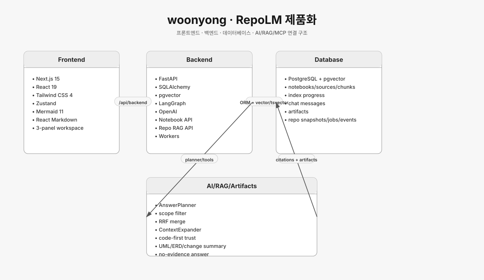
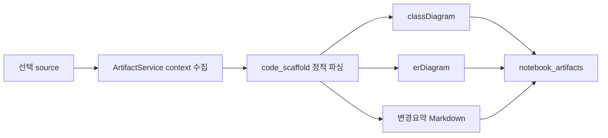

# woonyong 브랜치 아키텍처



## 기준 커밋

- 브랜치: `origin/woonyong`
- 커밋: `52ee4c7 fix: UML과 ERD 산출물 표현을 무채색으로 맞춰`

## 서비스 성격

`woonyong`은 현재 RepoLM 제품화 브랜치다.
NotebookLM 컨셉을 레포/문서/메모/산출물에 적용해 source를 SQL과 RAG에 저장하고, 선택된 source/file scope 안에서 채팅, 검색, UML, ERD, 변경요약을 제공한다.

## 기술 스택

### Frontend

- Next.js 15
- React 19
- Tailwind CSS 4
- Zustand
- Mermaid 11
- React Markdown
- rehype-sanitize
- pdfjs-dist
- svg-pan-zoom

### Backend

- FastAPI
- SQLAlchemy asyncio/sync 혼합 저장소
- pgvector
- PostgreSQL tsvector
- LangChain text splitters
- LangGraph
- OpenAI
- MCP dependency
- structlog
- uvicorn workers

### Infrastructure

- `compose.yaml`
- FastAPI API container
- repo-sync/code-index/rag/agent worker containers
- PostgreSQL pgvector
- Next.js standalone
- Cloudflare tunnel 배포

## 백엔드 구조

```text
backend/app
├── api
├── auth
├── github
├── notebooks
│   ├── api
│   ├── application
│   ├── domain
│   └── infrastructure
├── repo_rag
│   ├── api
│   ├── application
│   ├── domain
│   └── infrastructure
├── pipeline
├── proposals
└── workers
```

`app/api/router.py`가 전체 라우터를 조립한다.
인증, GitHub, Notebook, Repo RAG, Pipeline, Proposals, Link Metadata가 같은 FastAPI app에 올라간다.

## API 구조

Notebook:

- `POST /notebooks`
- `GET /notebooks`
- `GET/PATCH/DELETE /notebooks/{notebook_id}`
- `POST /notebooks/{notebook_id}/sources`
- `GET /notebooks/{notebook_id}/sources`
- `GET /notebooks/{notebook_id}/sources/{source_id}`
- `GET /notebooks/{notebook_id}/sources/{source_id}/tree`
- `GET /notebooks/{notebook_id}/sources/{source_id}/files`
- `GET /notebooks/{notebook_id}/sources/{source_id}/progress`
- `GET /notebooks/{notebook_id}/sources/progress/stream`
- `POST /notebooks/{notebook_id}/chat`
- `GET/DELETE /notebooks/{notebook_id}/chat/messages`
- `POST /notebooks/{notebook_id}/artifacts`

Repo RAG/Pipeline:

- `POST /pipeline/sync`
- `GET /pipeline/sync/{job_id}`
- `POST /pipeline/search`
- `POST /pipeline`
- proposals 관련 API

Auth:

- `GET /auth/github/login`
- `GET /auth/github/callback`
- `GET /auth/me`
- `POST /auth/logout`

## Notebook SQL 모델

- `notebooks`: 사용자별 노트북
- `notebook_sources`: 문서, URL, repo, note, artifact source
- `notebook_chunks`: metadata-rich chunk, embedding, tsvector
- `notebook_index_progress`: queued/running/done/failed, 파일 진행률, chunk count
- `notebook_chat_messages`: user/assistant 대화와 citation
- `notebook_artifacts`: UML, ERD, dependency, change_summary, note

Chunk metadata:

- `source_id`
- `file_path`
- `language`
- `format`
- `heading_path`
- `page`
- `start_line/end_line`
- `start_offset/end_offset`
- `content_hash`
- `parent_chunk_id`
- `prev_chunk_id`
- `next_chunk_id`

## Repo RAG SQL 모델

- `repository_connections`
- `branch_snapshots`
- `source_files`
- `source_chunks`
- `sync_jobs`
- `sync_events`

검색은 vector score와 keyword score를 같이 쓰는 방향이다.
PostgreSQL `Vector`, `TSVECTOR`, GIN index, HNSW index가 함께 정의되어 있다.

## RAG/채팅 흐름

```mermaid
flowchart LR
    q["질문"] --> planner["DeterministicAnswerPlanner"]
    planner --> scope["source/file scope"]
    scope --> search["ChunkStore vector+keyword search"]
    search --> rrf["RRF 병합"]
    rrf --> expand["parent/prev/next 확장"]
    expand --> trust["소스코드 우선순위/충돌 처리"]
    trust --> tools["scope 제한 tool"]
    tools --> answer["LLM 또는 deterministic answer"]
    answer --> save["chat message + citations 저장"]
```



중요한 정책:

- 선택되지 않은 source/file은 검색과 tool read에 쓰지 않는다.
- 소스코드 질문은 docs보다 실제 `.py`, `.ts`, `.tsx`, `.sql` 근거를 우선한다.
- 근거가 없으면 “자료 내에서 확인할 수 있는 근거를 찾지 못했습니다.”로 답한다.
- 여러 repo가 선택되고 질문이 애매하면 대상 repo를 되묻는다.
- 채팅 중 추가 입력은 큐에 담아 single-flight로 순차 처리한다.

## Artifact 흐름



UML은 Mermaid `classDiagram`, ERD는 `erDiagram`으로 생성한다.
둘 다 무채색 theme를 사용하고, ERD는 참조를 받는 중심 엔티티가 먼저 보이도록 정렬한다.

## 평가

- 장점: source lifecycle, chunk metadata, indexing progress, chat, artifact, auth, worker가 제품 단위로 연결되어 있다.
- 장점: SQL과 RAG가 모두 사용자/노트북/source scope에 묶여 있어 권한 분리와 citation 생성이 가능하다.
- 한계: 기능 범위가 넓어 API, worker, frontend 상태 간 회귀 테스트가 중요하다.
- RepoLM 관점: 현재 서비스의 기준 브랜치이며, 다른 브랜치 실험을 흡수해 실제 제품 흐름으로 통합한 형태다.

