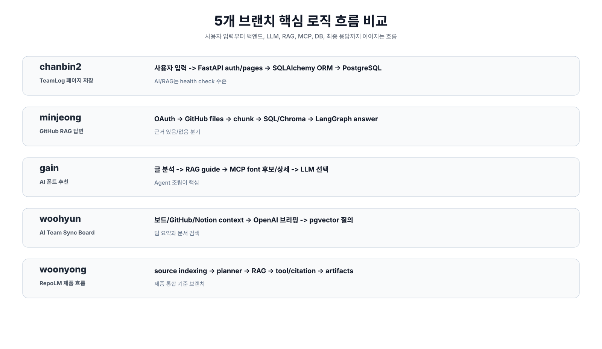

# 5개 브랜치 핵심 로직 흐름도

이 폴더는 각 브랜치의 “서비스가 실제로 어떻게 움직이는가”를 시퀀스 중심으로 정리한다.
기존 [브랜치 아키텍처 비교](../branch-architectures/README.md)가 구성요소와 기술 스택 중심이라면, 이 문서는 사용자 입력부터 백엔드 처리, AI/RAG/MCP/DB 활용, 최종 응답까지의 흐름을 다룬다.

## 전체 비교 흐름

## 문서 목록

| 브랜치 | 담당 표기 | 핵심 흐름 | 문서 | 흐름도 |
| --- | --- | --- | --- | --- |
| `chanbin2` | 창빈2 | 로그인 후 페이지/블록을 저장하는 TeamLog 흐름 | [chanbin2-flow.md](./chanbin2-flow.md) | [SVG](./diagrams/chanbin2-flow.svg) |
| `minjeong` | 민정 | GitHub 레포 인덱싱 후 RAG/LangGraph로 답변하는 흐름 | [minjeong-flow.md](./minjeong-flow.md) | [SVG](./diagrams/minjeong-flow.svg) |
| `gain` | 가인 | 글 분석, RAG 검색, MCP 폰트 조회로 추천하는 흐름 | [gain-flow.md](./gain-flow.md) | [SVG](./diagrams/gain-flow.svg) |
| `woohyun` | 우현 | 팀 보드, GitHub, Notion을 동기화해 브리핑/RAG 답변하는 흐름 | [woohyun-flow.md](./woohyun-flow.md) | [SVG](./diagrams/woohyun-flow.svg) |
| `woonyong` | 우녕 | RepoLM source 색인, planner, RAG, artifact 생성 흐름 | [woonyong-flow.md](./woonyong-flow.md) | [SVG](./diagrams/woonyong-flow.svg) |

## 읽는 방법

- “핵심 입력”은 사용자가 화면에서 시작하는 동작이다.
- “백엔드/에이전트”는 요청을 받아 분기, 검증, 조립하는 영역이다.
- “LLM/RAG/MCP”는 브랜치에 실제 구현된 경우만 표시한다.
- “저장소”는 PostgreSQL, ChromaDB, pgvector, SQLModel/SQLAlchemy 모델을 포함한다.
- “응답”은 사용자에게 최종적으로 표시되는 화면 또는 API 응답이다.

