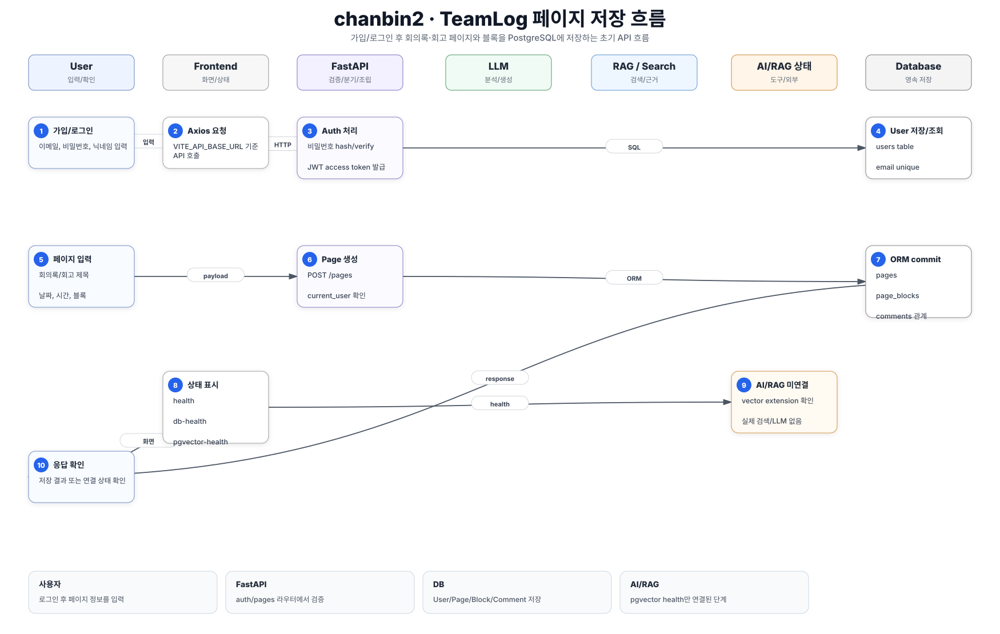

# chanbin2 핵심 로직 흐름

## 서비스 흐름 요약

`chanbin2`는 TeamLog의 초기 구현이다.
사용자는 가입/로그인 후 회의록 또는 회고 페이지를 만들고, 페이지는 블록과 함께 PostgreSQL에 저장된다.
프론트는 현재 API, DB, pgvector 연결 상태 확인이 중심이며, 실제 AI/RAG 추천 흐름은 아직 런타임에 연결되지 않았다.

## 핵심 시퀀스

| 단계 | 참여자 | 처리 |
| --- | --- | --- |
| 1 | 사용자 | 이메일, 비밀번호, 닉네임으로 가입하거나 로그인한다. |
| 2 | Frontend | Axios client가 `VITE_API_BASE_URL` 기준으로 FastAPI에 요청한다. |
| 3 | Backend Auth Router | `POST /auth/signup`, `POST /auth/login`, `GET /auth/me`를 처리한다. |
| 4 | Security | 비밀번호를 hash/verify하고 JWT access token을 발급한다. |
| 5 | 사용자 | 회의록/회고 페이지 생성 정보를 입력한다. |
| 6 | Backend Pages Router | `POST /pages`에서 현재 사용자와 payload를 검증한다. |
| 7 | ORM | `Page`, `PageBlock`, `User`, `Comment` 모델이 SQLAlchemy session에 연결된다. |
| 8 | Database | PostgreSQL에 page와 block을 transaction으로 저장한다. |
| 9 | Backend | Pydantic response model로 필요한 필드만 반환한다. |
| 10 | Frontend | 페이지 생성 결과 또는 연결 상태를 화면에 표시한다. |

## 데이터 저장 흐름

## AI/RAG 관점

- `/pgvector-health`는 PostgreSQL vector extension 활성 여부만 확인한다.
- RAG chunking, embedding, vector search, LLM 답변은 아직 실제 요청 흐름에 없다.
- 문서 폴더에는 RAG/MCP 학습 자료가 있으므로 이후 구현 방향의 설계 자료로 볼 수 있다.

## 핵심 코드 기준

- `backend/app/main.py`: FastAPI 생성, CORS, health check
- `backend/app/routers/auth.py`: 가입, 로그인, 현재 사용자 조회
- `backend/app/routers/pages.py`: 페이지 생성/조회 API
- `backend/app/models/page.py`: Page와 PageBlock, Comment 관계
- `frontend/src/App.tsx`: API/DB/pgvector 연결 상태 확인 화면

## 사용자가 보는 결과

- API 서버 상태
- PostgreSQL 연결 상태
- pgvector extension 상태
- 가입/로그인 성공 시 JWT 기반 사용자 세션
- 페이지 생성 API 성공 시 저장된 페이지 응답

