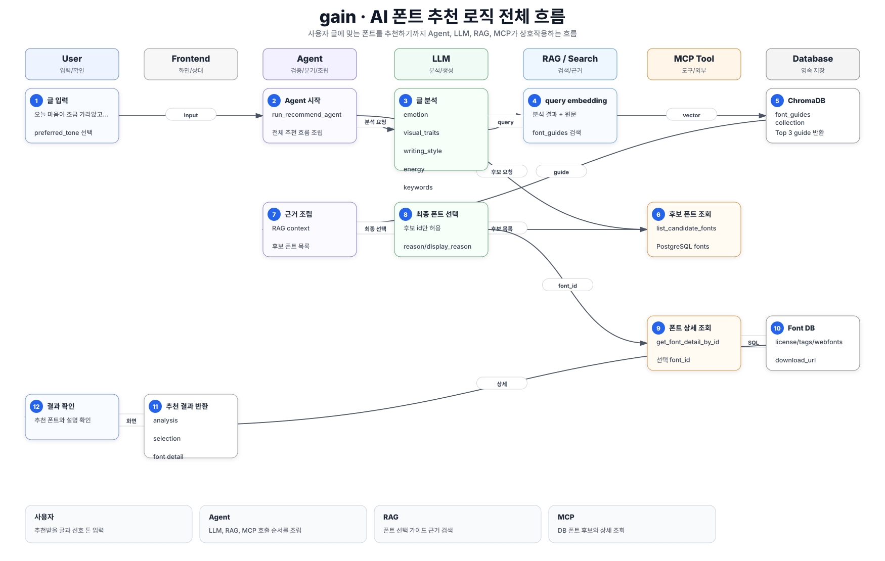
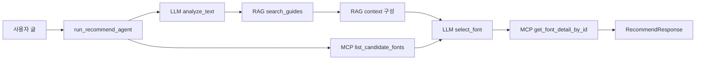

# gain 핵심 로직 흐름

## 서비스 흐름 요약

`gain`은 사용자의 글을 입력받아 어울리는 폰트를 추천한다.
흐름은 첨부 예시처럼 `사용자 입력 -> Agent -> LLM 분석 -> RAG 검색 -> MCP 후보/상세 조회 -> LLM 최종 선택 -> 추천 결과 반환`으로 이어진다.

## 핵심 시퀀스

| 단계 | 참여자 | 처리 |
| --- | --- | --- |
| 1 | 사용자 | 글 내용과 선호 톤을 입력한다. |
| 2 | Backend | `RecommendRequest`를 받아 `run_recommend_agent()`를 실행한다. |
| 3 | Agent | MCP로 추천 후보 폰트 목록을 가져온다. |
| 4 | LLM | 사용자 글을 감정, 시각 특성, 글쓰기 스타일, 에너지, 키워드로 구조화한다. |
| 5 | Agent | 분석 결과와 원문을 합쳐 RAG query를 만든다. |
| 6 | RAG | ChromaDB `font_guides` collection에서 관련 폰트 가이드를 찾는다. |
| 7 | Agent | 검색된 guide를 LLM이 읽기 쉬운 context로 합친다. |
| 8 | LLM | 원문, 분석 결과, RAG 근거, 후보 폰트 목록을 보고 `font_id` 하나를 선택한다. |
| 9 | MCP | 선택된 `font_id`의 상세 정보를 PostgreSQL fonts 테이블에서 조회한다. |
| 10 | Backend | 분석 결과, 선택 결과, 폰트 상세를 `RecommendResponse`로 반환한다. |
| 11 | Frontend | 추천 폰트와 사용자 설명을 표시한다. |

## Agent 조립 흐름

## LLM 역할

1차 LLM:

- 입력: 사용자 글, 선호 톤
- 출력: `AnalysisResult`
- 필드: `emotion`, `visual_traits`, `writing_style`, `energy`, `keywords`

2차 LLM:

- 입력: 원문, 분석 결과, RAG 근거, MCP 후보 폰트
- 출력: `FontSelection`
- 필드: `font_id`, `reason`, `display_reason`
- 제약: 후보 목록에 있는 `font_id`만 선택

## RAG 역할

- `data/font_guides_embedded.json`의 사전 임베딩 가이드를 ChromaDB에 저장한다.
- `search_guides(query, top_k=3)`가 query embedding과 가까운 guide를 반환한다.
- RAG는 추천 이유의 근거를 보강하지만, 폰트 실데이터와 충돌하면 후보 폰트 정보를 우선한다.

## MCP 역할

- `font_mcp/font_server.py`: `FastMCP("font-recommendation-server")`
- `list_candidate_fonts()`: 폰트 후보 요약 반환
- `get_font_detail_by_id(font_id)`: 선택 폰트 상세 반환
- `font_mcp/font_client.py`: stdio MCP client로 tool call 실행

## 핵심 코드 기준

- `backend/agent/recommend_agent.py`: 추천 agent 전체 orchestration
- `backend/models/recommend.py`: LLM structured output schema
- `backend/rag/search.py`: ChromaDB guide 검색
- `backend/rag/vector_store.py`: guide embedding upsert
- `backend/font_mcp/font_server.py`: MCP server
- `backend/font_mcp/font_client.py`: MCP client
- `backend/font_mcp/font_tools.py`: DB 폰트 조회 tool 구현

## 사용자가 보는 결과

- 글 분석 결과
- 추천된 `font_id`
- 추천 이유
- 화면 표시용 자연어 설명
- 폰트 상세 데이터: 이름, 라이선스, 태그, 설명, weight, webfont, 다운로드 URL

