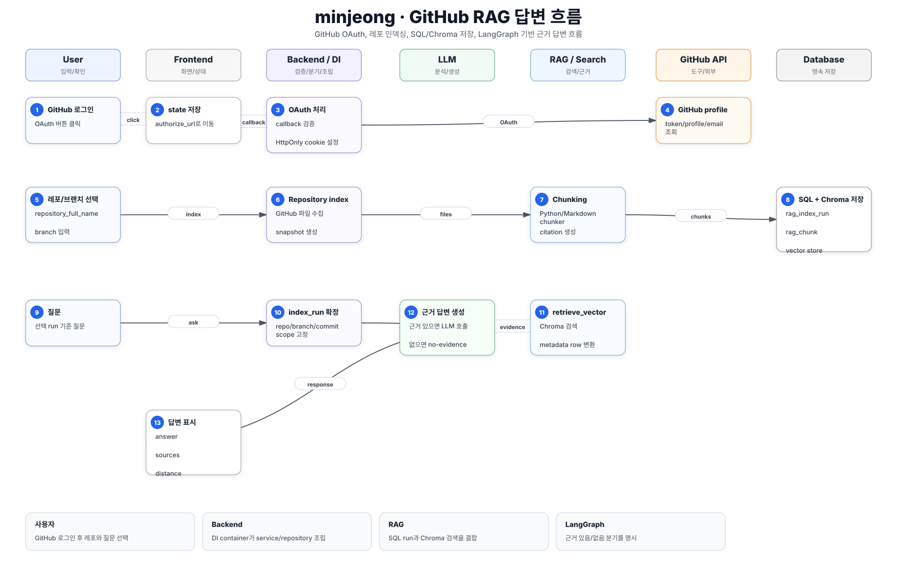
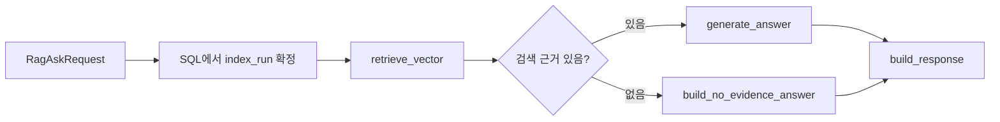

# minjeong 핵심 로직 흐름

## 서비스 흐름 요약

`minjeong`은 GitHub OAuth로 로그인한 사용자가 레포지토리를 선택하고, 해당 레포의 파일을 RAG index run으로 저장한 뒤 질문하는 흐름을 갖는다.
핵심은 `SQL에 확정된 run`과 `Chroma vector 검색`을 LangGraph answer graph가 연결한다는 점이다.

## 핵심 시퀀스

| 단계 | 참여자 | 처리 |
| --- | --- | --- |
| 1 | 사용자 | GitHub 로그인 버튼을 누른다. |
| 2 | Auth API | `GET /auth/github/login`이 authorize URL과 state를 만든다. |
| 3 | GitHub | callback으로 code/state를 전달한다. |
| 4 | Auth Service | GitHub profile/token을 검증하고 HttpOnly cookie를 설정한다. |
| 5 | 사용자 | repository full name과 branch를 입력하거나 선택한다. |
| 6 | RAG API | `GET /rag/github/repository/branches`로 브랜치 목록을 조회한다. |
| 7 | RAG Index Service | `POST /rag/github/repository/index/store`가 GitHub 파일을 가져온다. |
| 8 | Chunking Service | Python/Markdown chunker가 파일을 chunk로 나눈다. |
| 9 | SQL Repository | `rag_index_run`, `rag_file_snapshot`, `rag_chunk`를 저장한다. |
| 10 | Vector Repository | chunk embedding을 ChromaDB에 저장한다. |
| 11 | 사용자 | 선택한 run을 기준으로 질문한다. |
| 12 | LangGraph | `retrieve_vector -> route -> generate_answer/no_evidence -> build_response` 순서로 실행한다. |
| 13 | LLM | 근거 chunk가 있을 때만 답변을 생성한다. |
| 14 | Frontend | 답변과 citation source를 표시한다. |

## LangGraph 흐름

## RAG 저장 기준

- `rag_index_run`: repository, branch, commit_sha, indexed_at, file/chunk 통계
- `rag_file_snapshot`: 파일 path, sha, language, source_type, content_hash, citation
- `rag_chunk`: chunk text, chunk type, symbol, line range, metadata
- `rag_skipped_file`: 너무 크거나 처리하지 못한 파일과 이유

## 핵심 코드 기준

- `backend/app/container.py`: DI container 조립 지점
- `backend/app/rag/api/router.py`: RAG index/search/ask API
- `backend/app/rag/service/index_service.py`: SQL/Vector 저장 orchestration
- `backend/app/rag/service/answer_graph.py`: LangGraph answer graph
- `backend/app/rag/domain/*chunk*`: chunk 생성과 citation
- `frontend/src/features/repository/RepositoryWorkspace.jsx`: 레포 등록/브랜치 선택 UI
- `frontend/src/features/chatbot/ChatbotDrawer.jsx`: 챗봇 드로어 상태

## 사용자가 보는 결과

- 로그인 상태
- 레포 브랜치 목록
- RAG index run 목록
- 질문 답변
- citation, path, distance 기반 source 정보
- 근거 없을 때 no-evidence 안내

