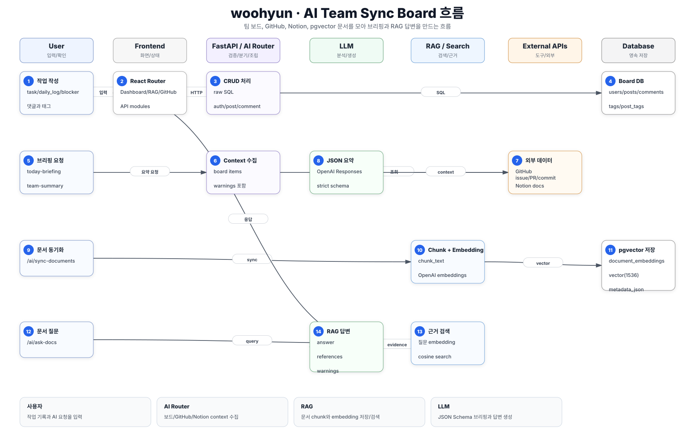
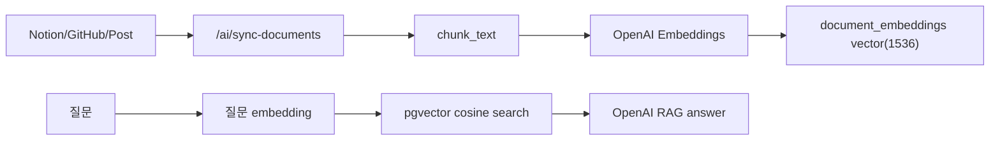

# woohyun 핵심 로직 흐름

## 서비스 흐름 요약

`woohyun`은 팀 보드 데이터를 중심으로 GitHub, Notion, OpenAI, pgvector를 연결한다.
사용자는 게시글/댓글을 작성하고, AI 기능은 보드 작업, GitHub issue/PR/commit, Notion 문서, 저장된 embedding을 모아 오늘 브리핑, 팀 요약, 문서 질의를 만든다.

## 핵심 시퀀스

| 단계 | 참여자 | 처리 |
| --- | --- | --- |
| 1 | 사용자 | 로그인 후 게시글, 작업, 댓글, 태그를 작성한다. |
| 2 | Frontend | React Router 페이지와 API module이 FastAPI에 요청한다. |
| 3 | Backend | `main.py`가 raw SQL로 auth/post/comment CRUD를 처리한다. |
| 4 | Database | users, posts, comments, tags, post_tags에 팀 작업 데이터가 저장된다. |
| 5 | 사용자 | 오늘 브리핑 또는 팀 요약을 요청한다. |
| 6 | AI Router | `/ai/today-briefing` 또는 `/ai/team-summary`가 context를 수집한다. |
| 7 | External Services | GitHub issue/PR/commit, Notion docs를 조회한다. |
| 8 | LLM | OpenAI Responses API가 JSON Schema에 맞춘 브리핑/요약을 생성한다. |
| 9 | 사용자 | 문서 동기화를 실행한다. |
| 10 | RAG Service | Notion/GitHub/Post 데이터를 chunk로 나누고 embedding을 만든다. |
| 11 | Database | `document_embeddings`에 vector(1536)과 metadata를 저장한다. |
| 12 | 사용자 | `/ai/ask-docs`로 질문한다. |
| 13 | RAG Search | 질문 embedding과 cosine search로 근거 chunk를 찾는다. |
| 14 | LLM | 근거와 질문을 바탕으로 JSON Schema 답변을 만든다. |

## RAG 동기화 흐름

## AI 요약 흐름

- `collect_today_context()`: 내 board item, GitHub assigned issue, PR, recent commits, Notion docs 수집
- `collect_team_context()`: 팀 board item, GitHub issue/PR/commit, Notion docs 수집
- `generate_today_briefing()`: JSON Schema 기반 오늘 브리핑 생성
- `generate_team_summary()`: JSON Schema 기반 팀 요약 생성
- OpenAI 호출 실패 시 fallback 응답 제공

## 데이터 저장 기준

- `users`: 이메일, 비밀번호 해시, 닉네임, GitHub username, role
- `posts`: task/daily_log/blocker/discussion 형태의 작업 기록
- `comments`: 게시글 댓글
- `tags`, `post_tags`: 태그 검색용 관계
- `notion_documents`: Notion 문서 원문과 동기화 시간
- `document_embeddings`: source_type, source_id, chunk_text, embedding, metadata_json

## 핵심 코드 기준

- `backend/app/main.py`: 인증, 게시글, 댓글 raw SQL API
- `backend/app/routers/ai.py`: AI 브리핑/RAG API
- `backend/app/services/ai_service.py`: OpenAI JSON Schema 호출
- `backend/app/services/rag_service.py`: 문서 동기화, chunking, embedding, 검색
- `backend/app/services/embedding_service.py`: OpenAI embedding 생성
- `backend/sql/005_create_rag_tables.sql`: pgvector RAG 테이블
- `frontend/src/pages/RagPage.jsx`: RAG 화면
- `frontend/src/api/aiApi.js`, `ragApi.js`: AI/RAG API 호출

## 사용자가 보는 결과

- 팀 작업 목록과 댓글
- GitHub/Notion 기반 오늘 브리핑
- 팀 전체 요약
- 동기화된 문서 기반 질의 답변
- source reference와 warning 정보

