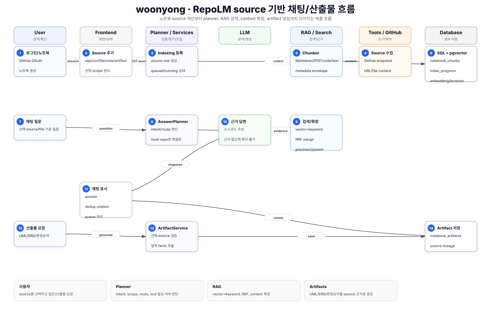
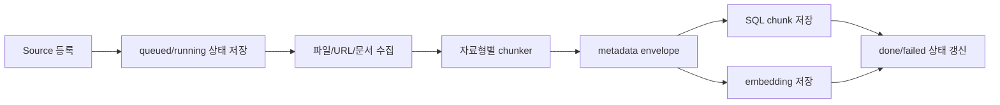

# woonyong 핵심 로직 흐름

## 서비스 흐름 요약

`woonyong`은 RepoLM 제품 브랜치다.
사용자는 노트북을 만들고, GitHub 레포/문서/메모/산출물을 source로 등록한다.
백엔드는 source를 SQL과 pgvector에 색인하고, 채팅 시 planner가 질문 의도를 분류한 뒤 선택된 source/file scope 안에서 RAG 검색, context 확장, tool 사용, 답변 생성을 수행한다.

## 핵심 시퀀스

| 단계 | 참여자 | 처리 |
| --- | --- | --- |
| 1 | 사용자 | GitHub OAuth로 로그인한다. |
| 2 | Auth API | callback 처리 후 session cookie를 설정한다. |
| 3 | 사용자 | 노트북을 만들고 source를 추가한다. |
| 4 | Notebook API | `POST /notebooks/{id}/sources`가 source row를 만들고 indexing job을 등록한다. |
| 5 | Indexing Service | 파일/URL/문서/레포 snapshot을 수집한다. |
| 6 | Chunker | Markdown, PDF, code, text/url 자료형별로 metadata-rich chunk를 생성한다. |
| 7 | Storage | `notebook_sources`, `notebook_chunks`, `notebook_index_progress`에 상태와 chunk를 저장한다. |
| 8 | Vector/Keyword Index | pgvector embedding과 PostgreSQL tsvector 검색 필드를 유지한다. |
| 9 | 사용자 | 채팅 질문을 보낸다. |
| 10 | AnswerPlanner | intent, route, source/file scope, 검색/도구 필요 여부를 결정한다. |
| 11 | Retriever | 선택된 source/file 안에서 vector/keyword 검색을 수행한다. |
| 12 | Combiner/Expander | RRF 병합 후 parent/prev/next chunk를 token budget 안에서 확장한다. |
| 13 | Trust/Tool | 소스코드 근거를 docs보다 우선하고 scope 제한 tool을 준비한다. |
| 14 | LLM/Answerer | 근거 기반 답변을 생성하고 citation을 만든다. |
| 15 | Chat Store | user/assistant message와 citation을 저장한다. |
| 16 | Artifact Service | UML/ERD/변경요약 요청 시 선택 source에서 정적 facts를 추출해 산출물을 저장한다. |

## 채팅 처리 흐름

```mermaid
flowchart LR
    question["질문"] --> planner["AnswerPlanner"]
    planner --> scope["source/file scope"]
    scope --> search["ChunkStore search"]
    search --> rrf["RRF merge"]
    rrf --> expand["ContextExpander"]
    expand --> codeFirst["소스코드 우선순위"]
    codeFirst --> tools["ToolRegistry"]
    tools --> answer["LLM answerer"]
    answer --> citation["citation 생성"]
    citation --> store["chat message 저장"]
```

## Source 색인 흐름

## Artifact 생성 흐름

- UML: Python/TS class/interface를 정적 파싱해 Mermaid `classDiagram`으로 생성
- ERD: ORM/SQL 테이블과 FK/relationship을 추출해 `erDiagram`으로 생성
- 변경요약: 최근 커밋과 코드 facts를 기준으로 Markdown 생성
- Note: 사용자가 직접 작성하거나 채팅 내용을 source로 되돌릴 수 있는 텍스트 산출물

## 데이터 저장 기준

Notebook:

- `notebooks`
- `notebook_sources`
- `notebook_chunks`
- `notebook_index_progress`
- `notebook_chat_messages`
- `notebook_artifacts`

Repo RAG:

- `repository_connections`
- `branch_snapshots`
- `source_files`
- `source_chunks`
- `sync_jobs`
- `sync_events`

## 핵심 코드 기준

- `backend/app/notebooks/api/router.py`: notebook/source/chat/artifact API
- `backend/app/notebooks/application/chat_service.py`: planner, RAG, tool, answer orchestration
- `backend/app/notebooks/application/indexing_service.py`: source indexing
- `backend/app/notebooks/domain/chunking.py`: 자료형별 chunk envelope
- `backend/app/notebooks/application/context_expander.py`: parent/prev/next 확장
- `backend/app/notebooks/application/trust.py`: source trust/conflict 처리
- `backend/app/notebooks/infrastructure/code_scaffold.py`: UML/ERD/변경요약 정적 생성
- `apps/web/src/components/chat-view.tsx`: 채팅 UI와 queue
- `apps/web/src/components/source-panel.tsx`: source 상태/선택 UI

## 사용자가 보는 결과

- source별 색인 진행률과 chunk count
- 선택 source/file 기준 채팅 답변
- 중복 제거된 citation chip
- 근거 부족 답변
- 여러 repo 선택 시 범위 재질문
- UML, ERD, 변경요약, note 산출물

