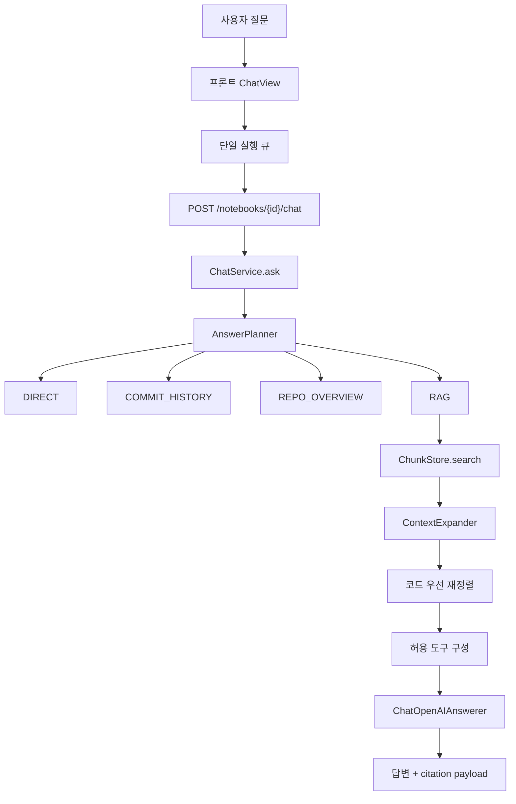

# AI 에이전트와 LLM 처리 흐름

## 1. 최소 AI 에이전트 구조

가장 단순한 LLM 앱은 다음 흐름이다.

```python
question = "이 레포는 어떤 프로젝트야?"
context = search(question)
prompt = f"근거:\n{context}\n\n질문:\n{question}"
answer = llm.invoke(prompt)
```

이 구조는 쉽지만 한계가 있다.

- 어떤 질문은 RAG 검색이 필요 없는데도 매번 검색한다.
- 어떤 질문은 커밋 이력, 파일 원문, 심볼 검색이 필요하다.
- 검색 결과가 부족하면 LLM이 추측할 수 있다.
- 여러 소스가 선택되었을 때 어느 범위를 기준으로 답할지 불명확하다.

RepoLM은 그래서 다음 단계로 확장되어 있다.



## 2. 프론트 입력 큐

파일: `apps/web/src/components/chat-view.tsx`

채팅 중 새 입력이 들어오면 바로 병렬 실행하지 않고 큐에 담는다.

```typescript
interface QueuedQuestion {
  id: string;
  question: string;
  messageId: string;
  diagram: "uml" | "erd" | "dependency" | null;
}
```

필드 의미:

- `id`: 큐 항목 식별자다.
- `question`: 사용자가 입력한 원문이다.
- `messageId`: 화면에 낙관적으로 추가한 사용자 메시지와 연결된다.
- `diagram`: 텍스트 채팅이 아니라 UML/ERD/의존성 생성 요청이면 타입이 들어간다.

큐 처리:

```typescript
useEffect(() => {
  if (sending || runningRef.current || queuedQuestions.length === 0) return;
  const next = queuedQuestions[0];
  setQueuedQuestions((prev) => prev.slice(1));
  void runQuestion(next);
}, [queuedQuestions, runQuestion, sending]);
```

라인별 의미:

- `sending`: 현재 요청이 진행 중이면 다음 항목을 실행하지 않는다.
- `runningRef.current`: React state 갱신 지연 때문에 동시에 실행될 수 있는 틈을 ref로 막는다.
- `queuedQuestions[0]`: 큐의 첫 질문만 꺼낸다.
- 먼저 큐에서 제거한 뒤 실행해 재진입을 막는다.

한글 IME 중복 전송 방지:

```typescript
function isImeComposing(event, compositionActive) {
  return compositionActive || event.nativeEvent.isComposing || event.nativeEvent.keyCode === 229;
}
```

`Enter` 처리:

- `Shift+Enter`: 줄바꿈
- `Enter`: IME 조합 중이 아니면 전송
- 조합 종료 직후 `IME_ENTER_SUPPRESS_MS` 동안은 전송 억제

## 3. 다이어그램 생성 의도 감지

과거 버그:

- "클래스 다이어그램을 보면 무슨 서비스라고 생각해?"는 다이어그램을 해석하라는 질문이다.
- 하지만 "다이어그램" 단어만 보고 UML 생성으로 오해해 뷰어로 이동했다.

현재 기준:

```typescript
const VISUALIZE_CUE =
  /(그려|그림|만들어|생성|시각화|보여|작성|도식|그래프로|diagram|draw|generate|create|visuali[sz]e|render)/i;
const DEFINITIONAL_CUE = /(뭐야|뭔가요|무엇|이란|개념|차이|장단점|what\s+is|difference)/i;

function detectDiagramIntent(question: string) {
  if (DEFINITIONAL_CUE.test(question)) return null;
  if (!VISUALIZE_CUE.test(question)) return null;
  if (/\berd\b|엔티티\s*관계|테이블\s*관계/i.test(question)) return "erd";
  if (/uml|클래스\s*다이어그램|class\s*diagram/i.test(question)) return "uml";
  if (/의존성|dependency|모듈\s*의존|import\s*관계/i.test(question)) return "dependency";
  return null;
}
```

핵심:

- 정의/해석 질문이면 `null`을 반환해 일반 채팅으로 보낸다.
- 생성 동사가 있을 때만 산출물 생성으로 라우팅한다.
- UML/ERD/의존성 키워드는 생성 동사 이후의 세부 타입 판단에만 쓴다.

## 4. 백엔드 planner

파일: `backend/app/notebooks/application/answer_planner.py`

Planner는 "판단자"다. 직접 검색하거나 LLM을 부르지 않는다. 어떤 route로 갈지만 결정한다.

```python
class AnswerRoute(Enum):
    DIRECT = "direct"
    COMMIT_HISTORY = "commit_history"
    REPO_OVERVIEW = "repo_overview"
    RAG = "rag"
```

route 의미:

- `DIRECT`: 인사, 잡담, 소스 없는 일반 질문처럼 RAG가 필요 없는 경우
- `COMMIT_HISTORY`: "최근 커밋", "마지막 변경" 같은 질문
- `REPO_OVERVIEW`: "이 레포 뭐야", "무슨 프로젝트야" 같은 개요 질문
- `RAG`: 코드, 문서, 오류, 구조 질문처럼 검색이 필요한 경우

```python
class DeterministicAnswerPlanner:
    def plan(self, question: str, *, has_sources: bool, source_count: int) -> AnswerPlan:
        intent = classify_intent(question, has_sources=has_sources)
        if should_skip_rag(intent, has_sources=has_sources):
            return AnswerPlan(route=AnswerRoute.DIRECT, intent=intent)
        if _is_commit_history_question(question):
            return AnswerPlan(route=AnswerRoute.COMMIT_HISTORY, intent=intent)
        if _is_repo_overview_question(question):
            return AnswerPlan(route=AnswerRoute.REPO_OVERVIEW, intent=intent)
        search_plan = plan_search(...)
        return AnswerPlan(route=AnswerRoute.RAG, intent=intent, search_plan=search_plan)
```

판단 순서:

1. 의도 분류
2. RAG 생략 가능 여부
3. 커밋 이력 질문인지 확인
4. 레포 개요 질문인지 확인
5. 나머지는 검색 계획 생성

## 5. 검색 계획

파일: `backend/app/notebooks/application/search_planner.py`

```python
class SearchStrategy(Enum):
    VECTOR_ONLY = "vector_only"
    KEYWORD_ONLY = "keyword_only"
    HYBRID = "hybrid"
    MULTI_QUERY = "multi_query"
```

현재 핵심 전략:

- 코드 질문: `HYBRID`, 질문에서 클래스/함수/경로 식별자를 추가 query로 만든다.
- 아키텍처 질문: `HYBRID`, top_k를 높인다.
- 버그 질문: `HYBRID`, 에러 키워드와 HTTP status code를 추가 query로 만든다.
- 일반 질문: `VECTOR_ONLY`, 낮은 top_k를 쓴다.

## 6. ChatService 시퀀스

파일: `backend/app/notebooks/application/chat_service.py`

```python
def ask(self, notebook_id: str, *, question: str, source_ids=None, file_paths=None, owner_user_id=...):
    normalized_question = question.strip()
    self.store.get_notebook(notebook_id, owner_user_id=owner_user_id)
    sources = self.store.list_sources(notebook_id)
    selected = select_sources(sources, source_ids)
    chat_history = self.store.list_chat_messages(notebook_id)
```

의미:

- 질문 공백을 제거한다.
- 노트북 owner를 확인한다. 다른 계정이 같은 노트북을 보는 버그를 막는 핵심이다.
- 선택된 소스 scope를 계산한다.
- 이전 대화를 가져와 follow-up 질문 재작성에 쓴다.

```python
if chat_history and self.answerer and hasattr(self.answerer, "reformulate"):
    standalone_question = self.answerer.reformulate(normalized_question, chat_history)
```

의미:

- "그럼 그 파일은?" 같은 질문을 검색 가능한 독립 질문으로 재작성한다.
- 실패하면 원문 질문을 그대로 쓴다.

```python
answer_plan = self._answer_planner().plan(
    standalone_question,
    has_sources=has_sources,
    source_count=len(selected),
)
```

의미:

- LLM 호출 전에 deterministic planner로 route를 정한다.
- 일반 채팅 본류는 LangGraph가 아니라 이 결정론 planner를 먼저 탄다.

```python
if _should_ask_repo_scope(standalone_question, selected):
    result = _repo_scope_clarification_result(selected)
```

의미:

- 서로 다른 repo가 여러 개 선택되어 있고 질문이 모호하면 답변하지 않고 기준 repo를 묻는다.
- 같은 repo의 여러 브랜치는 질문에 따라 브랜치별로 나누어 답하는 것이 자연스러워 묻지 않는다.

```python
results_per_query = [
    self.chunk_store.search(
        notebook_id,
        query_embedding=self.embedder.embed_query(query),
        query_text=query,
        source_ids=search_source_ids,
        top_k=plan.top_k,
        file_paths=file_paths,
    )
    for query in plan.queries
]
hits = combine_search_results(results_per_query, top_k=plan.top_k)
```

의미:

- 각 query를 embedding으로 변환한다.
- 같은 query text로 keyword search도 같이 수행한다.
- source_ids와 file_paths가 검색 단계에 직접 들어가 선택 범위를 강제한다.
- 여러 query 결과는 RRF로 병합한다.

```python
hits = self._context_expander().expand(...)
hits = _prioritize_source_code_hits(...)
tools = self._build_tools(...)
result = self._result_from_hits(...)
```

의미:

- top chunk 앞뒤/부모 청크를 예산 안에서 확장한다.
- 코드 질문이면 docs/README보다 실제 code/schema/config를 먼저 배치한다.
- planner가 허용한 도구만 LLM에 노출한다.
- 최종 답변과 citation을 만든다.

## 7. 도구 사용 에이전트 루프

파일: `backend/app/notebooks/infrastructure/chat_answerers.py`

일반 채팅에서 사용하는 도구는 MCP가 아니라 인프로세스 도구다.

```python
for _ in range(_MAX_TOOL_STEPS):
    response = model.invoke(messages)
    messages.append(response)
    calls = getattr(response, "tool_calls", None) or []
    if not calls:
        return coerce_text(getattr(response, "content", response)).strip()
    for call in calls:
        tool = tool_by_name.get(call.get("name"))
        result = tool.invoke(call.get("args", {}))
        messages.append(ToolMessage(content=str(result), tool_call_id=call.get("id", "")))
```

루프 의미:

1. LLM이 현재 근거와 질문을 보고 답변하거나 tool call을 낸다.
2. tool call이 없으면 답변을 반환한다.
3. tool call이 있으면 해당 tool을 실행한다.
4. tool 결과를 `ToolMessage`로 다시 LLM에 넣는다.
5. 최대 `_MAX_TOOL_STEPS`까지만 반복해 무한루프를 막는다.

현재 노출 가능한 도구:

- `search_indexed_code(query)`: 인덱싱된 chunk에서 다시 검색
- `find_symbol(name)`: repo snapshot 원문에서 class/def 위치 검색
- `read_source_file(path)`: 선택 scope 안의 파일 원문 읽기

도구는 `source_ids`와 `file_paths` scope를 클로저로 잡는다. 선택되지 않은 소스나 파일을 읽지 못하게 하는 장치다.

## 8. LangGraph 제안 그래프

파일: `backend/app/pipeline/agent_graph.py`

LangGraph는 현재 일반 채팅보다 pipeline proposal 생성 쪽에 연결되어 있다.

```mermaid
flowchart TD
    start(["START"]) --> gather["gather_evidence"]
    gather --> agent["agent"]
    agent --> should{"tool_calls 있음?"}
    should -- "yes, step <= max_steps" --> execute["execute_tools"]
    execute --> agent
    should -- "no 또는 한도 초과" --> draft["draft"]
    draft --> end(["END"])
```

상태 타입:

```python
class _GraphState(TypedDict):
    references: list[CodeReference]
    chunks: list[RetrievalChunk]
    evidence: dict[str, list[str]]
    drafts: list[ProposalDraft]
    messages: list[Any]
    step_count: int
```

필드 의미:

- `references`: AST 코드 인덱싱 결과
- `chunks`: RAG 검색/인덱싱 청크
- `evidence`: 파일별 citation map
- `drafts`: 최종 제안 목록
- `messages`: System/Human/AI/Tool 메시지 누적 목록
- `step_count`: tool loop 제한용 카운터

노드 역할:

- `gather_evidence`: 코드 참조와 chunk를 system/human prompt로 정리한다.
- `agent`: MCP 도구를 LangChain tool로 붙이고 LLM을 호출한다.
- `execute_tools`: LLM이 요청한 MCP tool을 호출하고 ToolMessage를 추가한다.
- `draft`: 마지막 AI 응답을 Pydantic parser로 `ProposalDraft` 목록으로 변환한다.

## 9. LLM이 무엇을 선택하는가

RepoLM에는 선택 지점이 두 종류 있다.

첫째, deterministic 선택:

- `AnswerPlanner`: route 선택
- `SearchPlanner`: query/top_k/strategy 선택
- `ChatService._build_tools`: 노출할 도구 선택
- `artifactScopeWarning`: 여러 repo 선택 시 UML/ERD 생성 차단

둘째, LLM 선택:

- `ChatOpenAIAnswerer`: 답변 문체와 내용 구성
- tool loop: 주어진 도구 중 호출 여부와 인자 선택
- `LangGraphProposer`: MCP tool 호출 여부와 최종 proposal JSON 생성
- `ChatOpenAIArtifactGenerator`: change summary를 자연어로 재정리

이렇게 나눈 이유:

- 권한, scope, route는 예측 가능한 코드로 결정해야 안전하다.
- 자연어 요약, 해석, 설명은 LLM이 맡는 편이 품질이 좋다.
- 파일 읽기/검색 도구는 LLM이 고를 수 있지만, 어떤 도구를 열어줄지는 planner가 제한한다.

