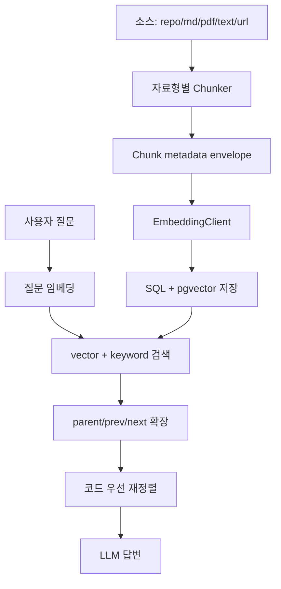

# RAG, 임베딩, SQL 저장 구조

## 1. RAG 한 사이클

RAG는 Retrieval-Augmented Generation의 약자다. RepoLM에서 한 사이클은 다음과 같다.



## 2. 임베딩 문법 예시

기본 형태:

```python
texts = ["class UserService: ...", "README content ..."]
vectors = embedder.embed_documents(texts)
query_vector = embedder.embed_query("UserService가 뭐야?")
```

RepoLM의 실제 구현:

```python
class DeterministicEmbeddingClient:
    def embed_documents(self, texts: list[str]) -> list[list[float]]:
        return [self._embed(text) for text in texts]

    def embed_query(self, text: str) -> list[float]:
        return self._embed(text)
```

의미:

- 테스트와 로컬 환경에서는 외부 API 없이 deterministic hash embedding을 쓴다.
- OpenAI provider가 설정되면 `OpenAIEmbeddingClient`가 langchain-openai `OpenAIEmbeddings`를 사용한다.
- 모델 기본값은 `text-embedding-3-small`이다.
- embedding dimension은 설정값과 DB vector column 차원과 맞아야 한다.

해시 임베딩 원리:

```python
for token in _tokenize(text):
    digest = sha256(token.encode("utf-8")).digest()
    index = int.from_bytes(digest[:4], "big") % self._dimension
    sign = 1.0 if digest[4] & 1 else -1.0
    vector[index] += sign
return _l2_normalize(vector)
```

의미:

- 텍스트를 토큰으로 나눈다.
- 각 토큰을 sha256으로 해시한다.
- 해시값으로 vector index를 고른다.
- 부호를 더하거나 빼서 sparse-like vector를 만든다.
- L2 normalize로 cosine search에 맞춘다.

## 3. 청크 envelope

노트북 chunk SQL 모델은 `backend/app/notebooks/infrastructure/models.py`의 `NotebookChunkModel`이다.

저장 필드:

- `id`: chunk id
- `notebook_id`: 어느 노트북의 chunk인지
- `source_id`: 어느 source에서 왔는지
- `file_path`: repo 파일 경로
- `chunk_index`: source 내 순서
- `language`: python, markdown, code, sql, config, text, pdf, url
- `format`: 표시/처리 형식
- `heading_path`: markdown/pdf heading 계층
- `page`: PDF page 번호
- `start_line`, `end_line`: 코드/문서 라인 범위
- `start_offset`, `end_offset`: 텍스트 offset 범위
- `content_hash`: 원문 내용 hash
- `parent_chunk_id`, `prev_chunk_id`, `next_chunk_id`: context expansion용 링크
- `text`: chunk 본문
- `embedding`: pgvector vector
- `content_tsv`: Postgres full-text search vector
- `created_at`: 생성 시각

왜 이렇게 저장하는가:

- citation에 파일/라인을 표시하려면 `file_path`, `start_line`, `end_line`이 필요하다.
- PDF와 Markdown처럼 구조가 있는 문서는 `heading_path`, `page`가 있어야 맥락을 복원할 수 있다.
- 검색 결과가 너무 짧을 때 `prev/next/parent`를 따라 주변 문맥을 추가할 수 있다.
- 삭제/재색인에서 같은 내용인지 판단하려면 `content_hash`가 필요하다.

## 4. 자료형별 청킹

파일: `backend/app/repo_rag/domain/chunking.py`

### 지원 확장자

```python
SUPPORTED_LANGUAGES = {
    ".py": "python",
    ".pyi": "python",
    ".md": "markdown",
    ".markdown": "markdown",
    ".ts": "code",
    ".tsx": "code",
    ".js": "code",
    ".jsx": "code",
    ".sql": "sql",
    ".json": "config",
    ".yaml": "config",
    ".yml": "config",
    ".toml": "config",
    ".txt": "text",
    ".pdf": "pdf",
}
```

현재 지원:

- Python: AST 기반 class/function chunk
- Markdown: heading 기반 section chunk
- TS/JS/SQL/config: 구조화 전용 파서까지는 아니고 code-like/text split 기반 chunk
- Text: recursive split
- PDF: page separator(`\f`) 기반 page chunk
- URL: fetcher로 본문 추출 후 text chunker 사용

### Python 청킹

```python
tree = ast.parse(content_text)
chunks = [
    self._build_symbol_chunk(file_context, lines, node)
    for node in ast.walk(tree)
    if _is_python_chunk_node(node)
]
chunks.insert(0, _file_summary_draft(file_context, "python_file_summary"))
```

의미:

- Python 파일을 AST로 파싱한다.
- `ClassDef`, `FunctionDef`, `AsyncFunctionDef`를 symbol chunk로 만든다.
- 파일 전체 맥락을 잃지 않게 `python_file_summary`를 앞에 추가한다.
- 문법 오류가 있으면 plain text fallback chunk를 만든다.

### Markdown 청킹

```python
sections = build_markdown_sections(lines, default_heading=file_context.path)
for section in sections:
    parts = self.text_splitter_service.split(section.text)
```

의미:

- `#`부터 `######`까지 heading을 계층으로 읽는다.
- section이 크면 overlap split을 적용한다.
- `heading_path`를 유지해 citation과 맥락 복원에 쓴다.

### PDF 청킹

```python
pages = _split_pdf_pages(file_context.content)
for page_number, page_text in pages:
    for draft in _split_with_offsets(...):
        draft.page = page_number
        draft.heading_path = _detect_heading_path(page_text)
```

의미:

- PDF 텍스트가 `\f`로 page 구분되어 있으면 page별로 나눈다.
- page 번호를 metadata에 넣는다.
- 첫 의미 있는 줄을 heading 후보로 추정한다.
- page text가 길면 recursive splitter로 overlap split한다.

### TS/JS/SQL/config/text 청킹

```python
class CodeLikeChunker(SplitTextChunker):
    def build_chunks(self, file_context: FileContext) -> list[ChunkDraft]:
        drafts = [_file_summary_draft(file_context, f"{self.language}_file_summary")]
        drafts.extend(super().build_chunks(file_context))
        return drafts
```

의미:

- TS/JS/SQL은 현재 full AST 파서가 아니라 text split 기반이다.
- 파일 summary chunk를 먼저 추가해 전체 파일 목적을 잃지 않게 한다.
- 추후 TypeScript AST, SQL parser를 붙일 수 있는 확장 지점이다.

## 5. TextSplitter

파일: `backend/app/repo_rag/domain/text_splitter.py`

```python
DEFAULT_CHUNK_SIZE = 800
DEFAULT_CHUNK_OVERLAP = 120
TEXT_SPLIT_SEPARATORS = ["\n\n", "\n", " ", ""]
```

의미:

- 기본 chunk 크기는 800자다.
- overlap은 120자다.
- 문단, 줄, 공백, 문자 순서로 자연스러운 분할을 시도한다.
- `langchain_text_splitters`가 있으면 `RecursiveCharacterTextSplitter`를 쓰고, 없으면 자체 fallback을 쓴다.

## 6. 노트북 인덱싱 흐름

파일: `backend/app/notebooks/application/indexing_service.py`

```python
def index_source(self, notebook_id: str, source_id: str, *, resync_repo: bool = False) -> None:
    source = self.store.get_source(notebook_id, source_id)
    if should_sync_repo:
        source, resync_error = self._resync_repo(source)
    self.chunk_store.delete_by_source(source_id)
    file_chunks = _plan_files(source, self.url_fetcher)
    self.registry.update(source_id, _start(file_chunks))
    for file in file_chunks:
        chunks = self._build_chunks(source, file, created_at)
        self.chunk_store.add_many(chunks)
        self.registry.update(source_id, _mark_file_done(file.path, len(chunks)))
    self.registry.update(source_id, _finish(self.clock()))
```

단계:

1. source row 조회
2. repo 소스면 필요 시 최신 snapshot 재수집
3. 기존 source chunk 삭제
4. 자료형별 chunk 계획 생성
5. 진행 상태를 `running`으로 표시
6. 파일별 chunk 생성 + embedding 생성
7. `notebook_chunks`에 저장
8. 진행 상태를 `done`으로 표시

## 7. 검색 흐름

파일: `backend/app/notebooks/infrastructure/sql_chunk_store.py`

```python
vector_scores = self._vector_candidates(...)
keyword_scores = self._keyword_candidates(...)
fused[chunk_id] += VECTOR_WEIGHT * score
fused[chunk_id] += KEYWORD_WEIGHT * score
```

의미:

- vector score는 pgvector cosine distance 기반이다.
- keyword score는 Postgres `websearch_to_tsquery` + `ts_rank_cd` 기반이다.
- 기본 가중치는 vector 0.7, keyword 0.3이다.
- 두 검색 결과를 chunk id 기준으로 합산한다.

scope 필터:

```python
filters = [NotebookChunkModel.notebook_id == notebook_id]
if source_ids is not None:
    filters.append(NotebookChunkModel.source_id.in_(source_ids))
if file_paths is not None:
    filters.append(or_(NotebookChunkModel.file_path.is_(None), NotebookChunkModel.file_path.in_(file_paths)))
```

의미:

- 선택된 notebook 안에서만 검색한다.
- 선택된 source가 있으면 그 source만 검색한다.
- 선택된 file path가 있으면 repo chunk는 그 파일만 후보가 된다.
- file_path가 없는 md/text/pdf chunk는 source 단위 선택으로 유지된다.

## 8. SQL을 쓰는 이유

RepoLM은 SQL을 단순 저장소가 아니라 제품 상태의 기준으로 쓴다.

SQL에 저장하는 것:

- 사용자별 notebook
- source metadata
- repo snapshot
- chat message
- artifact
- chunk text
- chunk embedding
- indexing progress
- sync job/event
- repo file/chunk lifecycle

왜 필요한가:

- 백엔드 재시작 후에도 색인 상태와 대화 기록이 남아야 한다.
- source 삭제 시 chunk까지 함께 제외되어야 한다.
- 여러 사용자가 각자의 notebook만 봐야 한다.
- RAG 검색은 vector index와 full-text index가 필요하다.
- sync job은 worker가 다시 집어 처리할 수 있어야 한다.

## 9. 노트북 SQL과 Repo RAG SQL의 차이

노트북 SQL:

- `notebooks`
- `notebook_sources`
- `notebook_chunks`
- `notebook_index_progress`
- `notebook_chat_messages`
- `notebook_artifacts`

역할:

- 사용자 제품 화면의 단위다.
- 사용자가 직접 추가한 repo/md/pdf/text/url과 생성 artifact를 저장한다.
- 채팅 검색은 주로 `notebook_chunks`를 본다.

Repo RAG SQL:

- `repository_connections`
- `branch_snapshots`
- `source_files`
- `source_chunks`
- `sync_jobs`
- `sync_events`

역할:

- `/pipeline/sync`와 worker 기반 repo indexing 파이프라인의 단위다.
- 파일 diff, soft delete, chunk activation을 관리한다.
- proposal/automation 흐름과 연결된다.

## 10. 코드 우선 신뢰도

채팅에서는 docs보다 실제 소스코드를 우선하도록 정렬한다.

기준:

- source가 repo이고 파일이 code/schema/config면 높은 우선순위
- repo 내부 docs/README는 낮은 우선순위
- 코드 질문이면 문서 chunk는 코드와 용어가 맞물릴 때 보조 근거로 유지
- 문서와 코드가 충돌하면 조용히 한쪽을 선택하지 않고 conflict 답변으로 보낸다.

이 정책의 이유:

- 문서는 낡을 수 있다.
- 실제 서비스 동작은 코드와 schema가 결정한다.
- 문서는 코드와 일치할 때 이해를 돕는 보조 자료로 가장 유용하다.

