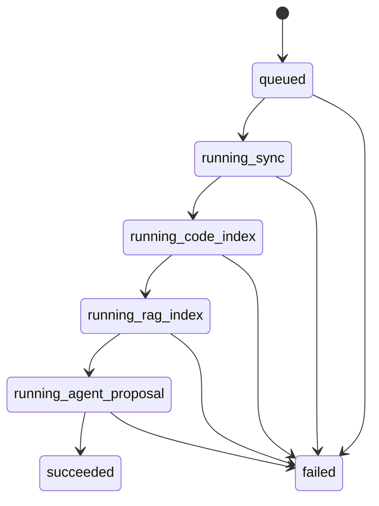

# 동기화, 스케줄러, 라이프사이클

## 1. 현재 동기화 구조

RepoLM에는 repo를 다루는 경로가 두 가지 있다.

1. 노트북 source indexing
   - 사용자가 소스 패널에서 repo URL을 추가한다.
   - `NotebookService`가 repo snapshot을 만들고 `IndexingService`가 `notebook_chunks`로 색인한다.
   - 채팅은 이 경로의 `notebook_chunks`를 주로 검색한다.

2. Repo RAG pipeline sync
   - `/pipeline/sync`로 repo sync job을 만든다.
   - `sync_jobs`에 큐잉되고 worker/poller가 처리한다.
   - `repository_connections`, `source_files`, `source_chunks`에 저장한다.

## 2. Repo URL 수집

파일: `backend/app/repository_source/infrastructure/repo_sync.py`

```python
def sync(self, request: PipelineRequest) -> RepoSnapshot:
    if request.repository_url is not None:
        return self._sync_remote_repository(request)
    return self._sync_request_files(request)
```

의미:

- `repository_url`이 있으면 GitHub repo를 clone/fetch한다.
- URL이 없고 inline files가 있으면 요청 파일만으로 snapshot을 만든다.

```python
def _validate_repository_url(self, repository_url: str) -> None:
    parsed = urlparse(repository_url)
    if parsed.scheme == "https" and parsed.netloc == "github.com" and parsed.path.strip("/"):
        return
    allow_file_url = os.environ.get(ALLOW_FILE_URL) == "1"
    if parsed.scheme == "file" and allow_file_url:
        return
    raise ValueError(...)
```

의미:

- 기본 허용은 `https://github.com/...`이다.
- 테스트/로컬 개발용으로만 `REPOLM_ALLOW_FILE_REPOSITORY_URL=1`일 때 `file://`을 허용한다.
- SSRF와 임의 프로토콜 clone 위험을 줄이는 경계다.

```python
self._fetcher.fetch(repository_url, branch, clone_path)
return self._snapshot_from_local_repository(...)
```

의미:

- URL hash를 기준으로 `data/git_cache/<hash>`에 clone cache를 둔다.
- branch가 지정되면 해당 branch로 shallow clone/fetch한다.
- snapshot에는 repository, branch, commit_sha, tracked text files, recent commits가 들어간다.

## 3. 파일 수집 기준

```python
for relative_path in self._git(root, "ls-files", "-z").split("\0"):
    content = self._read_text_file(path)
    if content is None:
        continue
    files.append(RepoFile(path=relative_path, content=content))
```

포함:

- git tracked file
- UTF-8 text file
- `MAX_BYTES = 200_000` 이하

제외:

- git untracked file
- binary file
- 너무 큰 file
- UTF-8 decode 실패 file

이유:

- RAG 검색 대상은 텍스트 근거다.
- binary/대용량 파일은 토큰과 DB 비용을 급격히 올린다.
- git tracked 기준으로 실제 repo snapshot과 일치시킨다.

## 4. Diff 기준

파일: `backend/app/repo_rag/domain/diff.py`

```python
current_hashes = {file.path: file_hash(file) for file in snapshot.files}
paths = sorted(previous_files.keys() | current_hashes.keys())
```

의미:

- 현재 snapshot의 파일별 hash를 만든다.
- 이전 active files와 현재 파일 path 합집합을 비교한다.

```python
if previous is None and current_hash is not None:
    status = "added"
elif previous is not None and current_hash is None:
    status = "deleted"
elif previous is not None and previous.content_hash != current_hash:
    status = "modified"
else:
    status = "unchanged"
```

상태:

- `added`: 새 파일
- `deleted`: 사라진 파일
- `modified`: path는 같지만 hash가 바뀐 파일
- `unchanged`: hash 동일

## 5. Repo RAG job lifecycle

SQL 모델:

- `sync_jobs`: job 상태
- `sync_events`: stage event log

상태 흐름:



## 6. Worker polling

파일: `backend/app/repo_rag/poller.py`

```python
class StageJobPoller:
    def run_once(self) -> str | None:
        with self._uow_factory() as uow:
            claimed = uow.repo_rag.claim_next_job_by_status(self._processor.target_status)
        if claimed is None:
            return None
        with contextlib.suppress(Exception), self._uow_factory() as uow:
            self._processor.process(claimed.id, uow)
        return claimed.id
```

라인별 의미:

- `claim_next_job_by_status`: target status의 job 하나를 가져온다.
- DB에서는 `FOR UPDATE SKIP LOCKED`를 써서 여러 worker가 같은 job을 잡지 않게 한다.
- job이 없으면 `None`을 반환한다.
- job이 있으면 새 UnitOfWork에서 processor를 실행한다.
- processor 내부 예외는 job fail 처리로 기록되고, poller 루프가 죽지 않게 흡수된다.

```python
def run_forever(self, should_stop=None) -> None:
    while should_stop is None or not should_stop():
        if self.run_once() is None:
            time.sleep(self._idle_sleep)
```

의미:

- 현재 구현은 `idle_sleep` 기반 단순 polling이다.
- 제품 계획의 active 15분/idle 1시간/backoff 정책은 이 루프 위에 확장할 수 있다.

## 7. Stage processor

파일: `backend/app/repo_rag/application/worker_stages.py`

### repo-sync

```python
snapshot = self.repo_sync.sync(job.request)
repository = uow.repo_rag.upsert_repository(job.request, snapshot)
uow.repo_rag.attach_job_repository(job.id, repository.id)
uow.repo_rag.record_snapshot(repository.id, snapshot)
uow.repo_rag.update_job_status(job.id, "running_code_index")
```

역할:

- repo를 clone/fetch한다.
- repository row를 upsert한다.
- snapshot row를 남긴다.
- 다음 상태로 넘긴다.

### code-index

```python
previous_files = uow.repo_rag.active_files(repository_id)
changes = self.diff.compare(previous_files, snapshot)
file_records = uow.repo_rag.apply_file_changes(...)
uow.repo_rag.update_job_status(job.id, "running_rag_index")
```

역할:

- 이전 active files와 현재 snapshot을 비교한다.
- added/modified/deleted/unchanged를 계산한다.
- 파일 row를 active/retire 상태로 갱신한다.

### rag-index

```python
embedded_chunks = self.indexing.index_changes(snapshot, changes)
chunk_records = uow.repo_rag.upsert_chunks(...)
uow.repo_rag.update_job_status(job.id, "running_agent_proposal")
```

역할:

- 변경 파일만 청킹한다.
- embedder가 있으면 vector를 붙인다.
- source_chunks에 저장한다.

### agent-proposal

```python
references = self.code_index.index(snapshot)
chunks = uow.repo_rag.active_chunks(repository_id)
proposals = self.agent_proposal_service.propose(references, chunks)
uow.repo_rag.finish_job(job.id)
```

역할:

- AST 코드 참조를 만든다.
- active RAG chunk를 가져온다.
- proposal agent가 개선 제안을 만든다.
- job을 succeeded로 종료한다.

## 8. Soft delete와 cleanup

파일이 삭제되면:

```python
self._retire_file(session, active_file, now)
self._deactivate_chunks(session, repository_id, change.path, now)
```

의미:

- 파일 row는 `is_active=False`, `deleted_at=now`로 바뀐다.
- 해당 파일의 chunk도 `is_active=False`, `deleted_at=now`가 된다.
- 검색에서는 active filter가 적용되어 즉시 제외된다.

cleanup:

```python
def hard_delete_inactive(self, batch_size: int, cutoff: datetime) -> int:
    chunk_ids = select(ChunkModel.id).where(
        ChunkModel.is_active.is_(False),
        ChunkModel.deleted_at <= cutoff,
    )
```

의미:

- 일정 cutoff 이후 inactive chunk/file을 물리 삭제한다.
- soft delete는 즉시 검색 제외, hard delete는 storage 정리 역할이다.

## 9. 색인 진행 상태

노트북 source indexing 상태는 `notebook_index_progress`에 저장된다.

필드:

- `status`: queued/running/done/failed
- `total_files`
- `processed_files`
- `skipped_files`
- `total_chunks`
- `indexed_chunks`
- `files`: 파일별 상태 JSON
- `error`
- `content_hash`
- `updated_at`
- `last_synced_at`

UI 표시:

- source row의 3단계 progress bar는 대기/분석/완료 흐름을 나타낸다.
- chunk count는 `indexed_chunks` 또는 active chunk count를 기준으로 표시한다.
- 진행 중 응답이 오래 걸릴 수 있으므로 실패가 아니라 stale 상태로 재확인하는 polling hook이 필요하다.

## 10. 현재 구현과 계획의 차이

구현됨:

- repo clone/fetch
- branch snapshot
- tracked text file 수집
- file hash diff
- SQL job/event 저장
- staged worker processor
- soft delete
- hard delete cleanup 함수
- 노트북 색인 progress SQL 저장

확장 필요:

- webhook 우선 polling
- active 15분 / idle 1시간 스케줄 정책
- 실패 exponential backoff
- remote HEAD가 바뀐 경우에만 자동 재색인
- stage별 독립 worker 실행 구성
- source row와 repo-rag repository row의 완전한 통합

