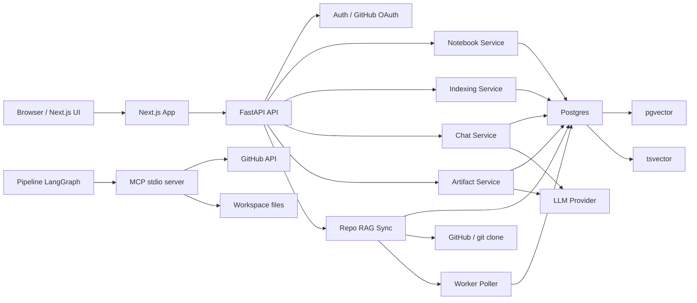
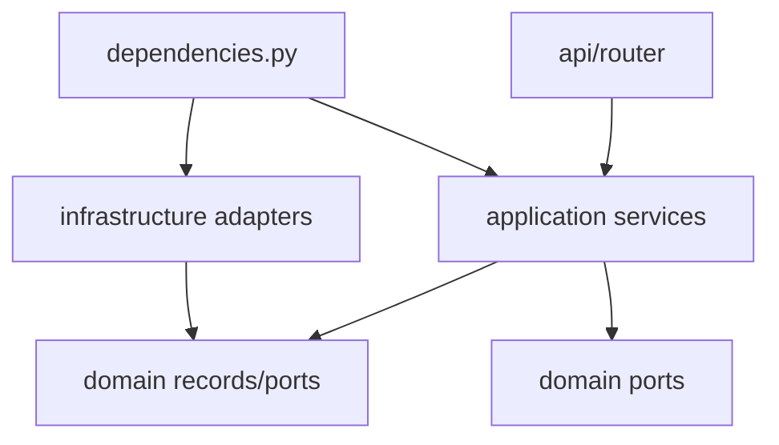
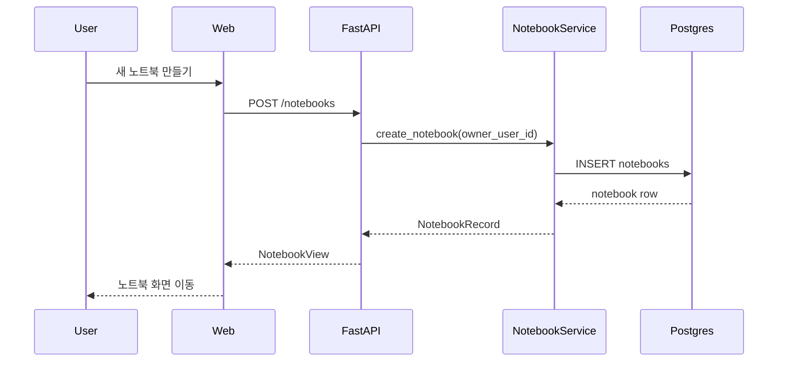
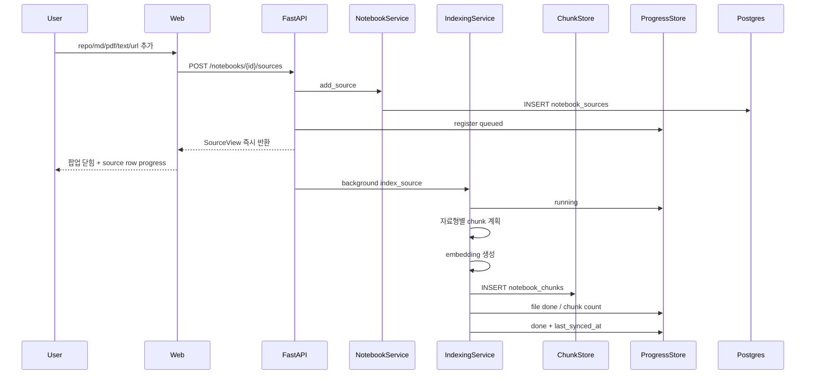
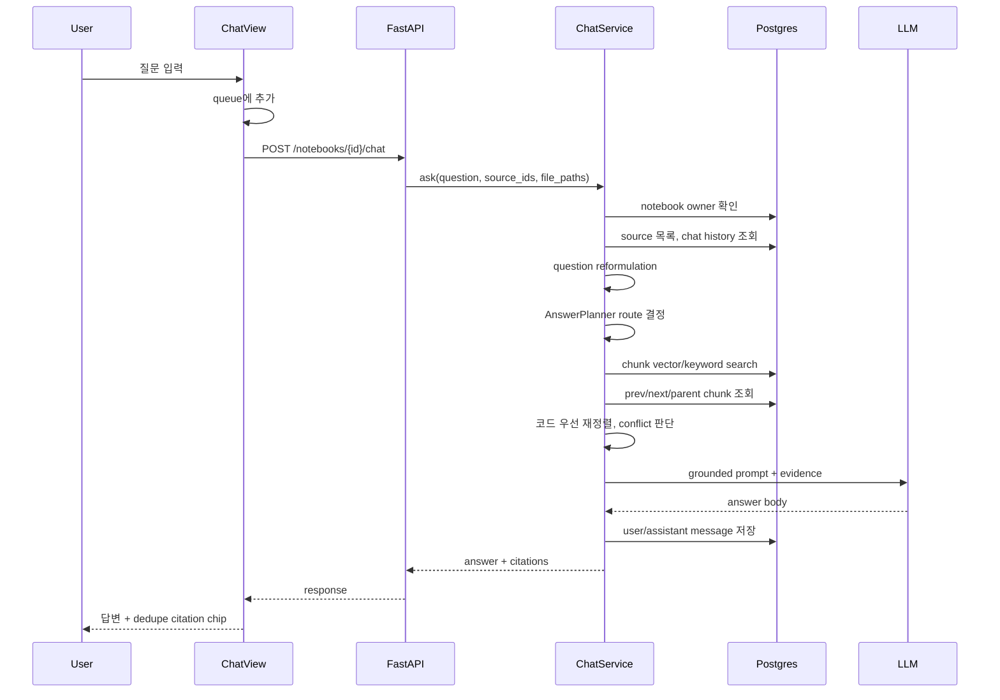
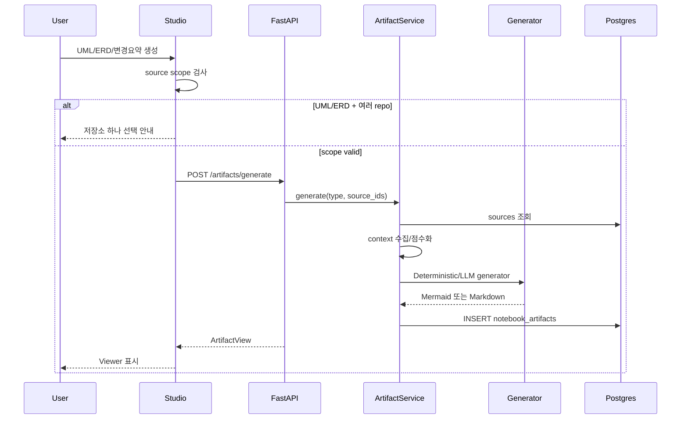

# 서비스 아키텍처와 트랜잭션 흐름

## 1. 전체 아키텍처

## 2. 백엔드 계층

주요 모듈:

- `app/api`: FastAPI router 조립, error handler
- `app/auth`: GitHub OAuth, session token
- `app/notebooks`: 제품 본류: 노트북, 소스, 채팅, 아티팩트, 색인
- `app/repo_rag`: repo sync job, diff, source_chunks 저장
- `app/pipeline`: 코드 인덱싱, LangGraph proposal pipeline
- `app/mcp`: MCP server/client
- `app/repository_source`: GitHub/local repo snapshot 수집

의존 방향:

핵심 원칙:

- domain에는 record, port, policy를 둔다.
- application service가 use case를 조립한다.
- infrastructure가 SQL, GitHub, LLM, MCP 등 외부 구현을 맡는다.
- FastAPI `dependencies.py`가 concrete adapter를 주입한다.

## 3. 프론트 계층

주요 모듈:

- `apps/web/src/lib/api.ts`: API client
- `apps/web/src/lib/store.ts`: Zustand workspace state
- `apps/web/src/lib/source-scope.ts`: source/file scope helper
- `apps/web/src/components/chat-view.tsx`: 채팅, 큐, 추천 질문, 입력
- `apps/web/src/components/sources-panel.tsx`: source 선택과 progress 표시
- `apps/web/src/components/studio-panel.tsx`: UML/ERD/요약 생성
- `apps/web/src/components/citation-list.tsx`: citation chip, 실제 GitHub/file URL 링크
- `apps/web/src/components/viewer-panel.tsx`: artifact/diagram/markdown viewer

프론트 설계 기준:

- 3패널 app shell 유지
- source/file scope를 모든 chat/artifact 요청에 반영
- 진행 중 새 입력은 queue로 순차 처리
- citation은 중복 file path를 한 번만 표시
- Enter는 전송, Shift+Enter는 줄바꿈
- 한글 IME 조합 중 Enter 중복 전송 방지

## 4. 노트북 생성 트랜잭션

검토 기준:

- owner_user_id가 반드시 들어가야 다른 계정에서 같은 노트북을 보지 않는다.
- 노트북 제목/내용 입력 폼 없이 더미 제목으로 바로 생성하는 UX가 현재 요구사항에 맞다.

## 5. 소스 추가와 색인 트랜잭션

왜 즉시 반환해야 하는가:

- repo clone과 embedding은 오래 걸릴 수 있다.
- 사용자는 팝업 안에서 실패 메시지를 보는 것보다 source row에서 진행 상태를 보는 편이 자연스럽다.
- progress는 SQL에 있으므로 새로고침 후에도 상태를 복원할 수 있다.

## 6. 채팅 트랜잭션

중요 정책:

- source_ids/file_paths는 검색과 tool read 양쪽에 적용한다.
- LLM 본문에는 `[출처 1]` 같은 번호를 쓰지 못하게 하고, UI citation chip으로 표시한다.
- citation chip은 같은 source/path면 한 번만 표시한다.
- GitHub repo source면 `repository_url/blob/{branch}/{path}#L{line}` 링크를 만든다.

## 7. Artifact 생성 트랜잭션

UML/ERD 설계:

- 여러 repo를 합쳐 그리면 같은 class/table 이름이 섞여 해석이 어려워진다.
- 그래서 한 repo 기준으로 생성하게 안내한다.
- 같은 repo의 여러 브랜치 비교는 별도 비교 artifact로 확장하는 편이 좋다.

## 8. UML/ERD 생성 기준

현재 deterministic generator:

- UML: Python AST, TS/JS regex 기반 class/interface 추출
- relation: 상속과 타입 참조/Name 참조
- layer: path token 기준 entry/application/domain/infrastructure/data/config/tests/other
- ERD: SQLAlchemy/Django style ORM, SQL `CREATE TABLE`, `ForeignKey`, `relationship`

Mermaid output:

- UML은 `classDiagram`
- ERD는 `erDiagram`
- 생성 결과가 없으면 Placeholder skeleton으로 폴백

검토 기준:

- 사용자에게 보기 좋은 다이어그램은 모든 class를 무조건 한 화면에 넣는 것보다 layer별/관계 중심으로 정리하는 편이 낫다.
- "누락 없이"와 "읽기 쉬움"은 충돌한다. 현재는 `MAX_UML_NODES`로 상한을 두고 connected class를 우선한다.
- 완전한 TS AST/SQL parser를 붙이면 누락을 더 줄일 수 있다.

## 9. 왜 이렇게 개발했는가

결정 기준:

- 권한/범위/scope는 deterministic code로 처리한다.
- 자연어 설명은 LLM이 처리한다.
- 근거 검색은 SQL + vector + keyword로 재현 가능하게 만든다.
- LLM tool은 scope가 제한된 도구만 노출한다.
- source lifecycle은 SQL row와 chunk row가 함께 움직이게 만든다.
- 프론트는 실패를 광고하는 대신 진행 상태와 복구 가능 상태를 보여준다.

검토한 위험:

- 다른 계정이 같은 노트북을 보는 권한 버그
- 한글 IME Enter 중복 전송
- 채팅 중 병렬 agent 실행
- 문서가 코드보다 앞서는 답변 품질 저하
- 여러 repo를 합친 UML/ERD 오해
- citation 중복과 실제 링크 부재
- LLM prompt injection
- SSRF와 file URL 제한
- repo clone 장기 실행과 stale progress

## 10. 앞으로의 구조 개선 방향

- 노트북 source indexing과 repo_rag pipeline 저장소를 더 명확히 통합한다.
- raw SQL처럼 보이는 검색 expression은 repository helper로 감싼다.
- TS/JS는 TypeScript compiler API 또는 tree-sitter 기반 chunker로 개선한다.
- SQL은 sqlglot 같은 parser로 ERD 정확도를 높인다.
- Streamable HTTP MCP endpoint를 추가해 외부 MCP 클라이언트에서도 RepoLM 도구를 쓰게 한다.
- LangGraph는 일반 채팅에도 필요한 경우에만 planner가 호출하는 별도 orchestrator로 격리한다.
- RAGAS 기반 평가는 별도 eval dataset으로 retrieval precision, faithfulness, answer relevancy를 측정한다.

