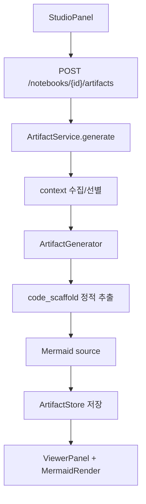
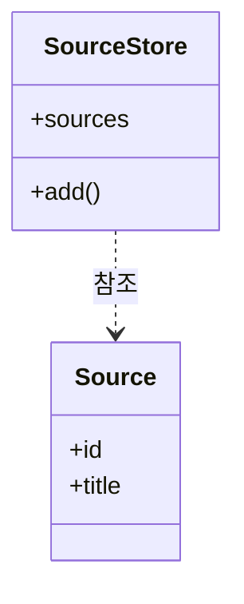
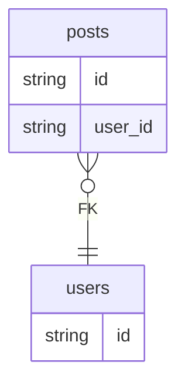
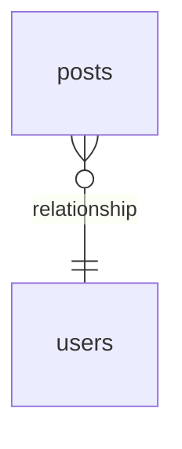

# UML/ERD/변경요약 산출물 생성 기준

이 문서는 RepoLM의 오른쪽 스튜디오에서 만드는 산출물, 특히 UML, ERD, 변경요약이 어떤 기준으로 만들어지는지 설명한다.
RepoLM의 산출물은 "LLM이 마음대로 그리는 그림"이 아니라, 저장된 repo snapshot과 정적 파싱 결과를 먼저 사용하고 필요한 경우에만 LLM을 붙이는 구조다.

## 1. 산출물 생성의 목표

산출물은 채팅 답변과 역할이 다르다.

- 채팅 답변: 사용자의 질문에 필요한 근거를 골라 자연어로 설명
- UML: 소스코드의 클래스, 인터페이스, 상속, 참조 관계를 시각화
- ERD: ORM/SQL 모델의 엔티티, 컬럼, FK/relationship 관계를 시각화
- 변경요약: 최근 커밋과 저장된 파일 snapshot을 기준으로 실제 변경 파일과 영향 범위 요약
- 메모: 대화나 사용자가 작성한 내용을 다시 source로 넣기 위한 텍스트 산출물

중요한 기준은 "보기 좋은 그림"보다 "실제 소스에 근거한 그림"이다.
그렇지만 그림이 너무 퍼지거나 관계가 안 보이면 사용성이 떨어지므로, 현재 구현은 관계와 읽기 순서를 최대한 보존하도록 정렬한다.

## 2. 코드 위치

핵심 코드는 다음 파일에 있다.

```text
backend/app/notebooks/application/artifact_service.py
backend/app/notebooks/infrastructure/artifact_generators.py
backend/app/notebooks/infrastructure/code_scaffold.py
apps/web/src/components/studio-panel.tsx
apps/web/src/components/viewer-panel.tsx
apps/web/src/components/mermaid-render.tsx
```

역할은 다음처럼 나뉜다.



## 3. UML 생성 기준

UML은 현재 Mermaid `classDiagram`으로 생성한다.
사용자가 기대하는 기본 형태가 "클래스명, 속성, 메서드, 상속/참조 관계"이기 때문이다.

### 3.1 추출 대상

Python 파일:

```python
class UserService(BaseService):
    repository: UserRepository

    def list_users(self):
        ...
```

위 코드는 다음 사실로 추출된다.

```text
ClassInfo(
  name="UserService",
  bases=["BaseService"],
  attributes=["repository"],
  methods=["list_users"],
  references=["UserRepository", ...]
)
```

TS/JS 파일:

```ts
export interface Source {
  id: string
  title: string
}

export class SourceStore {
  sources: Source[] = []
  add(source: Source) {}
}
```

위 코드는 다음 사실로 추출된다.

```text
ClassInfo(Source, attrs=["id", "title"])
ClassInfo(SourceStore, attrs=["sources"], methods=["add"], refs=["Source"])
```

### 3.2 Mermaid 출력

현재 출력은 다음 형태다.



관계 규칙:

- `Base <|-- Child : 상속`
- `SourceStore ..> Source : 참조`

색상 규칙:

- UI의 Mermaid 렌더러는 dark/light 모두 무채색 themeVariables를 사용한다.
- UML 본문도 `classDef default`를 추가해 파랑/보라 중심 색을 피한다.
- ERD와 시각 톤이 어긋나지 않도록 선과 박스 색을 회색 계열로 맞춘다.

### 3.3 한계

Mermaid `classDiagram`은 큰 레포에서 레이아웃 제어가 제한적이다.
클래스가 많고 관계가 적으면 가로로 길게 늘어나거나 일부 관계가 눈에 잘 안 보일 수 있다.

현재 RepoLM은 다음 기준으로 손실을 줄인다.

- 클래스 수가 너무 많으면 연결 관계가 있는 클래스를 우선 선별
- 경로 기반 레이어 주석을 추가해 API, service, domain, infrastructure 순서를 보조
- private/dunder 메서드는 노이즈로 보고 제외
- docs/README가 아니라 실제 `.py`, `.ts`, `.tsx`, `.js`, `.jsx` 코드에서 클래스 추출

## 4. ERD 생성 기준

ERD는 Mermaid `erDiagram`으로 생성한다.
관계 중심으로 읽기 쉽게 하기 위해 FK/relationship 수가 많은 엔티티를 먼저 출력한다.

### 4.1 Python ORM 추출

SQLAlchemy 예시:

```python
class User(Base):
    __tablename__ = "users"
    id = Column(Integer)

class Post(Base):
    __tablename__ = "posts"
    id = Column(Integer)
    user_id = Column(Integer, ForeignKey("users.id"))
```

추출 결과:

```text
Entity(users, columns=["id"])
Entity(posts, columns=["id", "user_id"], relations=[("users", "FK")])
```

Mermaid 출력:



### 4.2 relationship 추출

`ForeignKey`가 없더라도 SQLAlchemy `relationship("User")`가 있으면 관계로 표시한다.

```python
class Post(Base):
    __tablename__ = "posts"
    user = relationship("User")
```

출력:



### 4.3 SQL 추출

SQL 파일에서 `CREATE TABLE`과 `references`를 읽는다.

```sql
CREATE TABLE posts (
    id text primary key,
    user_id text references users(id)
);
```

DDL 키워드인 `CREATE`, `ALTER`, `PRIMARY`, `FOREIGN`, `REFERENCES` 같은 단어는 컬럼으로 넣지 않는다.

### 4.4 관계 중심 정렬

엔티티 순서는 단순 알파벳순이 아니다.

1. FK/relationship으로 많이 연결된 엔티티
2. 다른 엔티티가 참조하는 중심 엔티티
3. 관계가 없는 독립 엔티티
4. 이름순

이렇게 정렬해야 관계 없는 테이블이 먼저 나오면서 그림이 오른쪽으로 길게 밀리는 문제를 줄일 수 있다.

## 5. 변경요약 생성 기준

변경요약은 "색인된 파일 목록"이 아니라 "최근 커밋과 실제 코드 facts"를 사용자에게 설명하는 마크다운이어야 한다.

입력 우선순위:

1. `__recent_commits__.md`에 저장된 최근 커밋 메타데이터
2. 실제 코드 파일의 클래스/함수/라우트/테이블/exports
3. 설정 파일과 스키마 파일
4. docs/README는 보조 근거

출력 예:

```md
## 변경 요약

### 최근 커밋 기준
- `c1db574` standalone 배포 정적 자산 복사 보장

### 코드 기준 핵심
- `apps/web/src/lib/api.ts`: API 프록시와 인증 에러 처리 흐름 보강
- `backend/app/notebooks/application/chat_service.py`: source/file scope 기반 채팅 처리

### 영향 범위
- 외부 배포에서 프론트 정적 자산 로딩 안정성 개선
- 선택된 소스만 답변 근거로 사용하는 UX 강화
```

## 6. LLM을 쓰지 않고 정적 생성을 우선하는 이유

UML/ERD는 문법 오류가 나면 사용자가 바로 "렌더 실패"를 본다.
특히 ERD는 Mermaid 문법이 엄격해 LLM이 `list<float>` 같은 타입을 만들면 바로 깨진다.
따라서 현재 구현은 UML/ERD/dependency는 정적 파싱 결과를 우선 사용한다.

LLM은 변경요약처럼 자연어 품질이 중요한 산출물에서 먼저 사용한다.
실패하면 결정론 요약으로 폴백한다.

## 7. 품질 점검 체크리스트

UML:

- `classDiagram`으로 시작하는가
- 클래스명이 파일명이 아니라 실제 class/interface/type 이름인가
- 메서드는 `+method()` 형태로 보이는가
- 상속은 `<|--`, 참조는 `..>`로 표시되는가
- 색상이 파랑/보라가 아니라 무채색 계열인가

ERD:

- `erDiagram`으로 시작하는가
- DDL 키워드가 컬럼으로 새지 않는가
- FK/relationship 관계가 `}o--||`로 표시되는가
- 관계 많은 엔티티가 먼저 출력되는가
- 관계 없는 엔티티가 중심 관계를 밀어내지 않는가

변경요약:

- 최근 커밋 SHA와 메시지가 포함되는가
- 실제 변경 파일 경로가 포함되는가
- docs만 보고 추정하지 않는가
- 코드 기준 영향 범위를 설명하는가

