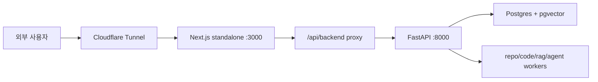

# 운영, 검증, 장애 대응 런북

이 문서는 RepoLM을 실제로 실행하고 점검할 때 보는 운영용 문서다.
개념 설명보다 "어떤 명령으로 확인하고, 실패하면 어디를 보면 되는지"에 집중한다.

## 1. 기본 실행 구조

현재 배포 구조는 다음과 같다.



확인해야 할 포인트:

- 외부 URL이 Next.js HTML을 반환하는가
- `/api/backend/health`가 `{"status":"ok"}`를 반환하는가
- FastAPI 직접 health가 `{"status":"ok"}`를 반환하는가
- Docker worker가 살아 있는가
- OAuth callback URL이 현재 Cloudflare URL과 맞는가

## 2. 검증 명령

백엔드 테스트:

```bash
cd backend
uv run pytest -q
```

타입 검사:

```bash
cd backend
uv run pyright
```

Lint:

```bash
cd backend
uv run ruff check .
```

프론트 타입체크:

```bash
pnpm --filter @repolm/web typecheck
```

프론트 production build:

```bash
BACKEND_PROXY_URL=http://127.0.0.1:8000 \
NEXT_PUBLIC_API_URL=/api/backend \
pnpm --filter @repolm/web build
```

## 3. Docker 재기동

백엔드 API와 worker를 다시 빌드해 띄우려면:

```bash
docker compose up --build -d \
  api \
  worker-repo-sync \
  worker-code-index \
  worker-rag \
  worker-agent
```

상태 확인:

```bash
docker compose ps
docker compose logs -f api
docker compose logs -f worker-repo-sync
```

## 4. 프론트 standalone 재기동

```bash
screen -S repolm-web -X quit 2>/dev/null || true
lsof -ti tcp:3000 | xargs -r kill
screen -dmS repolm-web bash -lc '
  cd /Users/woonyong/workspace/Krafton-Jungle/SW_AI-W15-warm-up &&
  HOSTNAME=0.0.0.0 \
  PORT=3000 \
  BACKEND_PROXY_URL=http://127.0.0.1:8000 \
  NEXT_PUBLIC_API_URL=/api/backend \
  node apps/web/.next/standalone/apps/web/server.js \
  >/tmp/repolm-web-screen.log 2>&1
'
```

로그 확인:

```bash
tail -f /tmp/repolm-web-screen.log
```

## 5. Health check

로컬 백엔드:

```bash
curl -fsS http://127.0.0.1:8000/health
```

프론트 프록시:

```bash
curl -fsS http://127.0.0.1:3000/api/backend/health
```

Cloudflare 외부 API:

```bash
curl -fsS \
  -H 'User-Agent: curl' \
  https://staying-refuse-freely-beside.trycloudflare.com/api/backend/health
```

Cloudflare 외부 프론트:

```bash
curl -fsSI \
  -H 'User-Agent: curl' \
  https://staying-refuse-freely-beside.trycloudflare.com
```

정상 기준:

- API는 `{"status":"ok"}`
- 프론트는 `HTTP/2 200`
- `content-type: text/html`

## 6. OAuth 장애 대응

증상:

- GitHub에서 `redirect_uri is not associated with this application`
- 로그인 후 다시 로그인 화면
- callback 후 500/401

확인:

1. GitHub OAuth App callback URL
2. backend `.env`의 `GITHUB_CLIENT_ID`, `GITHUB_CLIENT_SECRET`
3. `WEB_APP_URL`
4. `CORS_EXTRA_ORIGINS`
5. Cloudflare tunnel URL

현재 형태:

```text
Homepage URL:
https://staying-refuse-freely-beside.trycloudflare.com

Authorization callback URL:
https://staying-refuse-freely-beside.trycloudflare.com/api/backend/auth/github/callback
```

주의:

- tunnel URL이 바뀌면 GitHub OAuth App callback도 반드시 바뀐다.
- session cookie는 외부 HTTPS와 로컬 HTTP 설정이 다르다.
- production에서는 충분히 긴 `SESSION_SECRET`이 필요하다.

## 7. RAG 색인 장애 대응

증상:

- 소스가 계속 0%
- 프로그래스바 한 칸만 깜빡임
- "분석은 계속 확인 중입니다"만 표시
- source는 보이지만 채팅 답변이 근거를 못 찾음

확인 순서:

1. `notebook_index_progress` row가 있는지
2. `status`가 `queued/running/done/failed` 중 무엇인지
3. `updated_at`이 계속 갱신되는지
4. `active chunk count`가 늘었는지
5. worker 로그에 clone/fetch/chunk/embed 오류가 있는지
6. source 삭제 후 chunk가 검색에서 제외되는지

중요:

- 긴 repo 분석은 실패가 아니다.
- SSE가 끊겨도 5초 polling이 상태를 복구한다.
- 오래 갱신되지 않는 running 상태만 조용히 재분석 예약 대상이다.

## 8. 채팅 품질 점검

점검 질문:

```text
이 레포의 핵심 실행 흐름을 소스코드 기준으로 설명해줘
최근 커밋에서 실제로 바뀐 파일과 영향도를 요약해줘
문서와 소스코드가 어긋난 부분을 찾아줘
주요 API 라우트와 데이터 모델 관계를 정리해줘
오류가 날 만한 구현 지점과 개선 우선순위를 알려줘
```

정상 기준:

- 소스코드 관련 질문은 docs/README보다 `.py`, `.ts`, `.tsx`, `.sql` 근거가 먼저 온다.
- citation chip은 같은 파일이 중복 표시되지 않는다.
- citation chip은 GitHub URL과 line range를 가능한 한 포함한다.
- 근거가 없으면 일반 지식으로 추측하지 않고 근거 부족을 말한다.
- 여러 repo가 선택되어 질문이 애매하면 어떤 repo 기준인지 되묻는다.

## 9. 채팅 큐 점검

정상 흐름:

1. 첫 질문 전송
2. 답변 생성 중 두 번째 질문 입력
3. 두 번째 질문은 대기열에 표시
4. 사용자가 원하면 대기 항목 삭제 가능
5. 첫 답변 완료 후 두 번째 질문 자동 실행

오류 패턴:

- 답변 생성 중 새 질문이 바로 실행되면 single-flight guard 문제
- 한글 IME Enter에서 두 번 전송되면 composition guard 문제
- 다이어그램 해석 질문이 뷰어로 이동하면 diagram intent 판별 문제

관련 코드:

```text
apps/web/src/components/chat-view.tsx
```

## 10. UML/ERD 품질 점검

UML:

```text
classDiagram
direction TB
classDef default fill:#242424,stroke:#8a8a8a,color:#f3f3f3
```

정상 기준:

- 파일명이 아니라 실제 클래스/인터페이스 이름이 보인다.
- 클래스 안에 속성과 메서드가 들어간다.
- 상속/참조 관계가 선으로 보인다.
- 무채색 스타일로 렌더링된다.

ERD:

```text
erDiagram
posts }o--|| users : FK
```

정상 기준:

- FK/relationship 관계가 먼저 보인다.
- 관계 없는 엔티티가 중심 관계를 밀어내지 않는다.
- Mermaid 문법 오류가 없어야 한다.
- SQLAlchemy vector/list 타입이 ERD 타입으로 새지 않는다.

## 11. 문서 유지 기준

이 폴더 문서는 코드가 바뀔 때 같이 갱신해야 한다.

갱신 기준:

- MCP tool 추가/삭제: `01-mcp-implementation.md`
- agent planner/tool 분기 변경: `02-ai-agent-and-llm-flow.md`
- chunk metadata/RAG/SQL 변경: `03-rag-sql-indexing.md`
- worker/scheduler/lifecycle 변경: `04-sync-scheduler-lifecycle.md`
- API/트랜잭션/프론트 상태 흐름 변경: `05-service-architecture-and-transactions.md`
- UML/ERD/change summary 변경: `06-diagram-and-artifact-generation.md`
- 배포/검증/운영 절차 변경: `07-operation-validation-runbook.md`

문서는 기능 설명서이면서 회귀 방지 체크리스트다.
따라서 구현 의도, 코드 위치, 정상 기준, 한계를 같이 적어야 한다.

