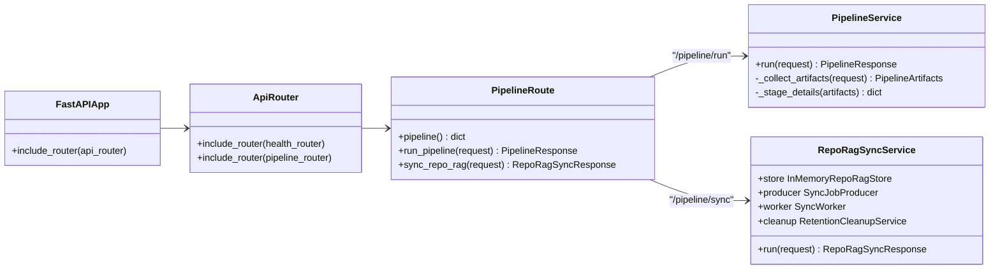
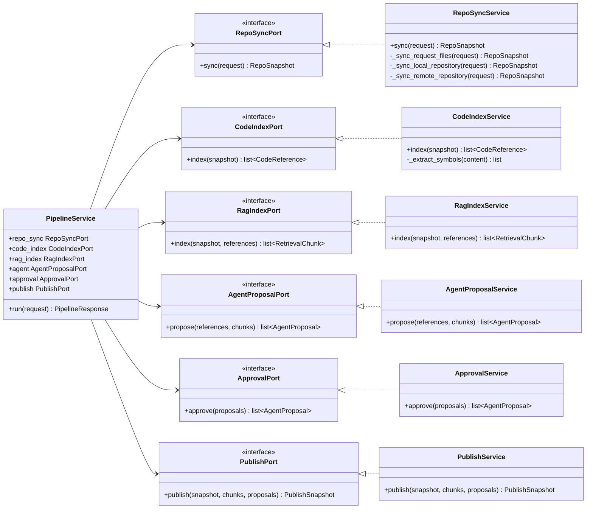
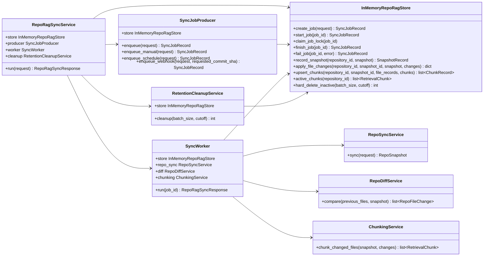
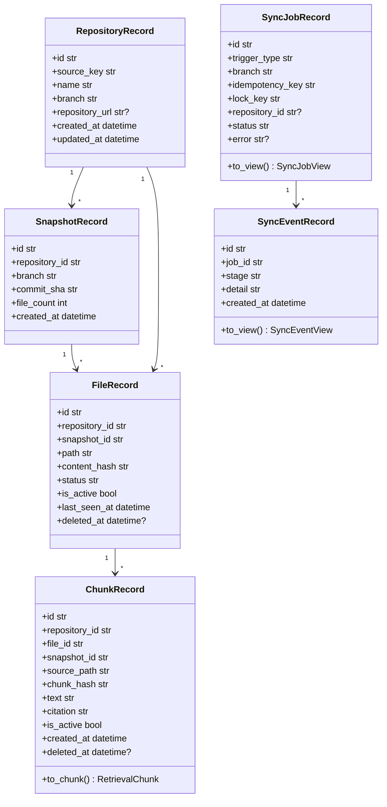
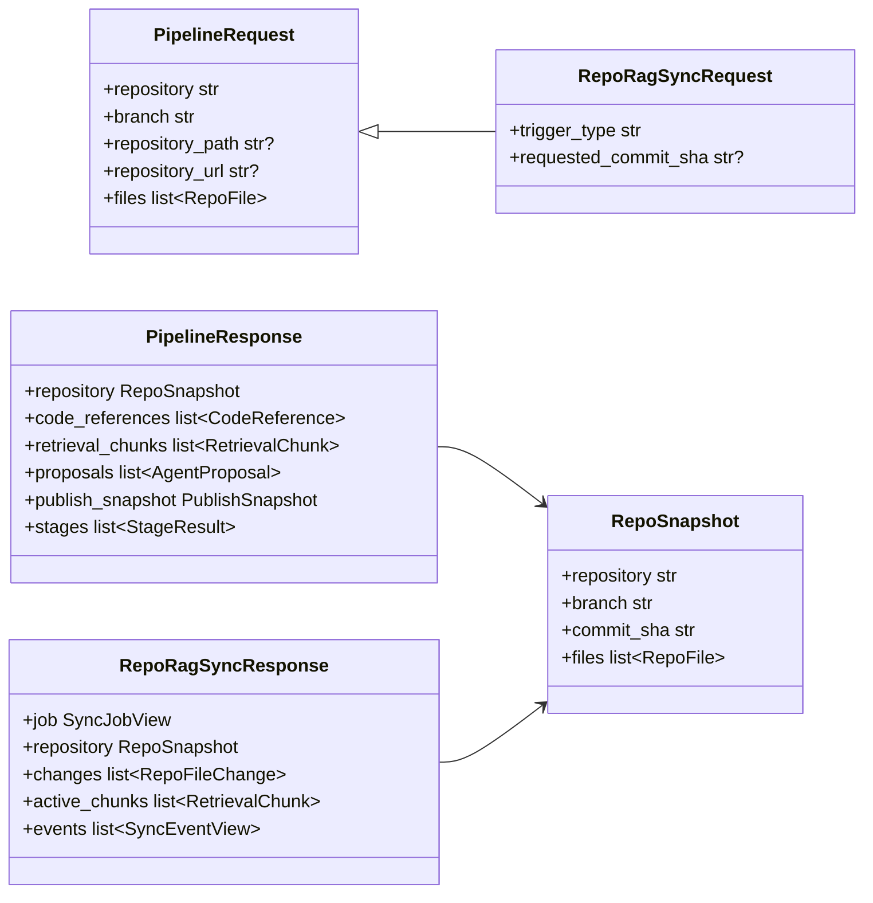

# 현재 구현 클래스 UML

이 문서는 2026-06-13 기준 RepoLM 최소 구현의 Python 백엔드 클래스와 서비스 관계를 한눈에 보기 위한 UML이다. 다음 구현 순서는 `16-repo-rag-implementation-plan.md`를 기준으로 한다.

현재 구현은 두 흐름으로 나뉜다.

1. `/pipeline/run`: 요청을 즉시 처리하는 최소 데모 파이프라인
2. `/pipeline/sync`: Repo RAG 증분 동기화를 job 중심으로 처리하는 파이프라인

## 전체 구조

## 최소 데모 파이프라인

`PipelineService`는 port/protocol을 통해 각 단계를 느슨하게 연결한다. 실제 구현체는 `RepoSyncService`, `CodeIndexService`, `RagIndexService`, `AgentProposalService`, `ApprovalService`, `PublishService`다.

## Repo RAG 증분 동기화

`RepoRagSyncService`는 job producer, worker, store, cleanup을 묶는 상위 서비스다. `manual`, `schedule`, `webhook`은 모두 producer 입구만 다르고 같은 job queue로 들어간다.

## Repo RAG 저장 레코드

현재 런타임 저장소는 `InMemoryRepoRagStore`다. Postgres DDL은 `docker/postgres/init/002_repo_rag.sql`에 준비되어 있지만, SQLAlchemy/Postgres repository 구현은 다음 단계다.

## API DTO

## 읽는 순서

처음 보는 사람은 아래 순서로 보면 좋다.

1. `backend/app/api/routes/pipeline.py`: API 진입점
2. `backend/app/services/pipeline.py`: 기존 최소 파이프라인
3. `backend/app/services/repo_sync.py`: 파일 snapshot 생성
4. `backend/app/services/repo_rag_sync.py`: job, diff, chunk, soft delete 흐름
5. `docker/postgres/init/002_repo_rag.sql`: 다음 단계 DB 구조
6. `docs/woonyong/ai-dev-workspace/16-repo-rag-implementation-plan.md`: Repo RAG 다음 구현 계획
