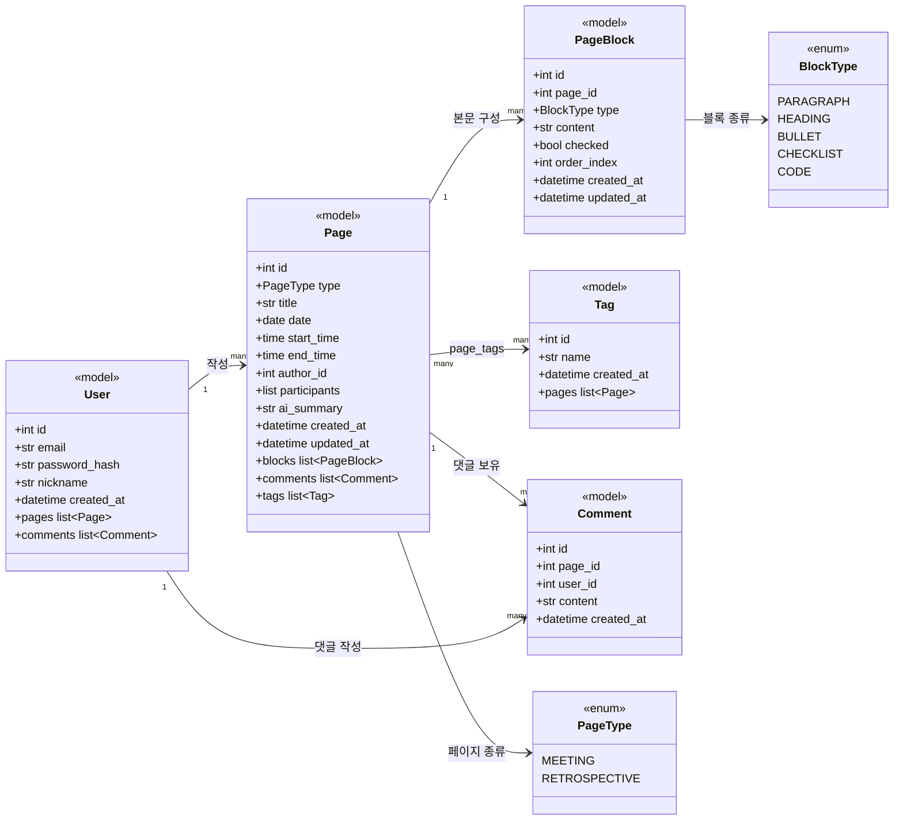
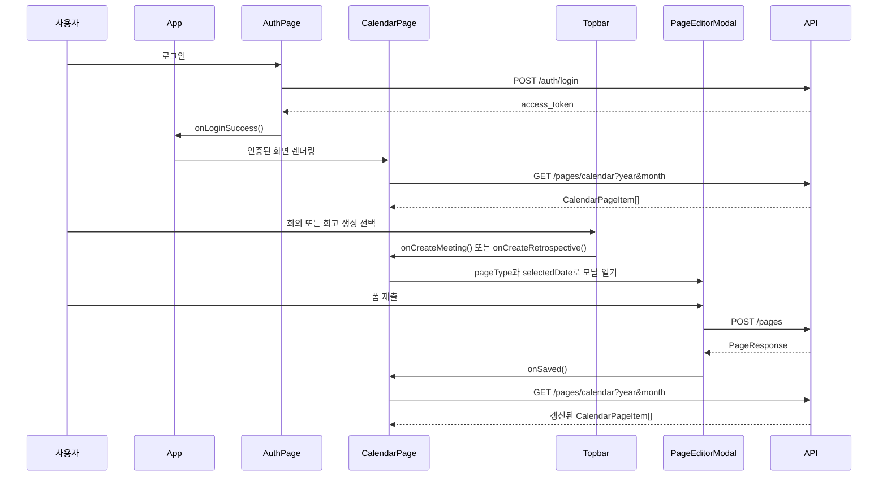

# 2026-06-11 warm-up 일일 구현 아카이브

## 메타데이터

- 인물: 찬빈
- Git 작성자: `JCBBBBBB <wjdcksqls1@naver.com>`
- 저장소: `Jungle-303-04/warm-up`
- 브랜치: `chanbin`
- 최신 확인 HEAD: `0b256da`
- 시간 기준: 한국 시간
- 검토일: 2026-06-11

## 요약

찬빈은 캘린더 기반 회의/회고 기록 앱의 핵심 세로 흐름을 구현했다.

작업은 단순 파일 수정이 아니라 다음 순서로 진행됐다.

1. 백엔드 기반 구축
2. 캘린더 월별 페이지 조회 추가
3. 캘린더 화면 구현
4. 인증과 세션 처리 연결
5. 회의/회고 작성 모달 추가
6. 로컬 Vite 캐시 정리

가장 강한 신호는 레이어별 완성보다 사용자가 실제로 한 번 흐름을 타볼 수 있는 기능을 먼저 연결했다는 점이다. 초기 구현 단계에서는 합리적인 선택이다. 다만 권한 정책 불일치, 상세/수정 UI 미완성, 빌드/API 검증 부재가 주요 위험으로 남아 있다.

## 시간대별 작업 기록

### 2026-06-08 23:26 KST - `ace5d8c`

- 커밋: `feat: 백엔드 기반 구축`
- 링크: https://github.com/Jungle-303-04/warm-up/commit/ace5d8c5d8e8a074fa91ce498f974f03bbd1752f

구현한 것:

- FastAPI 백엔드 기반
- 사용자, 페이지, 페이지 블록, 태그, 댓글, 연결 테이블 모델
- Alembic 마이그레이션 설정
- 페이지 CRUD 라우터
- 회원가입, 로그인, 현재 사용자 조회 라우터
- React/Vite 프론트엔드 스캐폴드
- 초기 레이아웃 컴포넌트와 캘린더 페이지 스캐폴드
- Docker Compose와 DB 초기화 파일

시도와 결정:

- 회의와 회고를 별도 테이블로 나누지 않고 `PageType`으로 구분했다.
- 페이지 본문을 하나의 긴 텍스트가 아니라 순서가 있는 `PageBlock` 목록으로 나눴다.
- 태그는 `page_tags` 다대다 관계로 분리했다.
- 참여자는 페이지의 JSON 필드로 보관했다.
- `ai_summary` 필드를 미리 둬서 추후 AI 요약 확장 가능성을 열어뒀다.

문제와 위험:

- 첫 기능 커밋의 범위가 커서 리뷰 단위가 무겁다.
- 백엔드와 프론트 기반이 한 커밋에 섞였다.
- 페이지 조회 권한 정책이 모든 조회 경로에 일관되게 적용되지 않았다.

### 2026-06-10 01:06 KST - `cffd4ed`

- 커밋: `feat: 캘린더 레이아웃과 월별 페이지 조회 구현`
- 링크: https://github.com/Jungle-303-04/warm-up/commit/cffd4ed196990ae959f6aee452047afd08541276

구현한 것:

- `year`, `month` 쿼리 파라미터를 받는 `/pages/calendar` 엔드포인트
- 월 시작일과 다음 달 시작일을 기준으로 한 날짜 범위 계산
- 현재 사용자 기준 캘린더 결과 필터링
- FullCalendar 기반 월간 캘린더 UI
- 선택한 날짜의 상세 패널
- 선택 날짜의 회의/회고 개수 표시
- 회의/회고 타입별 이벤트 스타일

시도와 결정:

- 전체 페이지를 가져오지 않고 현재 보이는 월만 조회하도록 했다.
- 캘린더 화면에는 `CalendarPageItem`이라는 작은 응답 모델만 사용했다.
- 월별 항목은 날짜와 시작 시간 기준으로 정렬했다.
- 생성/상세 액션은 먼저 placeholder alert로 남기고, 캘린더 조회 흐름부터 완성했다.

문제와 위험:

- 캘린더 조회는 현재 사용자 필터를 적용하지만 목록, 검색, 상세 조회에는 같은 정책이 일관되게 보이지 않는다.
- 상세 모달은 아직 구현되지 않았다.
- 빌드 또는 API 검증 결과가 커밋에 보이지 않는다.

### 2026-06-10 23:24 KST - `2425853`

- 커밋: `feat: 기본 캘린더 화면, 모달 구현`
- 링크: https://github.com/Jungle-303-04/warm-up/commit/242585358dc0bd794a2977bab23d1c1c78747c8a

구현한 것:

- 로그인/회원가입 화면
- `localStorage` 기반 토큰 저장
- 앱 시작 시 `/auth/me`로 토큰 유효성 확인
- Axios 요청 인터셉터를 통한 bearer token 자동 주입
- 인증 요청이 아닌 API에서 401 응답이 오면 자동 로그아웃 처리
- 회의/회고 생성을 위한 Topbar 드롭다운
- 페이지 작성용 `PageEditorModal`
- 문단, 제목, 불릿, 체크리스트, 코드 블록을 다루는 `BlockEditor`
- `POST /pages` 프론트 API 래퍼
- 작성 성공 후 캘린더 재조회
- 인증 흐름과 JWT 흐름을 설명하는 학습 문서

시도와 결정:

- 토큰 존재 여부만 믿지 않고 백엔드로 유효성을 확인했다.
- 회의와 회고가 하나의 작성 모달을 공유하도록 했다.
- 회고 작성 시에는 회의 시간 입력을 숨겼다.
- 쉼표로 입력한 참여자와 태그를 배열로 변환했다.
- 빈 본문 블록은 저장하지 않도록 제거했다.
- 인증 흐름을 별도 학습 문서로 정리해 이해를 보강했다.

문제와 위험:

- 작성 흐름은 구현됐지만 조회/상세 흐름은 여전히 `alert` 상태다.
- 폼 검증이 최소 수준이다.
- 시작 시간이 종료 시간보다 빠른지 검증하지 않는다.
- 프론트에서 `localStorage`를 사용한다. warm-up 앱에서는 가능하지만 보안상 tradeoff를 인지해야 한다.
- 코드 주석이 학습 설명까지 포함해 많다. 학습에는 좋지만 팀 코드로는 장황해질 수 있다.

### 2026-06-11 00:20 KST - `0b256da`

- 커밋: `chore: ignore frontend vite cache`
- 링크: https://github.com/Jungle-303-04/warm-up/commit/0b256da12dba4cf21c8bfe93492a43d6265586c9

구현한 것:

- `.gitignore`에 `frontend/.vite/` 추가

시도와 결정:

- 프론트를 로컬 실행하면서 Vite 캐시가 git 변경사항에 잡히는 문제를 확인한 것으로 보인다.
- 개발 환경 산출물이 버전 관리에 섞이지 않도록 정리했다.

문제와 위험:

- 기능 문제는 아니다. 정상적인 개발환경 정리 신호다.
- 프론트를 실행해 본 정황은 있지만, 빌드 또는 테스트 결과는 아직 커밋에 없다.

## 백엔드 클래스 UML



## 프론트 작성 흐름



## 잘한 점

- 백엔드와 프론트가 따로 노는 상태가 아니라 로그인부터 작성 후 캘린더 반영까지 이어지는 세로 흐름을 만들었다.
- 캘린더를 직접 만들지 않고 FullCalendar를 사용해 구현 리스크를 줄였다.
- Pydantic 스키마로 백엔드 응답 모양을 분리했다.
- `Page`와 `PageBlock` 구조를 통해 나중에 더 풍부한 편집기를 만들 여지를 남겼다.
- 앱 시작 시 토큰 유효성을 확인하는 흐름을 넣었다.
- 로컬 실행 중 생긴 Vite 캐시를 git 추적에서 제외했다.
- 인증과 JWT 흐름을 별도 학습 문서로 정리했다.

## 부족하거나 위험한 점

- 소유자 필터가 일관되지 않다.
  - 캘린더 조회는 `current_user.id` 기준으로 필터링한다.
  - 목록, 검색, 상세 조회에는 같은 정책이 명확히 적용되어야 한다.

- 상세 조회 UI가 완성되지 않았다.
  - 이벤트 클릭과 오른쪽 패널 항목 클릭이 아직 `alert`다.
  - 사용자는 작성한 내용을 전체 상세 화면으로 확인할 수 없다.

- 수정/삭제 UI가 없다.
  - 백엔드 라우터는 있지만 프론트 흐름이 연결되지 않았다.

- 검증 흔적이 없다.
  - 빌드 결과, 테스트 결과, 최소 API 스모크 체크가 보이지 않는다.

- 주석이 과하다.
  - 학습에는 도움이 되지만 장기적으로는 코드보다 문서에 남기는 편이 낫다.

## 다음 개선 순서

1. 권한 정책을 통일한다.
   - 목록, 검색, 상세 조회에도 소유자 필터를 넣거나 팀 공유 정책을 명시한다.

2. 읽기 전용 상세 모달을 만든다.
   - `GET /pages/{page_id}`를 사용한다.
   - 제목, 날짜, 시간, 참여자, 태그, 블록을 순서대로 보여준다.

3. 상세 모달에서 수정/삭제를 연결한다.
   - 기존 작성 모달을 재사용할 수 있는지 먼저 본다.
   - `PATCH /pages/{page_id}`, `DELETE /pages/{page_id}`를 연결한다.

4. 최소 검증을 추가한다.
   - 프론트: `npm run build`
   - 백엔드: 회원가입, 로그인, 페이지 생성, 캘린더 조회, 상세 조회 흐름

5. 학습 설명 주석을 정리한다.
   - 긴 설명은 `study/` 또는 문서로 옮긴다.
   - 코드에는 비자명한 의도만 짧게 남긴다.

## 사용자 행동 제안

찬빈에게 다음처럼 좁은 목표를 주면 된다.

```text
다음 작업은 기능 확장이 아니라 품질 잠금이다.
먼저 페이지 조회 권한 정책을 통일하고,
그 다음 캘린더 항목 클릭 시 읽기 전용 상세 모달을 띄워라.
상세 모달이 끝나면 수정/삭제를 붙이고, 마지막에 빌드와 API 스모크 테스트를 남겨라.
```
