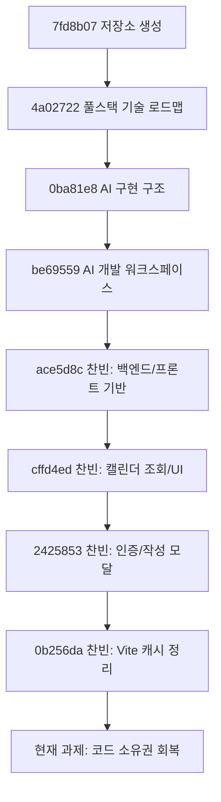

# 2026-06-12 warm-up 찬빈 커밋 흐름 분석

## 메타데이터

- 인물: 찬빈
- Git 작성자: `JCBBBBBB <wjdcksqls1@naver.com>`
- 저장소: `Jungle-303-04/warm-up`
- 브랜치: `chanbin`
- 최신 확인 HEAD: `0b256da`
- 기준 시간: 한국 시간
- 분석 범위: 첫 커밋 `7fd8b07`부터 최신 HEAD `0b256da`까지

## 전체 흐름 요약

초반 네 커밋은 우용님의 문서 기반 준비 작업이고, 이후 네 커밋이 찬빈의 실제 구현 흐름이다.

찬빈의 구현 의도는 캘린더 기반 회의/회고 기록 앱을 빠르게 완성 가능한 형태로 세로로 뚫는 것이었다. 방향 자체는 나쁘지 않다. 문제는 완성 욕심이 커서 AI가 만든 코드의 양이 찬빈의 이해 속도를 앞질렀다는 점이다.

## 의미 있는 커밋 단위 분석

### `7fd8b07` - 저장소 시작

- 작성자: 우용
- 시각: 2026-06-06 00:33 KST
- 링크: https://github.com/Jungle-303-04/warm-up/commit/7fd8b076f5bf3806144ebd46ce5a2947a0ebc792

무엇을 하고 있었나:

- 저장소의 기준점을 만들었다.
- 아직 기능, 구조, 담당자별 구현은 없다.

의도:

- 이후 문서와 구현을 쌓을 출발점을 만든 것이다.

고려하지 못한 점:

- 실행 입구, 역할, 구현 방향은 아직 없다.

어떻게 고치는가:

- 첫 커밋 자체는 문제가 아니다.
- 이후 README와 문서가 실제 실행 입구 역할을 하도록 보강되어야 한다.

### `4a02722` - 풀스택 기술 로드맵

- 작성자: 우용
- 시각: 2026-06-06 01:13 KST
- 링크: https://github.com/Jungle-303-04/warm-up/commit/4a0272297436c1f7dee6a40e207461b319588c48

무엇을 하고 있었나:

- 언어, 프론트엔드, 백엔드, 데이터 계층, 아키텍처를 나눠 학습 지도를 만들었다.

의도:

- 팀원이 구현 중 막힐 때 참고할 공통 기술 사전을 만들려는 것이다.

고려하지 못한 점:

- 큰 로드맵은 찬빈이 지금 이해하지 못하는 실제 코드 흐름을 바로 해결하지 못한다.

어떻게 고치는가:

- 찬빈에게는 전체 로드맵이 아니라 인증, API, 상태 관리, DB 모델 관계처럼 현재 코드와 연결되는 부분만 골라 설명하게 한다.

### `0ba81e8` - AI 구현 구조

- 작성자: 우용
- 시각: 2026-06-06 01:30 KST
- 링크: https://github.com/Jungle-303-04/warm-up/commit/0ba81e8506cf980011770bf7981319bb88cd91ee

무엇을 하고 있었나:

- LLM 런타임, RAG, MCP, 에이전트 오케스트레이션, 메모리/평가/관측성 문서를 추가했다.

의도:

- AI를 단순 코드 생성기가 아니라 개발 환경과 운영 체계로 보려는 것이다.

고려하지 못한 점:

- AI 사용 기준은 넓게 정리됐지만, AI 결과물을 자기 코드로 만드는 작은 절차는 강제되지 않았다.

어떻게 고치는가:

- 찬빈 작업에서는 AI 사용을 설명, 질문, 리뷰, 반례 찾기로 제한한다.
- "전체 구현해줘" 방식은 멈추고 작은 함수 단위로 직접 재구현하게 한다.

### `be69559` - AI 개발 워크스페이스 계획

- 작성자: 우용
- 시각: 2026-06-06 16:01 KST
- 링크: https://github.com/Jungle-303-04/warm-up/commit/be69559a6388f1aada0f22e5918b07919d98265d

무엇을 하고 있었나:

- 제품 요구사항, 정보 구조, 시스템 아키텍처, GitHub 프로젝트/에이전트 워크플로우 등을 정리했다.

의도:

- 코드 작성뿐 아니라 저장소, 이슈, RAG, MCP, 협업 흐름까지 포함한 개발 운영 체계를 만들려는 것이다.

고려하지 못한 점:

- 문서 체계가 실제 팀원의 이해도 체크로 자동 연결되지는 않는다.

어떻게 고치는가:

- 사람별 분석 문서에서 구현 흐름과 이해도 회복 체크리스트를 연결한다.

### `ace5d8c` - 찬빈의 백엔드 기반 구축

- 작성자: 찬빈
- 시각: 2026-06-08 23:26 KST
- 링크: https://github.com/Jungle-303-04/warm-up/commit/ace5d8c5d8e8a074fa91ce498f974f03bbd1752f

무엇을 하고 있었나:

- FastAPI, SQLAlchemy, Alembic, 인증 라우터, 페이지 라우터, React/Vite 기반을 한 번에 만들었다.

의도:

- 회의/회고 기록 앱의 전체 골격을 빠르게 완성하려 했다.
- 회의와 회고를 `PageType`으로 나누고 하나의 `Page` 도메인에서 처리하려 했다.
- 본문을 `PageBlock`으로 분리해 문단, 체크리스트, 코드 블록 같은 확장을 염두에 둔 것으로 보인다.

잘한 점:

- `Page`, `PageBlock`, `Tag`, `User`, `Comment` 구조는 확장 가능하다.
- 백엔드와 프론트의 큰 그림을 한 번에 연결하려는 시도는 있었다.

고려하지 못한 점:

- 커밋 범위가 너무 커서 본인이 설명하기 어려운 구조가 됐다.
- 백엔드, DB, 인증, 프론트 기반이 한 번에 들어가 검증 지점이 없다.
- 조회 권한 정책이 처음부터 일관되게 고정되지 않았다.

어떻게 고치는가:

- 기능 추가를 멈추고 도메인 관계부터 설명하게 한다.
- 찬빈이 `User`, `Page`, `PageBlock`, `Tag`, `Comment` 관계와 `db.flush()`, `get_or_create_tags`, `PageType`, `BlockType`의 이유를 말해야 한다.

### `cffd4ed` - 캘린더 레이아웃과 월별 페이지 조회

- 작성자: 찬빈
- 시각: 2026-06-10 01:06 KST
- 링크: https://github.com/Jungle-303-04/warm-up/commit/cffd4ed196990ae959f6aee452047afd08541276

무엇을 하고 있었나:

- `/pages/calendar`와 FullCalendar 기반 월간 화면을 붙였다.
- 선택한 날짜의 회의/회고를 오른쪽 패널에서 볼 수 있게 했다.

의도:

- 목록 앱이 아니라 캘린더 중심 앱으로 사용자 흐름을 잡으려 했다.
- 월 단위 조회로 데이터 범위를 줄이고, `CalendarPageItem`으로 화면에 필요한 필드만 받으려 했다.

잘한 점:

- 전체 데이터를 가져오지 않고 현재 보이는 월만 조회한다.
- 캘린더 조회 응답을 작게 분리했다.

고려하지 못한 점:

- 캘린더 조회만 현재 사용자 기준이고, 목록/검색/상세 조회는 같은 권한 정책이 보이지 않는다.
- 이벤트 클릭과 상세 확인이 아직 alert다.

어떻게 고치는가:

- `get_pages`, `search_pages`, `get_page`에도 권한 정책을 통일한다.
- 찬빈이 `visibleYear`, `visibleMonth`, `selectedDate`, `calendarItems`, `calendarEvents`의 차이를 설명해야 한다.

### `2425853` - 인증과 작성 모달

- 작성자: 찬빈
- 시각: 2026-06-10 23:24 KST
- 링크: https://github.com/Jungle-303-04/warm-up/commit/242585358dc0bd794a2977bab23d1c1c78747c8a

무엇을 하고 있었나:

- 로그인/회원가입, 토큰 저장, `/auth/me`, axios 인터셉터, 작성 모달, 블록 에디터를 붙였다.
- 회의/회고를 작성하면 서버에 저장하고 캘린더를 다시 불러오게 했다.

의도:

- 로그인 후 캘린더를 보고 회의/회고를 작성하는 세로 흐름을 완성하려 했다.
- 작성 후 로컬 상태만 조작하지 않고 서버 데이터를 다시 조회해 화면을 갱신하려 했다.

잘한 점:

- 토큰 존재만 믿지 않고 `/auth/me`로 검증한다.
- 작성 후 서버 데이터를 다시 조회한다.
- 인증 흐름과 JWT 흐름을 별도 학습 문서로 남겼다.

고려하지 못한 점:

- 작성한 내용을 상세로 확인하는 UI가 없다.
- 모달, 블록 에디터, 인증 흐름이 한 번에 붙어 이해 부담이 커졌다.
- `localStorage` 토큰 저장의 보안 tradeoff가 충분히 설명되지 않았다.
- 시간 검증, 에러 처리, 빌드 검증이 약하다.

어떻게 고치는가:

- 새 기능 추가보다 설명 세션을 먼저 한다.
- 찬빈이 토큰 저장, `/auth/me`, 401 로그아웃, `PageCreateRequest`, `BlockEditor`, 저장 후 재조회 이유를 설명해야 한다.
- 설명하지 못하는 함수는 AI 없이 다시 작성한다.

### `0b256da` - Vite 캐시 정리

- 작성자: 찬빈
- 시각: 2026-06-11 00:20 KST
- 링크: https://github.com/Jungle-303-04/warm-up/commit/0b256da12dba4cf21c8bfe93492a43d6265586c9

무엇을 하고 있었나:

- `.gitignore`에 `frontend/.vite/`를 추가했다.

의도:

- 로컬 개발 산출물이 Git에 섞이지 않게 정리하려 했다.

고려하지 못한 점:

- 실행 흔적은 있지만 빌드 성공이나 API 확인 결과가 없다.

어떻게 고치는가:

- `npm run build`와 최소 API 스모크 체크 결과를 남긴다.

## 현재 판단

찬빈의 방향은 틀리지 않았다. 캘린더 앱의 핵심 세로 흐름은 잡았다. 다만 커밋 크기와 기능 확장 속도에 비해 이해도 검증이 없다.

현재 가장 큰 문제는 코드 품질 하나가 아니라 찬빈이 이 코드를 자기 코드로 설명할 수 있는지다. 설명하지 못하면 다음 기능을 붙일수록 프로젝트 위험은 커진다.

## 지금 고치는 순서

1. 기능 추가 중단
2. 로그인, 인증 확인, 캘린더 조회, 작성 저장 흐름 설명
3. 작은 함수 직접 재구현
4. 페이지 조회 권한 정책 통일
5. 읽기 전용 상세 모달
6. 수정/삭제 UI
7. 빌드와 API 스모크 테스트 기록

## 찬빈에게 줄 질문

- 이 프로젝트에서 네가 직접 선택했다고 말할 수 있는 구조는 무엇인가?
- `Page` 하나로 회의와 회고를 처리한 이유는 무엇인가?
- 작성 모달에서 회의와 회고가 다르게 처리되는 부분은 어디인가?
- 캘린더 조회 API와 일반 페이지 조회 API의 권한 정책은 왜 같아야 하는가?
- AI가 만든 코드 중 지금 설명할 수 없는 파일은 무엇인가?
- 도움을 요청한다면 코드 전체가 아니라 어느 함수부터 보여줄 것인가?

