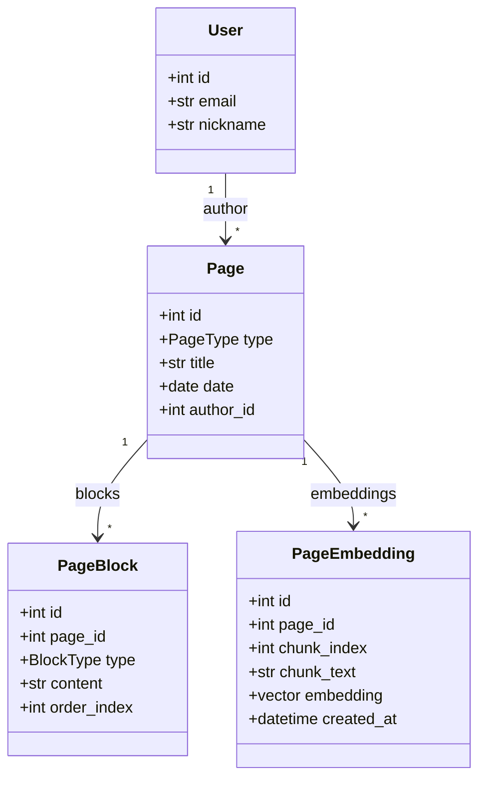

# 2026-06-14 warm-up 찬빈 페이지 임베딩 테이블 분석

## 메타데이터

- 인물: 찬빈
- Git 작성자: `JCBBBBBB <wjdcksqls1@naver.com>`
- 저장소: `Jungle-303-04/warm-up`
- 브랜치: `chanbin`
- 기준 시간: 한국 시간
- 확인 HEAD: `68ddb07`
- 대상 커밋: `68ddb0747e4e848e899181270f763cdec2cfd514`
- 커밋 메시지: `feat: 페이지 임베딩 테이블 추가`
- 커밋 시각: 2026-06-14 00:58 KST

## 최신 상태와 새 커밋 여부

새 커밋이 있다. 기존 최신 HEAD `0b256da` 이후 `68ddb07`이 추가됐다.

이번 커밋은 이름상으로는 페이지 임베딩 테이블 추가지만, 실제로는 아래 변경이 함께 들어갔다.

- `PageEmbedding` SQLAlchemy 모델 추가
- Alembic migration `7d45f88c552e_add_page_embeddings.py` 추가
- `OPENAI_API_KEY`, `OPENAI_EMBEDDING_MODEL`, `OPENAI_ANSWER_MODEL` 설정 추가
- `Tag`, `page_tags` 모델 제거
- 페이지 생성/수정/응답 schema에서 `tags` 제거
- 프론트 작성 모달에서 태그 입력 제거
- `/pages/search` API 주석 처리
- 모델 파일 전반에 설명 주석 추가
- 루트 `requirements.txt` 추가

## 현재 작업 형식과 흐름

찬빈은 캘린더 회의/회고 앱 위에 RAG/AI 검색 기반을 붙이려는 흐름으로 넘어갔다. `page_embeddings`는 회의/회고 페이지를 chunk로 나누고, 각 chunk의 embedding vector를 저장하기 위한 테이블이다.

하지만 실제 구현은 아직 "임베딩 저장을 위한 스키마 준비" 단계다. 아직 아래는 없다.

- 페이지 본문을 chunk로 나누는 서비스
- OpenAI embedding API 호출 코드
- `PageEmbedding` row 생성/갱신 로직
- 검색 query를 embedding으로 바꾸는 로직
- vector similarity 검색 API
- 답변 생성 API
- source/citation 응답

즉 "AI에게 물어보면 저장 기록을 찾아 답하는 챗봇"의 기반 방향은 보이지만, 실제 챗봇 기능은 아직 구현되지 않았다.

## 시간 단위 작업 정리

### 00:37 KST 전후

- Alembic migration 생성 시각이 `2026-06-14 00:37:25`로 기록되어 있다.
- `page_embeddings` 테이블을 만들고 `page_id`, `chunk_index`, `chunk_text`, `embedding`, `created_at`을 저장하려 했다.
- `page_id + chunk_index` unique constraint로 한 페이지 안에서 chunk 순서를 중복 없이 관리하려 했다.

### 00:58 KST

- 커밋 `68ddb07`을 push했다.
- 커밋 메시지는 `feat: 페이지 임베딩 테이블 추가`다.
- 실제 변경량은 19개 파일, 312 additions, 249 deletions로 기능 추가보다 구조 변경 폭이 크다.

## 무엇을 구현했는지

### `PageEmbedding` 모델

`backend/app/models/page_embedding.py`에 새 모델을 추가했다.



의도는 `Page`의 본문을 검색 가능한 vector 단위로 저장하는 것이다. `chunk_text`와 `embedding`을 같이 저장한 점은 좋다. 나중에 답변 근거를 만들려면 원문 chunk가 필요하기 때문이다.

### Alembic migration

`backend/alembic/versions/7d45f88c552e_add_page_embeddings.py`를 추가했다.

생성되는 테이블:

- `page_embeddings.id`
- `page_embeddings.page_id`
- `page_embeddings.chunk_index`
- `page_embeddings.chunk_text`
- `page_embeddings.embedding Vector(1536)`
- `page_embeddings.created_at`

### OpenAI/RAG 설정

`backend/app/core/config.py`에 아래 설정을 추가했다.

- `OPENAI_API_KEY`
- `OPENAI_EMBEDDING_MODEL = "text-embedding-3-small"`
- `OPENAI_ANSWER_MODEL = "gpt-4.1-mini"`

이름만 보면 임베딩 생성과 답변 생성을 모두 염두에 둔 것으로 보인다.

## 코드/커밋/주석 기준으로 무엇을 고려했는지

- `Vector(1536)`을 선택한 것으로 보아 `text-embedding-3-small`의 1536차원 embedding을 알고 맞추려 했다.
- `page_id`, `chunk_index` unique constraint를 둬서 같은 페이지의 chunk 순서를 안정적으로 관리하려 했다.
- `ondelete="CASCADE"`를 둬서 페이지가 삭제되면 embedding도 함께 삭제되게 하려 했다.
- 모델 파일에 한국어 주석을 많이 추가해 자기 이해를 복구하려는 흔적이 있다.
- OpenAI answer model 설정까지 넣은 것으로 보아 단순 vector 저장을 넘어 질문 답변까지 생각하고 있다.

## 잘한 점

- RAG 챗봇을 만들려면 먼저 문서 원문과 embedding을 저장할 테이블이 필요하다는 방향은 맞다.
- `chunk_text`를 저장한 점은 좋다. 검색 결과를 답변 근거로 보여주려면 vector만으로는 부족하다.
- `page_id + chunk_index` unique constraint는 같은 페이지 chunk 재생성 시 기준점이 될 수 있다.
- `page_id` cascade는 페이지 삭제 시 embedding 고아 데이터를 줄이는 데 도움이 된다.
- 주석을 늘린 것은 코드 소유권을 회복하려는 시도로 볼 수 있다.

## 부족하거나 위험한 점

### 1. 태그 기능이 삭제됐다

`Tag` 모델, `page_tags` association table, schema의 `tags`, 프론트 태그 입력이 제거됐다.

이건 "임베딩 테이블 추가"와 직접 관련 없는 기능 제거다. 태그는 검색/분류/RAG metadata로도 쓸 수 있는 값이라, 삭제 결정은 별도 커밋과 설명이 필요했다.

### 2. 검색 API가 주석 처리됐다

`/pages/search`가 비활성화됐다. 기존 텍스트 검색을 vector 검색으로 대체하려는 의도일 수 있지만, 대체 API는 아직 없다.

현재 상태는 "검색 개선"이 아니라 "검색 기능 제거 후 새 검색 기반 일부 추가"에 가깝다.

### 3. 목록/상세 조회 권한 문제가 아직 남아 있다

`/pages/calendar`는 `Page.author_id == current_user.id`로 필터링한다. 하지만 `get_pages`와 `get_page`는 여전히 소유자 필터나 `check_page_owner`이 없다.

특히 `get_page(page_id)`는 토큰만 있으면 다른 사용자의 page id를 조회할 가능성이 있다.

### 4. migration이 태그 테이블을 drop한다

새 migration은 `page_embeddings`를 만들면서 `page_tags`, `tags`를 drop한다. 이미 태그 데이터가 있었다면 migration 실행 시 데이터가 사라진다.

이 변경은 데이터 손실이므로 반드시 별도 결정 기록이 필요하다.

### 5. `requirements.txt` 인코딩이 깨져 보인다

루트 `requirements.txt`가 null byte가 섞인 형태로 보인다. 일반 pip requirements 파일로 바로 쓰기 어렵고, 리뷰/빌드에서 문제가 될 가능성이 높다.

### 6. OpenAI 설정이 필수값이 됐다

`OPENAI_API_KEY: str`가 기본값 없이 추가됐다. FastAPI 설정 로딩 시 `.env`에 이 값이 없으면 앱 시작이 막힐 수 있다.

아직 embedding 기능을 실제로 쓰지 않는데 앱 전체 실행 조건이 늘어나는 것은 위험하다.

## 어떻게 개선하면 좋은지

1. 이번 커밋을 기능별로 나눈다.
   - `feat: page_embeddings 모델과 migration 추가`
   - `refactor: 태그 제거` 또는 `revert: 태그 제거 취소`
   - `docs: 모델 주석 보강`
   - `chore: requirements 정리`

2. 태그 제거는 일단 되돌리는 편이 낫다.
   - RAG metadata로 태그를 계속 쓸 수 있다.
   - 제거하려면 "왜 태그가 필요 없어졌는지"를 먼저 설명해야 한다.

3. 검색 API를 주석 처리하지 말고 기존 텍스트 검색을 유지한다.
   - vector 검색은 `/pages/semantic-search`처럼 별도 API로 추가한다.
   - 새 검색이 안정화되면 기존 검색과 통합한다.

4. 권한 정책을 먼저 고친다.
   - `get_pages`: `Page.author_id == current_user.id`
   - `get_page`: 조회 후 `check_page_owner(page, current_user)`
   - 검색 API도 현재 사용자 page만 대상으로 제한

5. `PageEmbedding` 생성 흐름을 작은 단위로 구현한다.
   - `build_page_embedding_text(page, blocks)`
   - `split_page_chunks(text)`
   - `create_embedding(text)`
   - `replace_page_embeddings(page_id, chunks)`

6. OpenAI 설정은 실제 사용 전까지 optional로 두거나 embedding 기능 경로에서만 검증한다.

## 겪고 있을 가능성이 있는 어려움/막힘 신호

- RAG 챗봇을 만들고 싶지만, 기존 검색/태그/권한 설계를 어디에 유지해야 할지 정리하지 못한 것으로 보인다.
- Alembic autogenerate 결과를 그대로 받아들여 `tags` drop까지 들어간 가능성이 있다.
- "임베딩 테이블"을 만들면 AI 검색이 되는 것으로 착각할 수 있다. 실제로는 chunking, embedding 생성, upsert, vector search, answer generation, citation이 모두 남아 있다.
- 주석이 많아진 것은 좋은 신호이기도 하지만, 이해를 코드 변경으로 검증하기보다 설명 주석으로 버티는 신호일 수도 있다.

## 필요한 정보

- 태그를 제거한 이유가 의도인지 실수인지 확인해야 한다.
- 기존 텍스트 검색을 없애고 vector 검색으로 대체할 계획인지 확인해야 한다.
- page embedding은 언제 생성할지 정해야 한다.
  - 페이지 저장 직후 동기 생성
  - background job
  - 수동 재색인
- OpenAI API key가 없는 로컬 환경에서도 앱을 실행해야 하는지 정해야 한다.
- embedding 실패 시 페이지 저장을 실패시킬지, 검색만 나중에 재시도할지 정해야 한다.

## 사용자가 지금 도울 수 있는 구체적 행동

찬빈에게 지금 바로 확인할 질문:

```text
이번 커밋에서 page_embeddings 추가와 tags 삭제가 같이 들어갔는데, tags 삭제는 의도였어?
검색 API를 주석 처리한 이유는 vector 검색으로 대체하려는 거야, 아니면 잠깐 막아둔 거야?
page_embeddings 테이블에 실제 데이터는 언제, 어떤 함수가 넣을 계획이야?
```

권장 지시:

```text
새 기능을 더 붙이기 전에 이번 커밋을 설명해줘.
특히 태그를 왜 없앴는지, 검색 API를 왜 껐는지, embedding row가 언제 생기는지 말해야 해.
설명하지 못하면 tags 삭제와 search 주석 처리는 되돌리고, page_embeddings만 작은 커밋으로 다시 남기자.
```

## 코드 소유권 회복 관점에서 찬빈이 직접 설명해야 할 흐름

- `PageEmbedding`은 `Page`와 어떤 관계인가?
- 왜 embedding dimension이 1536인가?
- `chunk_text`와 `embedding`을 둘 다 저장하는 이유는 무엇인가?
- `page_id + chunk_index` unique constraint가 막는 문제는 무엇인가?
- `ondelete="CASCADE"`는 언제 작동하는가?
- Alembic autogenerate가 만든 migration을 그대로 믿으면 왜 위험한가?
- `tags` 테이블을 지우면 사용자가 잃는 기능은 무엇인가?
- 기존 `/pages/search`와 앞으로 만들 vector search는 어떻게 공존해야 하는가?
- OpenAI API key가 없을 때 앱은 어디까지 실행되어야 하는가?

## 작은 단위 재구현 과제

AI 없이 직접 구현/설명해야 할 과제:

1. `Page`와 `PageBlock`을 받아 하나의 검색용 텍스트로 합치는 함수 작성
2. 긴 텍스트를 500자 단위 chunk로 나누는 함수 작성
3. `PageEmbedding` row 예시를 손으로 2개 만들어 설명
4. `get_page`에 소유자 체크 추가
5. `get_pages`에 현재 사용자 필터 추가
6. 태그 제거가 실수라면 `Tag`, `page_tags`, schema, 프론트 입력을 복구

## 현재 판단

이번 커밋은 찬빈이 "AI에게 프로젝트 기록을 물어보는 기능" 방향으로 움직였다는 점에서 의미가 있다. 하지만 구현 단위가 불안정하다. `page_embeddings` 추가는 좋은 출발이고, `tags` 삭제와 검색 API 비활성화는 위험하다.

따라서 다음 액션은 새 RAG 기능 추가가 아니라, 이번 커밋을 쪼개고 회귀를 막는 것이다.

