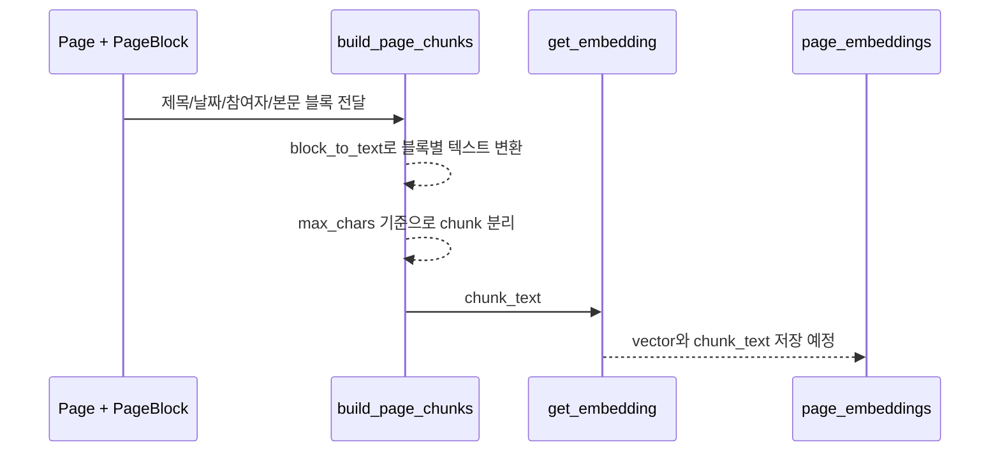

# 2026-06-15 warm-up 찬빈 RAG chunking 분석

## 메타데이터

- 인물: 찬빈
- Git 작성자: `JCBBBBBB <wjdcksqls1@naver.com>`
- 저장소: `Jungle-303-04/warm-up`
- 브랜치: `chanbin`
- 확인 범위: `68ddb07` 이후 2026-06-15 KST 커밋
- 대상 커밋:
  - `ba66453`, `feat: chunking 구현`, 2026-06-15 03:44 KST
  - `e476ffe`, `Ignore VS Code settings clone`, 2026-06-15 15:35 KST

## 최신 상태와 새 커밋 여부

새 커밋이 있었다. 6월 14일의 `page_embeddings` 테이블 추가 이후, 실제 RAG용 chunk 생성 서비스가 들어왔다.

## 현재 작업 형식과 흐름

찬빈은 "테이블부터 만들기"에서 "페이지를 검색 가능한 텍스트 조각으로 바꾸기" 단계로 이동했다. 이는 RAG에서 중요한 중간 단계다.



## 최근에 무엇을 구현했는지

- `backend/app/services/rag_service.py`를 추가했다.
- `block_to_text(block)`로 `PageBlock`을 RAG용 텍스트로 변환한다.
- `build_page_header(page)`로 제목, 날짜, 종류, 참여자를 chunk 앞에 붙인다.
- `build_page_chunks(page, max_chars=1200)`로 `Page`와 `PageBlock`을 여러 chunk로 나눈다.
- 빈 `backend/app/services/__init__.py`를 추가했다.
- `.gitignore`에 VS Code 설정 clone 관련 항목을 추가했다.

## 무엇을 고려했는지

- RAG 검색에는 본문만이 아니라 제목, 날짜, 종류, 참여자 같은 metadata가 필요하다는 점을 고려했다.
- block type에 따라 heading, bullet, checklist, code를 텍스트로 다르게 표현하려 했다.
- chunk 크기를 `max_chars`로 제한해 너무 긴 문서를 한 번에 embedding하지 않으려 했다.

## 잘한 점

- RAG의 핵심인 "검색 가능한 단위 만들기"를 독립 서비스로 빼려 한 점은 좋다.
- chunk마다 page header를 반복해서 붙인 점은 검색 결과가 단독으로 OpenAI에 들어가도 맥락을 잃지 않게 한다.
- checklist/code/heading 같은 block type을 평문으로 보존하려 한 점은 이후 답변 품질에 도움이 된다.

## 부족하거나 위험한 점

- token 기준이 아니라 문자 수 기준 chunking이다. 한국어/영어/코드가 섞이면 실제 LLM context 비용과 어긋날 수 있다.
- `max_chars=1200`의 근거가 없다.
- chunk overlap이 없어 경계에 걸친 결정 내용이 끊길 수 있다.
- 테스트가 보이지 않는다. `build_page_chunks`는 작은 단위 테스트가 반드시 필요하다.
- 이 시점에서는 아직 embedding 저장과 검색 API까지 연결되지 않았다.

## 어떻게 개선하면 좋은지

- `block_to_text`, `build_page_header`, `build_page_chunks` 단위 테스트를 먼저 만든다.
- 날짜/종류/참여자 header가 모든 chunk에 들어가는지 테스트한다.
- 긴 block 하나가 `max_chars`를 넘을 때 어떻게 처리할지 정한다.
- chunk overlap을 100~200자 정도 둘지 결정한다.
- 나중에 token 기반 chunking으로 바꿀 수 있게 함수 경계를 유지한다.

## 겪고 있을 가능성이 있는 어려움/막힘 신호

- RAG 구현 단계를 알고는 있지만, chunking 품질을 어떻게 검증할지 아직 기준이 약하다.
- "일단 동작하게 만들기" 쪽으로 가고 있어 테스트/평가 데이터가 뒤로 밀릴 가능성이 있다.

## 필요한 정보

- 한 회의/회고의 평균 길이
- 검색 질문 예시 5개
- 기대되는 참고 기록 예시
- chunk 크기와 overlap 기준

## 사용자가 지금 도울 수 있는 구체적 행동

찬빈에게 아래를 시키는 것이 좋다.

```text
회의록 샘플 1개를 손으로 chunk 2~3개로 나눠보고,
왜 거기서 끊었는지 설명해봐.
그 다음 네 코드의 build_page_chunks 결과가 네 손 chunk와 같은지 비교해봐.
```

## 코드 소유권 회복 관점에서 찬빈이 직접 설명해야 할 흐름

- 왜 본문만 embedding하지 않고 제목/날짜/참여자를 같이 넣는가?
- `block_to_text`에서 checklist와 code를 다르게 처리하는 이유는 무엇인가?
- `max_chars=1200`은 어떤 기준인가?
- chunk 경계에서 문맥이 잘리면 어떤 문제가 생기는가?
- chunking 결과를 어떻게 테스트할 것인가?

