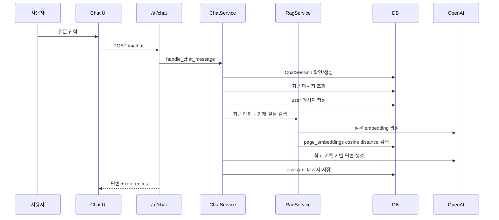

# 2026-06-16 warm-up 찬빈 AI 채팅 및 RAG 연동 분석

## 메타데이터

- 인물: 찬빈
- Git 작성자: `JCBBBBBB <wjdcksqls1@naver.com>`
- 저장소: `Jungle-303-04/warm-up`
- 브랜치: `chanbin`
- 확인 HEAD: `850f661`
- 대상 커밋: `850f661a906dd96c3c950d3cad9e30b0856b90dc`
- 커밋 메시지: `feat: AI 채팅 및 RAG 검색 연동 추가`
- 커밋 시각: 2026-06-16 01:03 KST

## 최신 상태와 새 커밋 여부

새 커밋이 있다. 최신 HEAD는 `850f661`이다.

이번 커밋은 백엔드 기준으로 RAG 검색과 AI 답변 생성까지 상당 부분 연결했다. 다만 프론트는 채팅 버튼/창 뼈대만 있고, 실제 메시지 입력/목록 연결은 아직 비어 있다.

## 현재 작업 형식과 흐름

작업 흐름은 아래처럼 진행됐다.



현재 코드상 백엔드 루프는 들어왔지만, 프론트 UI에서 실제로 `sendChatMessage`를 호출하는 흐름은 아직 닫히지 않았다.

## 최근에 무엇을 구현했는지

### 백엔드

- `/ai/chat` API 추가
- `/ai/rag/query` API 추가
- `ChatSession`, `ChatMessage` 모델 추가
- chat table migration `d639db507c4f_add_chat_tables.py` 추가
- `chat_service.py` 추가
  - 채팅방 생성/조회
  - 최근 메시지 조회
  - 사용자 메시지 저장
  - 최근 대화 + 현재 질문으로 retrieval query 생성
  - RAG 검색
  - OpenAI 답변 생성
  - assistant 메시지 저장
- `rag_service.py` 확장
  - OpenAI embedding 생성
  - 페이지 저장/수정 후 embedding refresh
  - page_embeddings cosine distance 검색
  - RAG answer 생성
- `pages.py`에서 생성/수정/삭제 시 embedding 갱신/삭제 연결

### 프론트엔드

- `frontend/src/api/chat.ts` 추가
- `ChatbotWidget`, `ChatbotWindow` 추가
- `ChatInput.tsx`, `ChatMessageList.tsx` 파일 추가
- `App.css`에 chatbot 관련 스타일 일부 추가

다만 `ChatInput.tsx`와 `ChatMessageList.tsx`는 0 byte이고, `ChatbotWindow`는 입력창/메시지 목록 주석만 있다. `ChatbotWidget`은 `./chatbot.css`를 import하지만 해당 파일은 없다. `ChatbotWidget`이 실제 화면에 mount되는 흐름도 확인되지 않는다.

## 무엇을 고려했는지

- 참고 기록이 없으면 OpenAI를 호출하지 않고 고정 문구를 반환해 환각을 줄이려 했다.
- `Page.author_id == current_user.id`로 RAG 검색 범위를 현재 사용자 기록으로 제한했다.
- 채팅 세션도 `session.user_id == current_user.id`로 확인한다.
- 최근 대화 2개를 retrieval query와 답변 prompt에 넣어 후속 질문을 처리하려 했다.
- 답변 근거를 `references`로 저장하고 프론트에 내려주려 했다.
- page 저장/수정 이후 embedding을 갱신하고, page 삭제 시 embedding도 삭제하려 했다.

## 잘한 점

- RAG의 핵심 루프인 `질문 -> embedding -> vector 검색 -> 참고 기록 -> 답변`을 실제 서비스 함수로 연결했다.
- 참고 기록이 없을 때 OpenAI 호출을 막은 판단은 좋다.
- 사용자별 격리를 RAG 검색과 채팅 세션에 적용한 점은 이전 권한 문제보다 나아진 부분이다.
- 채팅 메시지와 references를 DB에 남기려 한 점은 이후 디버깅/평가에 도움이 된다.
- 페이지 저장/수정/삭제와 embedding lifecycle을 연결하려 한 점은 중요하다.

## 부족하거나 위험한 점

### 1. 프론트 채팅은 아직 완성되지 않았다

- `sendChatMessage` 함수는 있지만 호출하는 UI가 없다.
- `ChatInput.tsx`, `ChatMessageList.tsx`는 빈 파일이다.
- `ChatbotWindow`에는 입력창과 메시지 목록이 주석으로만 있다.
- `ChatbotWidget`은 없는 `chatbot.css`를 import한다.
- `ChatbotWidget`이 `CalendarPage`나 `App`에 붙은 흔적이 없다.

### 2. 권한 문제는 일부 남아 있다

RAG 검색은 현재 사용자 기준으로 제한했지만, 기존 `get_pages`와 `get_page`는 여전히 `Page.author_id == current_user.id` 필터 또는 `check_page_owner`이 없다.

### 3. embedding 실패 처리의 transaction 경계가 위험하다

`create_page`는 page 저장 후 commit하고 `try_refresh_page_embeddings`에서 다시 commit/rollback한다. embedding 실패 시 page 저장을 살리는 의도는 좋지만, 실패 원인을 사용자에게 알리지 않고 조용히 로그만 남긴다. 그러면 사용자는 저장했는데 AI 검색에서는 안 잡히는 상태를 모를 수 있다.

### 4. OpenAI API key가 앱 시작 필수값이다

`settings = Settings()` 시점에 `OPENAI_API_KEY`가 없으면 앱 import/startup이 막힐 수 있다. AI 기능이 꺼진 상태에서도 기본 캘린더는 떠야 한다면 설정을 optional로 바꿔야 한다.

### 5. 검색 품질 평가가 없다

threshold `0.45`, `MAX_CONTEXT_CHUNKS=8`, 최근 메시지 2개는 근거가 없다. 검색 결과가 맞는지 확인하는 fixture/test가 없다.

### 6. 커밋 규모가 크다

24개 파일, 1641 additions로 채팅 모델, migration, API, RAG, 프론트, 문서가 한 번에 들어갔다. 찬빈이 모든 흐름을 한 번에 설명하기 어렵다.

## 어떻게 개선하면 좋은지

1. 프론트부터 실제로 닫는다.
   - `ChatInput` 구현
   - `ChatMessageList` 구현
   - `ChatbotWindow`에서 `sendChatMessage` 호출
   - `ChatbotWidget`을 실제 화면에 mount
   - 없는 `chatbot.css` import 제거 또는 파일 추가

2. 기존 페이지 조회 권한을 먼저 고친다.
   - `get_pages`: `Page.author_id == current_user.id`
   - `get_page`: `check_page_owner(page, current_user)`

3. RAG 품질 검증 데이터를 만든다.
   - 샘플 회의록 3개
   - 질문 5개
   - 기대 page/chunk
   - 기대 답변 핵심어

4. embedding 상태를 사용자/운영자가 볼 수 있게 한다.
   - page별 embedding chunk 개수
   - 마지막 embedding 생성 시각
   - 실패 로그 또는 재색인 API

5. OpenAI 설정을 optional로 만들거나 AI router import 시점 호출을 늦춘다.

## 겪고 있을 가능성이 있는 어려움/막힘 신호

- "백엔드 RAG는 거의 된 것처럼 보이는데 프론트는 비어 있는" 상태다. 완성 욕심 때문에 전체 그림을 크게 붙였지만 화면에서 실제 사용 가능한지 검증하지 못했을 가능성이 있다.
- 주석은 많지만 테스트가 없다. 이해를 말로 보강하려는 시도는 보이나, 동작 검증으로 이어지지 않았다.
- `chat_service.py`와 `rag_service.py`가 한 번에 커져서 찬빈이 질문 하나의 흐름을 끝까지 디버깅하기 어려울 수 있다.

## 필요한 정보

- 실제 실행 여부: backend import/startup, alembic upgrade, frontend build 결과
- OpenAI API key 없는 환경에서 앱을 어떻게 동작시킬지
- `ChatbotWidget`을 어느 화면에 붙일지
- AI 답변 references를 화면에 어떻게 보여줄지
- RAG 검색 품질 기준과 테스트 질문 목록

## 사용자가 지금 도울 수 있는 구체적 행동

찬빈에게 아래 순서로 설명하게 한다.

```text
1. 사용자가 /ai/chat에 질문을 보내면 어떤 함수들이 순서대로 실행되는지 말해봐.
2. page 저장 후 embedding row가 언제 생기는지 말해봐.
3. 참고 기록이 없을 때 왜 OpenAI를 호출하지 않는지 말해봐.
4. 지금 프론트에서 실제로 질문을 입력하고 답변을 받을 수 있는지 보여줘.
5. 안 된다면 비어 있는 파일과 누락된 import부터 정리해.
```

## 코드 소유권 회복 관점에서 찬빈이 직접 설명해야 할 흐름

- `/ai/chat`과 `/ai/rag/query`의 차이는 무엇인가?
- `ChatSession`과 `ChatMessage`를 나눈 이유는 무엇인가?
- 최근 메시지 2개를 retrieval query에 넣는 이유는 무엇인가?
- `search_relevant_chunks`에서 cosine distance가 작을수록 관련 있다는 뜻을 설명할 수 있는가?
- `threshold=0.45`는 어떻게 정했는가?
- page 저장 후 embedding 실패 시 사용자는 어떤 상태를 보게 되는가?
- `references`는 DB에 왜 저장하는가?
- 프론트에서 `sendChatMessage`가 어디서 호출되는가?

## 작은 단위 재구현 과제

AI 없이 직접 구현/설명해야 할 과제:

1. `ChatInput`에서 입력값을 받아 submit하는 최소 컴포넌트 작성
2. `ChatMessageList`에서 user/assistant 메시지를 구분해 렌더링
3. `ChatbotWindow`에서 `sendChatMessage`를 호출하고 답변을 화면에 추가
4. `get_page`에 소유자 검사 추가
5. `search_relevant_chunks`의 threshold를 인자로 바꿔 테스트 가능하게 만들기
6. RAG 샘플 데이터 3개와 질문 5개로 수동 평가표 작성

## 현재 판단

찬빈은 이제 실제 RAG/AI 채팅 백엔드까지 손을 댔다. 방향은 사용자가 말한 "저장된 기록에 따르면..."형 답변에 가까워졌다. 다만 완성도는 아직 백엔드 중심이고, 프론트와 검증이 비어 있다.

지금 더 필요한 것은 기능 추가가 아니라 실행 확인, 프론트 연결 완료, 권한 회귀 수정, RAG 품질 평가다.

