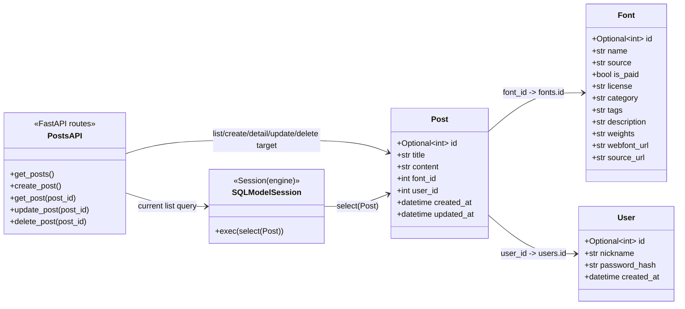

# 2026-06-10 구현 아카이브

## 대상

- 인물: 가인
- Git 작성자: `ummfieg <ummfieg@naver.com>`
- 저장소: [`Jungle-303-04/warm-up`](https://github.com/Jungle-303-04/warm-up)
- 브랜치: [`gain`](https://github.com/Jungle-303-04/warm-up/tree/gain)
- 정리 대상 날짜: `2026-06-10 KST`
- 이 문서 기준 최신 HEAD: [`ebbef70`](https://github.com/Jungle-303-04/warm-up/commit/ebbef7056201317e144e8acc1f336754ef272f3a)

이 문서는 하루 동안의 구현 흐름을 시간 순서로 고정한 기록이다. 최종 코드 리뷰라기보다, 어떤 시도와 결정이 있었고 다음에 무엇을 이어가야 하는지 보기 위한 작업 아카이브다.

## 하루 요약

가인은 `Font` 단일 테이블 구현에서 `Post`와 `User`를 포함한 백엔드 객체 모델로 확장했다. 이날의 큰 흐름은 다음과 같다.

1. `Font` 테이블 생성 경로를 확인했다.
2. 게시글을 표현할 `Post` 모델을 추가했다.
3. 작성자를 표현할 `User` 모델을 추가했다.
4. `Post`가 `Font`, `User`를 참조하도록 외래 키를 추가했다.
5. `/posts` CRUD API를 실제 구현하기 전에 의사코드로 흐름을 잡았다.

현재 브랜치는 초기 백엔드 설계 단계다. 실제 DB 조회가 들어간 API는 `GET /posts`뿐이고, 생성/상세/수정/삭제는 아직 미구현 자리표시자 상태다.

## 시간대별 구현 기록

### 00:03 - `a593a86` - `feat: font 테이블 생성 완료`

구현 내용:

- `backend/init_db.py`를 추가했다.
- `SQLModel.metadata.create_all(engine)`를 호출했다.
- `Font` 모델을 import해서 SQLModel metadata에 `fonts` 테이블이 등록되게 했다.

의미:

- SQLModel 테이블 정의가 실제 DB 테이블 생성으로 이어지는 경로를 확인했다.
- 작업 초점은 첫 번째 테이블인 `Font`를 실제로 생성하는 데 있었다.

시도와 결정:

- 마이그레이션 도구 없이 단순 초기화 스크립트로 테이블을 만든다.
- warm-up 단계에서는 빠르게 확인할 수 있는 선택이지만, 이후 스키마 변경에는 약하다.

문제 또는 위험:

- `create_all()`은 없는 테이블을 만들 뿐, 이미 있는 테이블의 컬럼 변경을 마이그레이션하지 않는다.
- 백엔드 실행 방법, 의존성, `.env.example`이 아직 보이지 않는다.

### 14:56 - `3e74e90` - `chore: 설명용 주석 추가 및 불필요한 print문 삭제`

구현 내용:

- 테이블 등록과 초기화 과정에 설명 주석을 추가했다.
- 일부 임시 `print`성 디버깅을 제거했다.

의미:

- `SQLModel.metadata.create_all(engine)` 전에 모델 import가 왜 필요한지 이해하려는 흔적이다.
- SQLModel metadata 등록 과정을 학습하면서 코드 가까이에 설명을 남겼다.

시도와 결정:

- 구현 코드 옆에 학습 메모를 남겼다.
- 초반 학습 단계에서는 유용하지만, 개념이 안정되면 오래 남길 주석과 지울 주석을 나눠야 한다.

문제 또는 위험:

- 설명 주석은 코드가 바뀌면 쉽게 낡는다.
- 실제로 하루 끝 시점의 `main.py`에는 `User` 모델이 이미 생겼는데도 “user 정보는 아직 table 생성안했음”이라는 낡은 주석이 남아 있다.

### 21:57 - `e430e2b` - `feat: post 테이블 컬럼 정의`

구현 내용:

- `Post` 모델을 추가했다.
- `title`, `content` 필드를 정의했다.
- 앱의 중심 콘텐츠 엔티티를 만들기 시작했다.

의미:

- 프로젝트가 단순 폰트 목록에서 “폰트가 적용된 사용자 게시글” 구조로 넘어갔다.
- 폰트는 저장만 되는 대상이 아니라, 게시글 안에서 사용되는 데이터가 되기 시작했다.

시도와 결정:

- 게시글을 제목과 본문을 가진 지속 데이터로 본다.
- 이후 폰트와 사용자 관계를 붙일 기반을 만들었다.

문제 또는 위험:

- 요청/응답 스키마가 아직 DB 테이블 모델과 분리되지 않았다.
- FastAPI 응답에서 테이블 모델이 그대로 노출될 가능성이 있다.

### 22:07 - `7a58771` - `feat: user 테이블 컬럼 정의`

구현 내용:

- `User` 모델을 추가했다.
- `nickname`, `password_hash`, `created_at`을 정의했다.

의미:

- 작성자 또는 계정 개념을 도입했다.
- 이후 인증 또는 최소한 작성자 식별이 필요하다고 판단한 것으로 보인다.

시도와 결정:

- 비밀번호 원문이 아니라 `password_hash`를 저장하는 방향을 잡았다.
- 보안 관점에서 방향은 맞다.

문제 또는 위험:

- 인증 범위가 아직 정의되지 않았다.
- 비밀번호 해싱 구현, 로그인 API, 인증 경계는 없다.
- 현재 단계에서는 인증 구현이 기본 CRUD 완성을 방해할 수 있다.

### 22:11 - `fbac6d8` - `feat: post 테이블 user id 컬럼 추가`

구현 내용:

- `Post`에 `user_id`를 추가했다.
- `Post`가 `fonts.id`, `users.id`를 모두 참조하게 되었다.

의미:

- 게시글은 특정 폰트를 사용하고 특정 사용자가 작성한다는 관계가 모델에 반영되었다.
- 사용자 생성 콘텐츠로서의 최소 관계 구조가 잡혔다.

시도와 결정:

- 테이블 모델에 외래 키를 직접 둔다.
- 관계는 다음과 같다.
  - `font_id -> fonts.id`
  - `user_id -> users.id`

문제 또는 위험:

- SQLModel relationship 필드는 아직 없다.
- 목록/상세 화면에서 폰트 이름, 태그, 사용자 닉네임을 함께 내려주려면 별도 조회 설계가 필요하다.

### 22:30 - `3fa8025` - `feat: Post, User table 생성`

구현 내용:

- `init_db.py`에서 `Post`, `User`를 import하도록 수정했다.
- `create_all()`이 `fonts`, `posts`, `users` 테이블을 모두 생성할 수 있게 되었다.

의미:

- 세 핵심 엔티티가 SQLModel metadata에 등록되었다.
- DB 초기화 경로 기준으로는 최소 모델 구성이 완료되었다.

시도와 결정:

- 초기화 스크립트에서 모든 모델을 import해서 metadata 등록을 보장한다.

문제 또는 위험:

- 여전히 수동 초기화 방식이다.
- 이후 컬럼이 바뀌면 `create_all()`만으로는 기존 테이블을 안전하게 변경할 수 없다.

### 23:11 - `ebbef70` - `chore: crud api 의사코드 작성`

구현 내용:

- `backend/main.py`에 `/posts` CRUD 라우트 골격을 추가했다.
- `GET /posts`는 `Session(engine)`과 `select(Post)`를 사용해 실제 DB 조회를 수행한다.
- 생성, 상세, 수정, 삭제는 의사코드와 빈 응답만 있다.

의미:

- DB 모델링에서 API 동작 설계로 넘어갔다.
- 프론트가 어떤 데이터를 필요로 하는지, 생성 후 어떤 응답이 필요한지 고민하기 시작했다.

고려한 점:

- 목록 화면에는 제목, 폰트 적용 모습, 폰트 태그 정도가 필요하다고 봤다.
- 생성 API는 프론트가 상세 페이지로 이동하거나 목록을 갱신할 수 있도록 생성된 데이터를 반환해야 한다고 봤다.
- 프론트 검증과 별개로 서버 검증도 필요하다고 봤다.
- 상세/수정/삭제에서는 `post_id` 존재 여부를 확인해야 한다고 봤다.
- 생성 과정에서 동시성 제어가 필요한지 질문을 남겼다.

문제 또는 위험:

- 실제 구현은 `GET /posts`까지만 되어 있다.
- `POST`, `GET /posts/{post_id}`, `PUT`, `DELETE`는 미구현 자리표시자다.
- `PostCreate`, `PostRead`, `PostUpdate` 같은 요청/응답 스키마가 없다.
- `User` 테이블이 생겼는데도 `main.py` 주석에는 아직 user table이 없다고 적혀 있다.
- 동시성 고민은 현재 구현 단계에 비해 이르다.

## 시각 모델

클래스 UML 작업자 세션에서 class diagram과 API 상태 다이어그램을 제안받았다. 아래 버전은 실제 `gain` 브랜치 코드 기준으로 필드와 라우트명을 보정한 것이다.



## `/posts` API 구현 상태

```text
2026-06-10 기준 /posts API 상태

[GET /posts]
  상태: 구현됨
  현재 흐름:
    request
      -> Session(engine)
      -> select(Post)
      -> session.exec(...).all()
      -> list[Post]
  남은 작업:
    응답 스키마
    font/user 표시 데이터 조인 또는 별도 조회

[POST /posts]
  상태: 미구현 자리표시자
  의도:
    title, content, font 정보, user 정보를 받는다
    서버 측 검증을 한다
    DB에 저장한다
    프론트의 상세 이동/목록 갱신에 필요한 생성 결과를 반환한다
  빠진 작업:
    PostCreate 스키마
    session.add()
    session.commit()
    session.refresh()
    font_id/user_id 유효성 확인

[GET /posts/{post_id}]
  상태: 미구현 자리표시자
  의도:
    post_id 존재 여부를 확인한다
    상세 화면 표시 데이터를 반환한다
  빠진 작업:
    session.get(Post, post_id)
    404 처리
    응답 스키마

[PUT /posts/{post_id}]
  상태: 미구현 자리표시자
  의도:
    id로 기존 게시글을 찾는다
    title/content/font 정보를 수정한다
    저장 후 성공 여부를 반환한다
  빠진 작업:
    PostUpdate 스키마
    부분 수정 정책
    updated_at 갱신
    404 처리

[DELETE /posts/{post_id}]
  상태: 미구현 자리표시자
  의도:
    id로 기존 게시글을 찾는다
    삭제한다
    결과를 반환한다
  빠진 작업:
    session.delete()
    session.commit()
    404 처리
```

## 잘한 점

- 테이블 생성, 모델 확장, API 동작 설계 순서가 자연스럽다.
- `Post`를 도메인의 중심에 둔 판단이 적절하다.
- `font_id`, `user_id`를 통해 관계형 모델을 의식하고 있다.
- CRUD 의사코드가 백엔드 동작만이 아니라 프론트 요구까지 함께 기록하고 있다.

## 부족한 점

- 첫 번째 write path인 `POST /posts`가 아직 구현되지 않았다.
- 요청/응답 계약을 담당하는 스키마 계층이 없다.
- DB 실행과 초기화 방법이 명시적이지 않아 다른 팀원이 재현하기 어렵다.
- 일부 주석이 이미 코드 상태와 맞지 않는다.
- 기본 CRUD가 없는데 동시성을 먼저 고민하고 있다.

## 다음 권장 작업

다음 커밋은 인증이나 동시성으로 시작하지 않는 편이 좋다. 가장 작은 동작 단위의 CRUD를 먼저 끝내야 한다.

1. `PostCreate`, `PostRead`, `PostUpdate`를 추가한다.
2. `POST /posts`를 구현한다.
3. 생성된 게시글을 반환한다.
4. `GET /posts/{post_id}`를 구현하고 404 처리를 넣는다.

사용자가 도울 수 있는 말:

> 동시성은 나중에 봐도 됩니다. 먼저 요청/응답 스키마를 명확히 만들고, 게시글 생성과 단건 조회가 DB에 실제로 반영되는지 끝까지 확인합시다.
