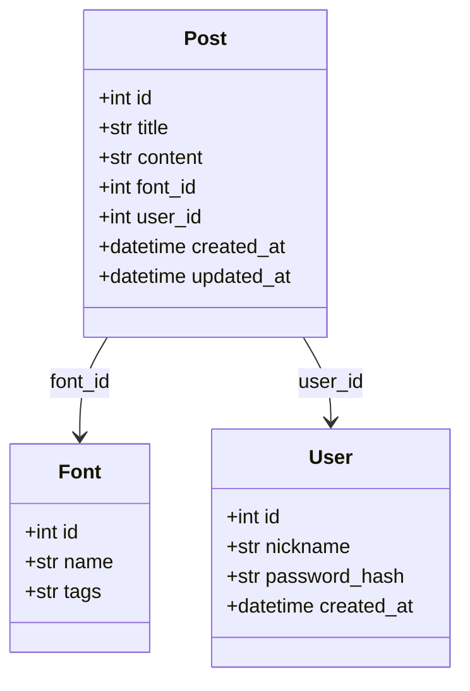
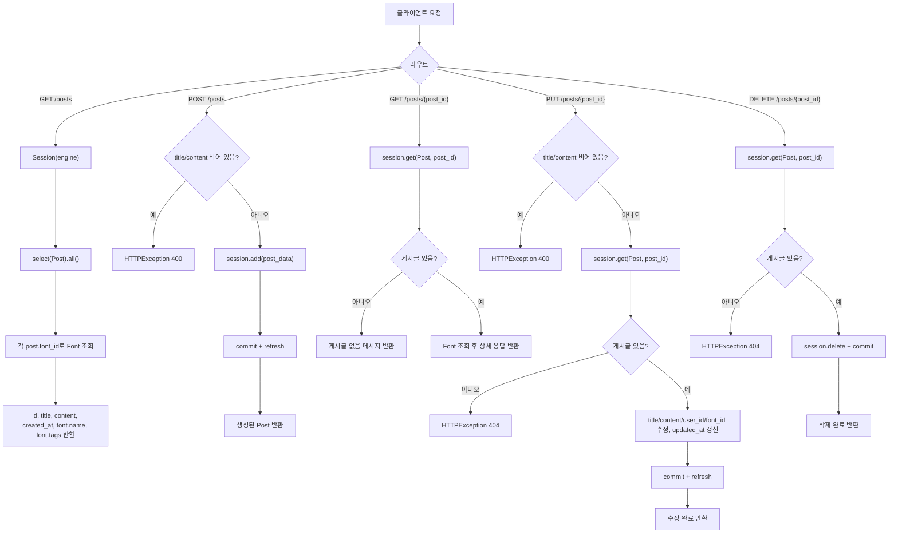

# 2026-06-11 구현 아카이브

## 대상

- 인물: [가인](./README.md)
- 저장소: [`Jungle-303-04/warm-up`](https://github.com/Jungle-303-04/warm-up)
- 브랜치: [`gain`](https://github.com/Jungle-303-04/warm-up/tree/gain)
- 작성자: `ummfieg <ummfieg@naver.com>`
- 기준 범위: [`ebbef70`](https://github.com/Jungle-303-04/warm-up/commit/ebbef7056201317e144e8acc1f336754ef272f3a) 이후부터 [`bf8bef0`](https://github.com/Jungle-303-04/warm-up/commit/bf8bef0abf0cd7517fcca3d994370ebe2987c03a)까지
- 확인 시각: `2026-06-11 18:16:32 +0900`

## 하루 요약

가인은 6월 11일 오후에 `/posts` 의사코드를 실제 게시글 CRUD API로 바꿨다. 작업 흐름은 “기본 CRUD 구현 → 목록 응답 축소 → 입력 예외 처리 → 상세 응답 축소” 순서다.

핵심 변화는 다음과 같다.

1. `POST /posts`, `GET /posts/{post_id}`, `PUT /posts/{post_id}`, `DELETE /posts/{post_id}`를 실제 DB 세션 기반으로 구현했다.
2. 게시글 목록 응답을 DB 모델 전체가 아니라 화면에 필요한 필드 중심으로 바꿨다.
3. 게시글 등록/수정 시 제목과 내용이 비어 있으면 `400`을 반환하도록 했다.
4. 게시글 상세 응답도 `Font` 정보를 중첩해 `name`, `tags`만 내려주는 형태로 조정했다.

## 시간대별 구현 기록

### 15:34 - `7da3481` - `feat: 게시글 CRUD API 추가`

#### 작업한 것

- `/posts` CRUD 라우트의 자리표시자를 실제 DB 동작으로 바꿨다.
- `POST /posts`에서 `Session(engine)`을 열고 `session.add`, `session.commit`, `session.refresh`를 수행하도록 했다.
- `GET /posts/{post_id}`에서 `session.get(Post, post_id)`로 단일 게시글을 조회했다.
- `PUT /posts/{post_id}`에서 제목, 내용, `user_id`, `font_id`를 수정하고 `updated_at`을 현재 시각으로 갱신했다.
- `DELETE /posts/{post_id}`에서 대상 게시글을 삭제했다.
- 없는 게시글 수정/삭제는 `HTTPException(status_code=404)`로 처리했다.

#### 시도와 결정

- 의사코드 단계에서 실제 CRUD 단계로 넘어갔다.
- 수정 API는 성공 여부와 메시지를 반환하는 단순 응답으로 결정했다.
- `updated_at`을 수정 시점에 갱신해야 한다는 점을 반영했다.

#### 수정/개선한 점

- 기존 빈 응답 대신 DB에 실제 반영되는 흐름을 만들었다.
- 게시글 수정과 삭제에서 없는 리소스를 `404`로 처리하기 시작했다.

#### 문제 또는 위험

- `POST /posts` 요청 바디가 DB 테이블 모델인 `Post`에 직접 묶여 있다.
- 생성 API에는 아직 제목/내용 검증이 없었다.
- `GET /posts`에 `print(posts)`가 남아 있어 서버 로그가 불필요하게 커질 수 있었다.
- 상세 조회에서 게시글이 없을 때 `404`가 아니라 `{"message": "게시글 없음"}`을 반환했다.

### 16:39 - `62d252f` - `refactor: 게시물 조회 전체 데이터 응답에서 필요한 데이터 응답 반환으로 수정`

#### 작업한 것

- `models.font.Font`와 `models.user.User`를 import했다.
- 목록 조회에서 `Post` 전체를 그대로 반환하지 않고 결과 배열을 직접 구성했다.
- 각 게시글의 `font_id`로 `Font`를 조회해 `font.name`, `font.tags`만 중첩 반환했다.
- `print(posts)`를 제거했다.

#### 시도와 결정

- 프론트엔드 화면에 필요한 데이터만 내려주는 방향을 선택했다.
- 게시글 목록 응답을 “게시글 + 최소 폰트 정보” 형태로 줄였다.

#### 수정/개선한 점

- 응답 데이터가 DB 내부 구조에 덜 의존하게 되었다.
- 목록 화면에서 바로 사용할 수 있는 구조가 되었다.
- 불필요한 로그 출력이 사라졌다.

#### 문제 또는 위험

- 게시글마다 `session.get(Font, post.font_id)`를 호출하므로 N+1 조회가 생길 수 있다.
- `font`가 없을 때 `font.name`, `font.tags` 접근에서 예외가 날 수 있다.
- `User`를 import했지만 실제 응답에는 아직 사용하지 않는다.

### 17:02 - `976a235` - `refactor: 게시물 등록시 입력 예외처리 추가 게시물 등록 및 수정시 제목, 내용이 비어있을 경우 예외처리 로직으로 수정`

#### 작업한 것

- `POST /posts`에서 제목이 비어 있으면 `400 title is required`를 반환하게 했다.
- `POST /posts`에서 내용이 비어 있으면 `400 content is required`를 반환하게 했다.
- `PUT /posts/{post_id}`에도 같은 제목/내용 검증을 추가했다.

#### 시도와 결정

- 프론트엔드 검증만 믿지 않고 백엔드에서도 필수 입력을 막기로 했다.
- 등록과 수정 모두 같은 기준으로 검증했다.

#### 수정/개선한 점

- 빈 제목/빈 내용 게시글이 DB에 저장되는 문제를 줄였다.
- API가 실패 이유를 상태 코드와 메시지로 표현하기 시작했다.

#### 문제 또는 위험

- `post_data.title` 또는 `post_data.content` 자체가 `None`이면 `.strip()`에서 예외가 날 수 있다.
- 에러 메시지가 영어라 팀 문서/사용자 메시지와 언어가 섞일 수 있다.
- 요청 스키마가 분리되지 않아 검증 책임이 라우트 함수 안에 직접 쌓이고 있다.

### 17:10 - `bf8bef0` - `refactor: 특정 게시물 조회시 필요한 응답 데이터 반환으로 구조 수정`

#### 작업한 것

- 상세 조회도 `Post` 전체 반환에서 화면용 응답 딕셔너리 반환으로 바꿨다.
- 상세 응답에 `id`, `title`, `content`, `created_at`, `updated_at`을 담았다.
- 상세 응답의 `font`에는 `name`, `tags`만 담았다.

#### 시도와 결정

- 목록 응답과 상세 응답의 방향을 맞췄다.
- 프론트엔드가 실제로 표시할 데이터 위주로 API 응답을 구성했다.

#### 수정/개선한 점

- DB 테이블 모델을 그대로 노출하지 않는 방향으로 한 단계 전진했다.
- 상세 화면에서 필요한 폰트 정보를 별도 요청 없이 받을 수 있게 했다.

#### 문제 또는 위험

- 상세 조회에서 게시글이 없을 때는 여전히 `404`가 아니라 일반 메시지를 반환한다.
- `font`가 없을 때의 방어 코드가 없다.
- 목록과 상세 응답 구조를 수동 딕셔너리로 반복 작성하고 있어 스키마가 필요해졌다.

## 현재 구현 상태

| API | 현재 상태 | 남은 위험 |
|---|---|---|
| `GET /posts` | 구현됨. 게시글 목록과 `font.name`, `font.tags` 반환 | N+1 조회, font 없음 처리 없음 |
| `POST /posts` | 구현됨. 제목/내용 빈 값 검증 후 DB 저장 | DB 모델을 요청 바디로 직접 사용 |
| `GET /posts/{post_id}` | 구현됨. 상세와 폰트 일부 반환 | 없는 게시글을 404로 처리하지 않음 |
| `PUT /posts/{post_id}` | 구현됨. 제목/내용 검증, `updated_at` 갱신 | 전체 교체 방식, 부분 수정 불가 |
| `DELETE /posts/{post_id}` | 구현됨. 없는 게시글은 404 | 삭제 후 응답 스키마 없음 |

## 시각 자료

### 클래스 관계

### API 흐름

## 잘한 점

- 전날의 의사코드를 실제 DB 동작으로 빠르게 전환했다.
- 수정 시 `updated_at` 갱신을 챙겼다.
- 프론트 화면에 필요한 응답만 내려주려는 방향이 좋다.
- 등록/수정 입력값 검증을 백엔드에도 추가했다.
- 없는 게시글 수정/삭제를 `404`로 처리한 점은 API 기본기에 맞다.

## 부족한 점

- 요청/응답 스키마가 없다. 지금은 `Post` 테이블 모델이 API 입력 모델 역할까지 하고 있다.
- 상세 조회의 “게시글 없음”도 `HTTPException(404)`로 맞추는 편이 좋다.
- `font_id`가 잘못되었거나 연결된 폰트가 삭제된 경우를 처리하지 않는다.
- 목록/상세에서 `Font`를 반복 조회하므로 데이터가 많아지면 비효율이 생긴다.
- 응답 딕셔너리를 라우트마다 수동으로 만들고 있어 중복이 늘고 있다.

## 다음 권장 작업

1. `PostCreate`, `PostRead`, `PostUpdate`, `FontSummary` 스키마를 분리한다.
2. `GET /posts/{post_id}`의 없는 게시글 응답을 `404`로 통일한다.
3. `font_id`, `user_id`가 실제로 존재하는지 생성/수정 시 검증한다.
4. `title`, `content`의 `None` 처리와 길이 제한을 추가한다.
5. 목록 조회는 join 또는 명시적 응답 조립 헬퍼로 정리한다.
6. 백엔드 실행 절차와 테스트용 샘플 요청을 문서화한다.

## 사용자가 지금 도울 수 있는 행동

- “CRUD는 잘 넘어갔고, 이제 스키마 분리와 404 통일을 하자”라고 다음 범위를 좁혀 준다.
- `POST /posts` 요청 예시를 하나 정해 준다.
- `font_id`, `user_id`가 없는 경우를 실패로 볼지, 임시 기본값을 둘지 결정해 준다.
- 프론트 목록/상세 화면에서 실제로 필요한 필드를 확인해 준다.
