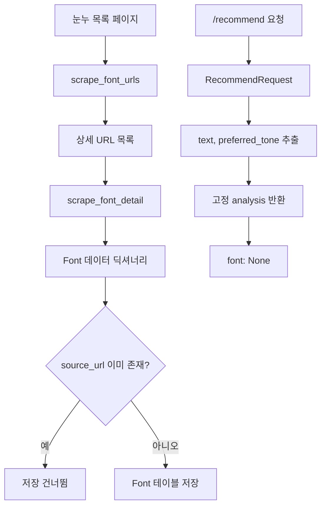

# 2026-06-12 구현 아카이브

## 대상

- 인물: [가인](./README.md)
- 저장소: [`Jungle-303-04/warm-up`](https://github.com/Jungle-303-04/warm-up)
- 브랜치: [`gain`](https://github.com/Jungle-303-04/warm-up/tree/gain)
- 작성자: `ummfieg <ummfieg@naver.com>`
- 기준 범위: [`bf8bef0`](https://github.com/Jungle-303-04/warm-up/commit/bf8bef0abf0cd7517fcca3d994370ebe2987c03a) 이후부터 [`b036995`](https://github.com/Jungle-303-04/warm-up/commit/b0369958e3c369a1718b111f3e3868675a35f232)까지
- 확인 시각: `2026-06-12 22:54:56 +0900`

## 하루 요약

가인은 6월 12일에 게시글 CRUD 이후의 다음 축으로 넘어갔다. 핵심은 “폰트 데이터 구조 확장 → 눈누 폰트 크롤링 → 중복 저장 방지 → 상세 페이지 일괄 수집 → 추천 API 입구 생성”이다.

이날 작업은 아직 완성된 추천 기능이 아니라, 추천에 필요한 폰트 데이터 확보와 `/recommend` API 계약을 먼저 만든 단계다.

## 시간대별 구현 기록

### 10:27 - `0143b7a` - `refactor: font 데이터 변경에 따른 DB 컬럼 수정 license_summary 및 webfonts , download_url추가, weights 및 tags타입변경`

- 작업한 것: `Font` 모델의 `tags`, `weights`를 JSON 리스트로 바꾸고 `license_summary`, `webfonts`, `download_url`을 추가했다.
- 의도: 실제 폰트 상세 페이지에서 가져오는 데이터를 추천/필터링/웹폰트 적용에 쓸 수 있게 구조화하려는 흐름이다.
- 잘한 점: 이전에 약점으로 보였던 문자열 태그/굵기 문제를 바로 개선했다.
- 부족한 점: 기존 DB 테이블에 대한 마이그레이션 또는 재생성 기준이 없다.
- 고치는 방법: 개발 DB 재생성 절차나 마이그레이션 절차를 문서화하고, JSON 내부 구조를 스키마로 명시한다.

### 17:34 - `0407422` - `feat: font data scrape 기능 구현`

- 작업한 것: `backend/crawler/noonnu.py`를 추가하고 눈누 상세 페이지에서 이름, 형태, 태그, 다운로드 URL, 굵기, 웹폰트 URL, 라이선스 정보를 추출했다.
- 의도: 추천에 사용할 실제 폰트 후보 데이터를 외부 페이지에서 수집하려는 시도다.
- 잘한 점: `Font` 모델에 바로 넣을 수 있는 `font_data` 형태로 수집 결과를 맞췄다.
- 부족한 점: `h2`, `형태` 라벨, 다운로드 버튼, 라이선스 article 등 외부 HTML 구조에 강하게 의존한다.
- 고치는 방법: 선택자 결과가 없을 때의 방어 로직과 `requests.get(..., timeout=10)`을 추가한다.

### 17:35 - `4c68c7e` - `feat: 이미 보유하고 있는 font data 저장 방지 기능 구현`

- 작업한 것: `backend/tests/test_noonnu.py`에서 특정 상세 URL을 크롤링하고 `source_url` 기준으로 중복 저장을 막았다.
- 의도: 크롤러를 여러 번 실행해도 같은 폰트가 중복 저장되지 않게 하려는 흐름이다.
- 잘한 점: 중복 기준을 `source_url`로 잡은 선택은 자연스럽다.
- 부족한 점: 파일명은 테스트지만 실제로는 외부 네트워크와 DB 쓰기를 수행하는 실행 스크립트에 가깝다.
- 고치는 방법: 실행 코드는 `scripts/seed_noonnu_fonts.py`로 옮기고, 테스트는 mock HTML과 임시 DB를 사용한다.

### 20:19 - `c0cf9cd` - `feat: tags 예외처리 및 폰트 굵기 저장로직 추가 후 urls scrape 로직 실행 구현`

- 작업한 것: 태그 추출 방식을 보완하고, `webfontSource`가 없을 때 빈 리스트로 처리했다. 목록 페이지에서 상세 URL을 모으는 `scrape_font_urls`도 추가했다.
- 의도: 한 개 상세 페이지 수집에서 여러 폰트 수집으로 확장하려는 단계다.
- 잘한 점: 고정 인덱스 의존을 줄이고, 웹폰트 정보가 없는 경우도 처리했다.
- 부족한 점: 목록 크롤링 범위, 요청 간 지연, 실패 원인 기록이 아직 약하다.
- 고치는 방법: 수집 개수 제한, 지연 시간, 실패 URL 목록 반환을 추가한다.

### 20:20 - `79aab2d` - `feat: 상세페이지 크롤링 로직 구현`

- 작업한 것: 목록에서 상세 URL을 가져와 여러 폰트를 반복 크롤링하고 DB에 저장했다.
- 의도: 실제 폰트 데이터 파이프라인을 한 번에 돌려보려는 흐름이다.
- 잘한 점: 개별 URL 실패가 전체 수집을 중단하지 않게 했다.
- 부족한 점: 여전히 `tests/test_noonnu.py`에서 실제 수집과 저장이 실행된다.
- 고치는 방법: 수집 실행은 스크립트로 옮기고, 테스트는 파서 단위로 작게 만든다.

### 21:36 - `2218eed` - `feat: recommend api 호출시 요청 타입 model 생성`

- 작업한 것: `RecommendRequest` 모델을 추가하고 `text`, 선택값 `preferred_tone`을 정의했다.
- 의도: 추천 API의 입력 계약을 먼저 세우려는 흐름이다.
- 잘한 점: 추천 API는 게시글 CRUD와 달리 시작부터 별도 요청 모델을 만들었다.
- 부족한 점: `text`의 빈 값, 최소/최대 길이 검증이 없다.
- 고치는 방법: 요청 스키마에 길이 제한과 빈 문자열 검증을 추가한다.

### 21:38 - `b036995` - `feat: recommend api 기본 구조 구현`

- 작업한 것: `POST /recommend`를 추가하고 고정된 `analysis`와 `font: None`을 반환했다.
- 의도: 실제 추천 알고리즘 전에 프론트가 호출할 API 응답 형태를 먼저 맞추려는 것이다.
- 잘한 점: 추천 결과를 감정, 시각 특성, 문체, 에너지, 키워드로 나눈 구조는 설명 가능한 추천으로 이어질 수 있다.
- 부족한 점: `text`, `preferred_tone`을 실제로 사용하지 않고 DB의 `Font`도 조회하지 않는다.
- 고치는 방법: `RecommendResponse`를 만들고, 최소 단계로 입력 키워드와 `Font.tags`를 매칭해 후보 폰트를 반환한다.

## 현재 구현 상태

| 영역 | 상태 | 남은 위험 |
|---|---|---|
| 폰트 모델 | JSON 필드로 확장됨 | 기존 DB 마이그레이션 기준 없음 |
| 크롤러 | 상세/목록 수집 가능 | 외부 HTML 구조 의존, timeout 없음 |
| 중복 저장 | `source_url` 기준 방지 | DB unique 제약은 없음 |
| 크롤러 실행 | `tests/test_noonnu.py`에서 수행 | 테스트와 실행 스크립트 역할 혼재 |
| 추천 API | `/recommend` 기본 구조 있음 | 실제 추천 미구현, 입력값 미사용 |

## 시각 자료

## 다음 권장 작업

1. 크롤러 실행 코드를 `tests/`에서 `scripts/`로 옮긴다.
2. 크롤러 테스트는 mock HTML 기반으로 바꾼다.
3. `source_url`에 unique 제약 또는 저장 전 검증을 명확히 둔다.
4. `RecommendRequest`에 길이 검증을 추가한다.
5. `/recommend`에서 최소한 `Font.tags`, `Font.weights`를 조회해 실제 후보를 반환한다.
6. 폰트 모델 변경 후 DB 초기화/마이그레이션 절차를 문서화한다.

## 사용자가 지금 도울 수 있는 행동

- “추천 API는 입구가 생긴 상태고, 다음은 실제 `Font` 조회를 붙이자”라고 범위를 잡아 준다.
- 크롤링은 테스트 파일이 아니라 실행 스크립트로 옮기라고 말해 준다.
- 추천 기준을 1차로 “입력 문장 키워드와 `Font.tags` 매칭” 정도로 작게 정해 준다.
