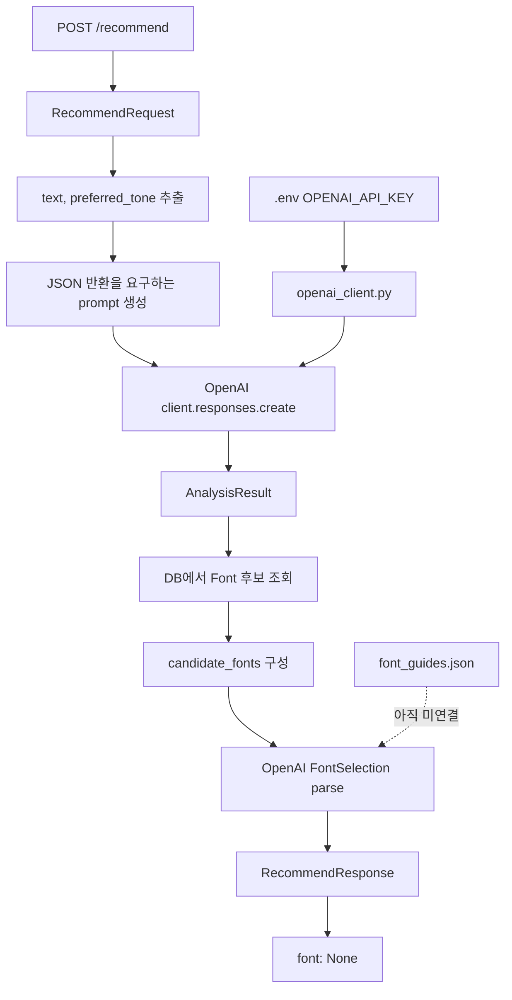

# 2026-06-13 구현 아카이브

## 대상

- 인물: [가인](./README.md)
- 저장소: [`Jungle-303-04/warm-up`](https://github.com/Jungle-303-04/warm-up)
- 브랜치: [`gain`](https://github.com/Jungle-303-04/warm-up/tree/gain)
- 작성자: `ummfieg <ummfieg@naver.com>`
- 기준 범위: [`b036995`](https://github.com/Jungle-303-04/warm-up/commit/b0369958e3c369a1718b111f3e3868675a35f232) 이후부터 [`48b1cc2`](https://github.com/Jungle-303-04/warm-up/commit/48b1cc2fd440c427ebeb168ecbfad13e26948024)까지
- 확인 시각: `2026-06-13 23:00:37 +0900`

## 하루 요약

가인은 6월 13일에 `/recommend` API를 고정 응답에서 OpenAI 호출 기반 문장 분석으로 올렸고, 이후 DB의 `Font` 후보 목록을 OpenAI에게 넘겨 선택 결과까지 받는 구조로 확장했다. 하루 끝에는 폰트 가이드 RAG 데이터셋도 추가했다.

아직 완성 추천은 아니다. 선택된 `font_id`와 이유는 반환하지만, 선택된 폰트 상세 객체는 여전히 `font: None`이고, `font_guides.json`도 코드에서 검색/주입되지 않는다.

## 시간대별 구현 기록

### 00:10 - `f3f8773` - `feat: openAI client module 생성`

- 작업한 것: `backend/openai_client.py`를 추가하고 `.env`에서 `OPENAI_API_KEY`를 읽어 `OpenAI` client를 생성했다.
- 의도: 추천 API에서 OpenAI 호출을 재사용할 수 있도록 client 생성을 별도 모듈로 분리하려는 흐름이다.
- 잘한 점: API client 생성을 `main.py`에 직접 쓰지 않고 모듈로 분리했다.
- 부족한 점: API 키가 없을 때의 명시적 오류 처리가 없다. import 시점에 `.env` 로드와 client 생성이 일어난다.
- 고치는 방법: `get_openai_client()` 함수로 늦게 생성하거나, 시작 시 설정 검증을 명확히 하고 키 누락 시 사용자에게 안전한 오류를 반환한다.

### 00:11 - `9d773fa` - `feat: recommend api에 openAI api 연결 추가`

- 작업한 것: `/recommend`에서 `RecommendRequest.text`, `preferred_tone`을 prompt에 넣고 `client.responses.create(model="gpt-4.1-mini")`를 호출했다.
- 의도: 추천 API의 첫 단계를 “입력 문장 분석”으로 만들려는 것이다.
- 잘한 점: 고정된 분석 응답에서 실제 입력 기반 분석으로 넘어갔다. 모델에게 순수 JSON만 반환하라고 명시해 응답 파싱을 고려했다.
- 부족한 점: `json.loads(response.output_text)`가 실패할 수 있다. OpenAI 오류와 JSON 파싱 오류가 모두 `500 detail=str(e)`로 노출된다. 아직 DB의 `Font`를 조회하지 않아 실제 폰트 추천은 아니다.
- 고치는 방법: JSON schema/structured output을 쓰거나 파싱 실패를 별도로 처리한다. `HTTPException` detail에는 내부 오류 문자열을 그대로 노출하지 않는다. 분석 결과의 `keywords`, `visual_traits`, `preferred_tone`을 `Font.tags`와 매칭하는 최소 추천 로직을 붙인다.

### 11:55 - `b48dbff` - `feat: openAI 응답 프롬프트 및 응답 생성 로직 추가`

- 작업한 것: DB에서 모든 `Font`를 조회해 후보 목록을 만들고, OpenAI에게 분석 결과와 후보 폰트 목록을 함께 전달해 하나의 `font_id`와 추천 이유를 고르게 했다.
- 의도: `font: None` 상태에서 벗어나 실제 후보 폰트 선택 단계로 들어가려는 흐름이다.
- 잘한 점: 추천이 단순 문장 분석에서 후보 선택으로 전진했다.
- 부족한 점: 모든 후보를 prompt에 넣으면 폰트 수가 늘수록 비용과 토큰 문제가 커진다. 선택된 `font_id`에 해당하는 실제 폰트 상세는 아직 반환하지 않는다.
- 고치는 방법: 후보를 먼저 서버에서 좁히고, 선택된 `font_id`로 실제 `Font`를 조회해 `font` 필드에 넣는다.

### 16:44 - `6e87dc3` - `refactor: try-except 구조 변경 및 후보폰트 내 웹폰트 여부 길이체크 에서 bool 값 확인으로 변경`

- 작업한 것: DB 후보 조회 부분에 try/except를 두고, `has_webfont` 판단을 `bool(font.webfonts) > 0` 형태로 바꿨다.
- 의도: 후보 폰트 구성 단계의 실패를 분리하고, 웹폰트 존재 여부를 더 단순히 표현하려는 리팩터링이다.
- 잘한 점: DB 후보 조회 실패와 추천 생성 흐름을 나누려는 시도는 좋다.
- 부족한 점: DB 조회 실패인데 오류 메시지는 `Invalid GPT response format`이다. `bool(font.webfonts) > 0`도 동작은 하지만 의미가 어색하다.
- 고치는 방법: DB 오류는 `Failed to load candidate fonts`처럼 별도 메시지로 분리하고, `has_webfont = bool(font.webfonts)`로 단순화한다.

### 17:43 - `8175cd0` - `refactor: 추천 응답 구조를 models로 변경 분석, 선택, 최종 응답 결과 class 생성 후 적용`

- 작업한 것: `RecommendRequest`, `AnalysisResult`, `FontSelection`, `RecommendResponse`를 `models/recommend.py`로 모았다.
- 의도: 추천 요청/응답 구조를 명시 모델로 관리하려는 방향이다.
- 잘한 점: 분석 결과, 선택 결과, 최종 응답 wrapper를 분리해 API 계약이 더 선명해졌다.
- 부족한 점: 이 시점에는 SQLModel 기반 schema로 되어 있었고, DB 테이블이 아닌 API schema까지 SQLModel을 쓰는 구조가 섞였다.
- 고치는 방법: API 전용 schema는 Pydantic `BaseModel`로 유지한다.

### 22:50 - `b410cd0` - `refactor: 추천 관련 스키마를 BaseModel로 변경`

- 작업한 것: 추천 관련 schema를 `SQLModel`에서 Pydantic `BaseModel`로 바꿨다. `/recommend`에는 `response_model=RecommendResponse`를 추가했고, OpenAI 호출도 `client.responses.parse(..., text_format=...)`로 바꿨다.
- 의도: DB 모델과 API schema를 분리하고, JSON 문자열 파싱 대신 구조화된 응답 파싱으로 옮기려는 흐름이다.
- 잘한 점: 이전 위험이던 `json.loads(response.output_text)` 의존을 줄였다.
- 부족한 점: `candidate_fonts` 타입은 `int`인데 실제 응답에는 `bool(candidate_fonts)`를 넣는다. main.py에 `BaseModel`, `json` import가 남아 있다.
- 고치는 방법: 후보 개수면 `len(candidate_fonts)`, 후보 존재 여부면 필드명을 `has_candidates: bool`로 바꾼다. 사용하지 않는 import를 제거한다.

### 22:59 - `48b1cc2` - `feat: font 가이드 Rag dataset 추가`

- 작업한 것: `backend/data/font_guides.json`에 폰트 선택 가이드 데이터셋을 추가했다.
- 의도: 단순 후보 폰트 매칭을 넘어, 폰트 선택 원칙을 RAG로 참고하려는 준비로 보인다.
- 잘한 점: 추천 품질을 높이기 위한 지식 데이터셋을 별도로 준비했다.
- 부족한 점: 아직 코드에서 `font_guides.json`을 로드하거나 검색하지 않는다. “RAG dataset 추가”지만 실제 RAG 파이프라인은 없다.
- 고치는 방법: 입력 문장/분석 결과와 관련된 guide 문서를 검색해 selection prompt에 제한적으로 주입한다.

## 현재 구현 상태

| 영역 | 상태 | 남은 위험 |
|---|---|---|
| OpenAI client | `.env`의 `OPENAI_API_KEY`로 생성 | 키 누락 처리 없음, import 시점 생성 |
| `/recommend` 분석 | structured parse로 `AnalysisResult` 반환 | 모델 호출 실패 처리 부족 |
| 폰트 선택 | DB 후보 목록을 OpenAI에 넘겨 `FontSelection` 반환 | 전체 후보 prompt 주입 비용, 선택 id 검증 부족 |
| 응답 | `analysis`, `selection`, `candidate_fonts`, `font` 반환 | `candidate_fonts` 타입 불일치, `font: None` 유지 |
| RAG 데이터셋 | `font_guides.json` 추가 | 아직 코드에서 검색/주입하지 않음 |

## 시각 자료

## 잘한 점

- 추천 API가 실제 입력 문장을 분석하는 방향으로 전진했다.
- OpenAI client를 별도 모듈로 분리했다.
- JSON 응답을 요구하는 prompt를 명시해 후속 처리 형태를 의식했다.
- `responses.parse`와 Pydantic schema를 적용해 JSON 파싱 위험을 줄였다.
- DB의 `Font` 후보를 실제 추천 선택 prompt에 넣기 시작했다.
- 폰트 선택 지식 데이터셋을 준비했다.

## 부족한 점

- 선택된 `font_id`에 해당하는 실제 `Font` 객체를 응답하지 않는다.
- `candidate_fonts` 타입이 `int`인데 실제 값은 bool이다.
- 모든 후보 폰트를 prompt에 넣는 방식은 데이터가 늘면 비용과 길이 문제가 생긴다.
- `font_guides.json`은 추가됐지만 아직 검색/주입되지 않는다.
- API 키 누락, 모델 호출 실패, DB 후보 조회 실패가 충분히 분리되지 않는다.

## 다음 권장 작업

1. `candidate_fonts` 필드를 `candidate_count: int` 또는 `has_candidates: bool`로 바로잡는다.
2. 선택된 `font_id`로 실제 `Font`를 조회해 `font` 필드에 넣는다.
3. 후보 전체를 prompt에 넣기 전에 서버에서 태그/카테고리/웹폰트 여부로 1차 필터링한다.
4. `font_guides.json`을 검색해 관련 guide만 selection prompt에 주입한다.
5. API 키 누락, 모델 호출 실패, DB 후보 조회 실패를 서로 다른 오류로 처리한다.

## 사용자가 지금 도울 수 있는 행동

- “후보 선택까지 왔으니 이제 `font: None`을 없애고, 선택된 `font_id`의 실제 폰트 정보를 반환하자”라고 다음 범위를 좁혀 준다.
