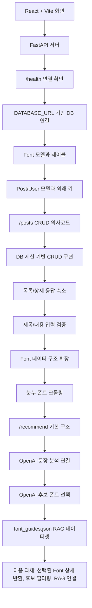

# 가인 커밋 진화 분석

## 대상

- 인물: [가인](./README.md)
- 저장소: [`Jungle-303-04/warm-up`](https://github.com/Jungle-303-04/warm-up)
- 브랜치: [`gain`](https://github.com/Jungle-303-04/warm-up/tree/gain)
- 작성자: `ummfieg <ummfieg@naver.com>`
- 분석 범위: [`a0d6639`](https://github.com/Jungle-303-04/warm-up/commit/a0d66397e210b4c41aa13e2c0cbc60b438637549)부터 [`48b1cc2`](https://github.com/Jungle-303-04/warm-up/commit/48b1cc2fd440c427ebeb168ecbfad13e26948024)까지
- 최신 확인 시각: `2026-06-13 23:00:37 +0900`

## 전체 흐름

가인의 작업은 처음부터 기능을 크게 만들기보다, 연결 가능한 조각을 하나씩 세우는 방식으로 진행되었다.

1. React + Vite로 프론트엔드 화면을 만든다.
2. FastAPI 서버를 세우고 CORS와 `/health`로 연결을 확인한다.
3. `.env` 기반 DB 연결과 SQLModel 엔진을 만든다.
4. `Font` 테이블을 먼저 정의하고 생성한다.
5. `Post`, `User` 테이블을 추가해 게시글-폰트-작성자 관계를 만든다.
6. `/posts` CRUD를 의사코드로 설계한다.
7. 실제 CRUD API를 구현한다.
8. 응답 데이터를 화면에 필요한 형태로 줄이고, 입력 검증을 추가한다.
9. 폰트 모델을 실제 크롤링 데이터에 맞게 확장한다.
10. 눈누 폰트 상세/목록 크롤러를 만든다.
11. `/recommend` 요청 모델과 기본 응답 구조를 만든다.
12. OpenAI client를 만들고 `/recommend`에 문장 분석 호출을 연결한다.
13. DB 후보 폰트 목록을 OpenAI 선택 prompt에 넣고 선택 결과를 받는다.
14. 추천 schema를 Pydantic `BaseModel`로 정리한다.
15. 폰트 선택 가이드 RAG 데이터셋을 추가한다.

## 의미 있는 커밋 단위 분석

### 1. 프론트엔드 출발점 - `a0d6639`

- 커밋: `chore: React + Vite 초기 설정`
- 한 일: Vite 기반 React 앱, 기본 `App.jsx`, 스타일, 패키지 파일을 만들었다.
- 의도: 빠르게 화면을 띄우고 이후 백엔드 연결을 붙일 최소 프론트엔드 기반을 만든 것으로 보인다.
- 잘한 점: 처음부터 무거운 구조를 잡지 않고 작은 앱으로 시작했다.
- 고려하지 못한 점: 화면 구조, 입력 상태, API 에러 상태, 로딩 상태는 아직 없다.
- 고치는 방법: 추천 요청 상태를 `loading`, `error`, `result`로 나누고, 입력값을 controlled input으로 관리한다.

### 2. 백엔드와 프론트 연결 확인 - `f23aa47`, `dac8237`, `da555cd`

- 커밋:
  - `f23aa47` - `chore: python 및 fastAPI 초기설정`
  - `dac8237` - `chore: test API 추가`
  - `da555cd` - `chore: React-FastAPItest 연결 확인`
- 한 일: FastAPI 앱을 만들고, CORS를 열고, `/`, `/health` 엔드포인트를 추가했다. 프론트에서는 버튼 클릭 시 `http://localhost:8000/health`를 호출해 `ok`를 보여준다.
- 의도: 기능 구현 전에 프론트와 백엔드가 실제로 통신되는지 검증하려는 흐름이다.
- 잘한 점: 가장 먼저 통신을 확인해 이후 문제의 범위를 줄였다.
- 고려하지 못한 점: API URL이 프론트 코드에 직접 박혀 있고, 실패 시 사용자에게 보여줄 에러 처리가 없다.
- 고치는 방법: `VITE_API_BASE_URL` 같은 환경 변수를 사용하고, `try/catch`로 네트워크 오류를 표시한다.

### 3. DB 연결 확인 - `cbd4a6b`

- 커밋: `chore: db 연결 확인 코드 작성`
- 한 일: `.env`에서 `DATABASE_URL`을 읽고 `create_engine`으로 SQLModel 엔진을 만든 뒤 연결을 확인했다.
- 의도: 테이블 설계 전에 PostgreSQL 연결이 되는지 먼저 확인하려는 선택이다.
- 잘한 점: DB 연결을 별도 `database.py`로 분리해 이후 모델/라우트에서 재사용할 기반을 만들었다.
- 고려하지 못한 점: import 시점에 DB 연결과 `print`가 실행된다. 테스트, 서버 시작, 마이그레이션 시 부작용이 생길 수 있다.
- 고치는 방법: `engine` 생성만 모듈에 두고, 연결 확인은 `check_db_connection()` 함수나 별도 스크립트로 분리한다.

### 4. 폰트 도메인 모델 시작 - `f3a661a`, `a593a86`, `3e74e90`

- 커밋:
  - `f3a661a` - `feat: font 테이블 스키마 정의`
  - `a593a86` - `feat: font 테이블 생성 완료`
  - `3e74e90` - `chore: 설명용 주석 추가 및 불필요한 print문 삭제`
- 한 일: `Font` 모델을 만들고 `init_db.py`에서 `SQLModel.metadata.create_all(engine)`로 테이블을 생성했다.
- 의도: 앱의 핵심 데이터인 폰트 메타데이터를 먼저 테이블로 고정하려는 흐름이다.
- 잘한 점: `name`, `source`, `license`, `category`, `tags`, `description`, `weights`, `webfont_url`, `source_url`처럼 추천 앱에 필요한 필드를 폭넓게 잡았다.
- 고려하지 못한 점: `tags`, `weights`가 문자열이라 검색/필터링이 복잡해질 수 있다. `source_url`만 필수이고 `webfont_url`은 선택인 기준도 팀 합의가 필요하다.
- 고치는 방법: 초기에는 문자열을 유지하되, 검색이 시작되면 tag 테이블 또는 JSON 컬럼으로 분리할지 결정한다.

### 5. 게시글과 사용자 모델 확장 - `e430e2b`, `7a58771`, `fbac6d8`, `3fa8025`

- 커밋:
  - `e430e2b` - `feat: post 테이블 컬럼 정의`
  - `7a58771` - `feat: user 테이블 컬럼 정의`
  - `fbac6d8` - `feat: post 테이블 user id 컬럼 추가`
  - `3fa8025` - `feat: Post, User table 생성`
- 한 일: `Post`, `User` 모델을 만들고, `Post`가 `Font`와 `User`를 참조하도록 `font_id`, `user_id`를 추가했다.
- 의도: 단순 폰트 추천에서 사용자가 폰트를 활용해 게시글을 남기는 흐름으로 도메인을 넓힌 것으로 보인다.
- 잘한 점: 게시글이 어떤 폰트와 작성자에 연결되는지 외래 키로 빠르게 잡았다. `created_at`, `updated_at`도 초기에 넣었다.
- 고려하지 못한 점: 인증 범위가 확정되지 않은 상태에서 `User.password_hash`까지 들어갔다. `Post`에 `user_id`가 필요하지만 실제 로그인/seed user 전략은 아직 없다.
- 고치는 방법: 지금 단계에서는 인증을 구현하지 말고 임시 seed user 또는 임시 `user_id` 정책을 명시한다. 나중에 인증을 붙일 때 `UserCreate`, `UserRead` 스키마를 분리한다.

### 6. CRUD 설계 메모 - `ebbef70`

- 커밋: `chore: crud api 의사코드 작성`
- 한 일: `/posts` 목록, 생성, 상세, 수정, 삭제 라우트의 의사코드를 `main.py`에 적었다.
- 의도: 구현 전에 프론트가 어떤 응답을 필요로 하는지, 서버에서 무엇을 검증해야 하는지 생각한 단계다.
- 잘한 점: 목록 응답은 제목/폰트 태그 중심, 생성 응답은 상세 이동이나 목록 갱신에 필요하다는 식으로 사용자 흐름을 고려했다.
- 고려하지 못한 점: 동시성 고민이 너무 이른 시점에 등장했다. 기본 CRUD와 요청/응답 스키마가 먼저다.
- 고치는 방법: 동시성은 “나중에 볼 항목”으로 빼고, 지금은 `PostCreate`, `PostRead`, `PostUpdate`부터 정한다.

### 7. 실제 CRUD 구현 - `7da3481`

- 커밋: `feat: 게시글 CRUD API 추가`
- 한 일: `POST`, `GET detail`, `PUT`, `DELETE`를 실제 `Session(engine)` 기반으로 구현했다.
- 의도: 전날 의사코드를 동작하는 API로 바꾸려는 커밋이다.
- 잘한 점: 저장, 조회, 수정, 삭제가 모두 DB에 반영되도록 빠르게 연결했다. 수정 시 `updated_at`도 갱신했다.
- 고려하지 못한 점: `Post` 테이블 모델을 요청 바디로 직접 받는다. 생성 검증이 아직 없고, 상세 조회 없음은 `404`가 아니다.
- 고치는 방법: 요청/응답 스키마를 분리하고, 모든 없음 응답을 `HTTPException(404)`로 통일한다.

### 8. 응답 형태 축소 - `62d252f`, `bf8bef0`

- 커밋:
  - `62d252f` - `refactor: 게시물 조회 전체 데이터 응답에서 필요한 데이터 응답 반환으로 수정`
  - `bf8bef0` - `refactor: 특정 게시물 조회시 필요한 응답 데이터 반환으로 구조 수정`
- 한 일: 목록과 상세에서 `Post` 전체를 반환하지 않고 `id`, `title`, `content`, 날짜, `font.name`, `font.tags`를 직접 조립해 반환했다.
- 의도: DB 모델 그대로가 아니라 프론트 화면에 필요한 데이터만 내려주려는 설계 변화다.
- 잘한 점: 응답이 화면 중심으로 바뀌었다. 민감하거나 불필요한 DB 필드가 새어 나갈 가능성을 줄였다.
- 고려하지 못한 점: `Font`를 게시글마다 개별 조회해 N+1 조회가 생긴다. `font`가 없을 때 예외가 난다. 응답 딕셔너리 중복이 늘었다.
- 고치는 방법: `FontSummary`, `PostRead` 스키마를 만들고, join 또는 응답 조립 헬퍼로 중복과 N+1 위험을 줄인다.

### 9. 입력 검증 추가 - `976a235`

- 커밋: `refactor: 게시물 등록시 입력 예외처리 추가 게시물 등록 및 수정시 제목, 내용이 비어있을 경우 예외처리 로직으로 수정`
- 한 일: 등록과 수정에서 `title`, `content`가 빈 문자열이면 `400`을 반환했다.
- 의도: 프론트 검증만 믿지 않고 백엔드에서도 최소 유효성을 보장하려는 흐름이다.
- 잘한 점: 등록과 수정 모두 같은 기준으로 검증했다.
- 고려하지 못한 점: `title` 또는 `content`가 `None`이면 `.strip()`에서 서버 오류가 날 수 있다. 길이 제한도 아직 없다.
- 고치는 방법: Pydantic/SQLModel 요청 스키마에서 `min_length`, `max_length`를 걸고, 라우트 안 수동 검증을 줄인다.

### 10. 폰트 데이터 구조 확장 - `0143b7a`

- 커밋: `refactor: font 데이터 변경에 따른 DB 컬럼 수정 license_summary 및 webfonts , download_url추가, weights 및 tags타입변경`
- 한 일: `tags`, `weights`를 JSON 리스트로 바꾸고 `license_summary`, `webfonts`, `download_url`을 추가했다.
- 의도: 실제 폰트 상세 페이지에서 가져올 데이터를 추천과 웹폰트 적용에 쓸 수 있는 구조로 저장하려는 흐름이다.
- 잘한 점: 이전에 약점으로 보였던 문자열 태그/굵기 문제를 바로 구조화했다.
- 고려하지 못한 점: 기존 DB 테이블과 모델 변경 사이의 마이그레이션 기준이 없다.
- 고치는 방법: 개발 DB 재생성 절차 또는 마이그레이션 절차를 문서화한다.

### 11. 눈누 폰트 크롤러 - `0407422`, `4c68c7e`, `c0cf9cd`, `79aab2d`

- 커밋:
  - `0407422` - `feat: font data scrape 기능 구현`
  - `4c68c7e` - `feat: 이미 보유하고 있는 font data 저장 방지 기능 구현`
  - `c0cf9cd` - `feat: tags 예외처리 및 폰트 굵기 저장로직 추가 후 urls scrape 로직 실행 구현`
  - `79aab2d` - `feat: 상세페이지 크롤링 로직 구현`
- 한 일: 눈누 상세 페이지에서 폰트 정보를 추출하고, 목록 페이지에서 상세 URL을 모아 여러 폰트를 DB에 저장하는 흐름을 만들었다.
- 의도: 추천에 필요한 실제 폰트 후보 데이터를 수집하려는 단계다.
- 잘한 점: `source_url` 기준 중복 저장 방지, 태그 예외 처리, 웹폰트 정보 추출, 실패 URL 건너뛰기를 넣었다.
- 고려하지 못한 점: `tests/test_noonnu.py`가 자동 테스트가 아니라 실제 네트워크/DB 쓰기 스크립트처럼 동작한다. 외부 HTML 구조 변경과 요청 timeout에도 취약하다.
- 고치는 방법: 실행 스크립트와 테스트를 분리하고, 테스트는 mock HTML로 바꾼다. `requests.get`에는 timeout을 넣고, 크롤링 정책을 문서화한다.

### 12. 추천 API 입구 - `2218eed`, `b036995`

- 커밋:
  - `2218eed` - `feat: recommend api 호출시 요청 타입 model 생성`
  - `b036995` - `feat: recommend api 기본 구조 구현`
- 한 일: `RecommendRequest` 모델과 `POST /recommend` API를 추가했다.
- 의도: 실제 추천 로직 전에 프론트가 호출할 추천 API 계약을 먼저 잡으려는 흐름이다.
- 잘한 점: 추천 API에서는 별도 요청 타입을 만든 점이 좋다. 분석 결과를 감정, 시각 특성, 문체, 에너지, 키워드로 나눈 것도 추천 설명 가능성과 연결된다.
- 고려하지 못한 점: `text`, `preferred_tone`을 실제로 사용하지 않고, DB의 `Font`도 조회하지 않는다. 현재는 고정 응답과 `font: None`이다.
- 고치는 방법: `RecommendResponse` 스키마를 만들고, 최소 구현으로 `Font.tags`와 입력 키워드를 매칭해 후보 폰트를 반환한다.

### 13. OpenAI 분석 연결 - `f3f8773`, `9d773fa`

- 커밋:
  - `f3f8773` - `feat: openAI client module 생성`
  - `9d773fa` - `feat: recommend api에 openAI api 연결 추가`
- 한 일: `.env`의 `OPENAI_API_KEY`로 OpenAI client를 만들고, `/recommend`에서 입력 문장과 선호 톤을 prompt에 넣어 `gpt-4.1-mini`를 호출했다.
- 의도: 추천 API의 첫 단계를 실제 입력 기반 문장 분석으로 바꾸려는 흐름이다.
- 잘한 점: 고정 분석 응답에서 벗어나 실제 사용자 입력을 분석하게 했다. JSON 반환을 요구하는 prompt를 넣어 후속 처리 형태도 고려했다.
- 고려하지 못한 점: structured output이 아니라 `response.output_text`를 `json.loads`로 파싱한다. API 키 누락, 모델 호출 실패, JSON 파싱 실패가 모두 500으로 묶이고 내부 오류 문자열이 노출될 수 있다. 여전히 `font: None`이라 실제 폰트 추천은 아니다.
- 고치는 방법: JSON schema 기반 structured output을 쓰고, 오류 유형을 분리한다. 다음 단계에서는 `analysis.keywords`, `analysis.visual_traits`, `preferred_tone`을 `Font.tags`와 매칭해 최소 후보를 반환한다.

### 14. 후보 폰트 선택과 응답 schema 정리 - `b48dbff`, `6e87dc3`, `8175cd0`, `b410cd0`

- 커밋:
  - `b48dbff` - `feat: openAI 응답 프롬프트 및 응답 생성 로직 추가`
  - `6e87dc3` - `refactor: try-except 구조 변경 및 후보폰트 내 웹폰트 여부 길이체크 에서 bool 값 확인으로 변경`
  - `8175cd0` - `refactor: 추천 응답 구조를 models로 변경 분석, 선택, 최종 응답 결과 class 생성 후 적용`
  - `b410cd0` - `refactor: 추천 관련 스키마를 BaseModel로 변경`
- 한 일: DB에서 `Font` 후보 목록을 가져와 OpenAI에게 후보 중 하나를 선택하게 했고, `AnalysisResult`, `FontSelection`, `RecommendResponse`로 응답 schema를 정리했다.
- 의도: 단순 문장 분석에서 실제 폰트 후보 선택으로 넘어가려는 흐름이다.
- 잘한 점: `responses.parse`와 Pydantic schema를 쓰면서 JSON 문자열 파싱 위험을 줄였다. 추천 응답 구조도 더 명확해졌다.
- 고려하지 못한 점: 전체 후보 폰트를 prompt에 넣어 비용과 길이 문제가 생길 수 있다. `candidate_fonts` 타입은 `int`인데 실제로는 bool을 넣는다. 선택된 `font_id`의 상세 폰트는 여전히 `font: None`이다.
- 고치는 방법: 서버에서 후보를 먼저 줄이고, `candidate_count` 또는 `has_candidates`로 필드를 명확히 바꾼다. 선택된 `font_id`로 `Font`를 다시 조회해 `font`를 채운다.

### 15. 폰트 가이드 RAG 데이터셋 준비 - `48b1cc2`

- 커밋: `feat: font 가이드 Rag dataset 추가`
- 한 일: `backend/data/font_guides.json`에 폰트 선택 원칙 데이터셋을 추가했다.
- 의도: 추천 시 폰트 후보만 보는 것이 아니라, 폰트 선택 원칙을 참고하는 RAG 흐름을 만들려는 준비다.
- 잘한 점: 추천 품질을 높일 지식 기반을 따로 만들었다.
- 고려하지 못한 점: 아직 코드에서 데이터셋을 로드하거나 검색하지 않는다. 따라서 현재는 RAG 파이프라인이 아니라 데이터 파일 추가 상태다.
- 고치는 방법: 입력 문장/분석 결과와 관련 있는 guide만 검색해 selection prompt에 넣는다.

## 현재까지 가장 중요한 변화

가장 의미 있는 전환점은 `ebbef70`에서 `7da3481`로 넘어간 지점이다. 이때 가인은 “무엇을 만들지 생각하는 단계”에서 “DB에 실제 반영되는 API를 만드는 단계”로 이동했다.

두 번째 전환점은 `62d252f`와 `bf8bef0`이다. 이때부터 단순히 DB 객체를 반환하는 것이 아니라, 프론트가 쓸 응답 형태를 의식하기 시작했다.

세 번째 전환점은 `0143b7a` 이후다. 이때부터 가인은 게시글 CRUD에서 벗어나 추천에 필요한 폰트 데이터 파이프라인과 추천 API 입구를 만들기 시작했다.

네 번째 전환점은 `9d773fa`다. 이때 `/recommend`가 고정 응답에서 OpenAI 기반 문장 분석으로 넘어갔다. 다만 아직 실제 폰트 선택과는 연결되지 않았다.

다섯 번째 전환점은 `b48dbff`부터 `b410cd0`까지다. 이때 실제 DB 폰트 후보를 OpenAI 선택 prompt에 넣고, 추천 응답 schema를 정리했다. 추천 기능이 “분석”에서 “후보 선택”으로 이동한 지점이다.

여섯 번째 전환점은 `48b1cc2`다. 이때 폰트 가이드 데이터셋을 추가해 RAG 기반 추천으로 확장하려는 준비가 시작됐다.

## 반복해서 보이는 강점

- 연결 확인을 먼저 한다. 프론트-백엔드, 백엔드-DB를 작게 검증한다.
- 커밋 단위가 비교적 학습 흐름과 맞다. 설정, 연결, 모델, API가 단계별로 나뉜다.
- 주석과 커밋 메시지에서 다음에 구현할 생각이 드러난다.
- 구현 후 응답 형태를 다시 줄이는 리팩터링을 했다.

## 반복해서 보이는 약점

- 요청/응답 스키마 분리가 늦다.
- 실행 재현 문서가 약하다. 팀원이 같은 환경에서 바로 실행하기 어렵다.
- 예외 처리 기준이 아직 일관되지 않다. 상세 조회 없음은 메시지, 수정/삭제 없음은 `404`다.
- DB 관계는 만들었지만 존재 검증은 없다. 잘못된 `font_id`, `user_id`가 들어올 수 있다.
- 구조화해야 할 데이터와 문자열로 둬도 되는 데이터의 기준이 아직 없다.
- 크롤러 실행 코드가 테스트 파일에 들어가 있어 테스트와 운영 스크립트 역할이 섞였다.
- 추천 API는 후보 선택까지 붙었지만 선택된 `Font` 상세 객체를 반환하지 않는다.
- 전체 후보 폰트를 prompt에 넣어 토큰/비용/응답 품질 문제가 생길 수 있다.
- RAG 데이터셋은 추가됐지만 아직 코드에서 검색하거나 prompt에 주입하지 않는다.

## 지금 고치는 순서

1. `backend/schemas/post.py`를 만들고 `PostCreate`, `PostRead`, `PostUpdate`, `FontSummary`를 정의한다.
2. `POST /posts`와 `PUT /posts/{post_id}`는 `Post` 대신 요청 스키마를 받게 바꾼다.
3. `GET /posts/{post_id}`의 없음 응답을 `HTTPException(status_code=404)`로 통일한다.
4. 생성/수정 시 `font_id`, `user_id`가 실제 존재하는지 확인한다.
5. 목록/상세 응답 조립을 함수로 빼거나 스키마 기반으로 정리한다.
6. `.env.example`, 의존성 설치, DB 초기화, 서버 실행 명령을 문서화한다.
7. 크롤러 실행 코드를 `scripts/`로 옮기고 mock HTML 기반 테스트를 만든다.
8. 선택된 `font_id`로 실제 `Font`를 조회해 `font` 필드를 채운다.
9. `candidate_fonts`를 `candidate_count: int` 또는 `has_candidates: bool`로 바로잡는다.
10. 전체 후보를 prompt에 넣기 전에 태그/카테고리/웹폰트 여부로 1차 필터링한다.
11. `font_guides.json`을 검색해 관련 가이드만 selection prompt에 주입한다.
12. API 키 누락, 모델 호출 실패, DB 후보 조회 실패를 분리 처리한다.

## 사용자가 지금 해줄 수 있는 말

> 지금까지 흐름은 좋아요. 이제 새 기능을 더 붙이기보다 `PostCreate`, `PostRead`, `PostUpdate`, `FontSummary`로 스키마를 분리하고, 없는 게시글은 전부 `404`로 통일합시다. 인증은 아직 미루고 seed user 또는 임시 `user_id`로 갑시다.

## 흐름도

