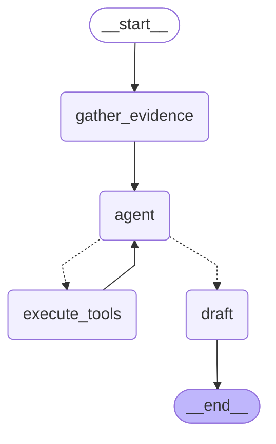

# LangGraph 제안 그래프

이 문서는 `backend/app/pipeline/proposer.py`의 `LangGraphProposer` 실행 흐름을
시각화한 자료입니다. 그래프 노드나 조건부 엣지를 수정한 뒤에는 아래 명령으로 문서를
다시 생성하세요.

```bash
cd backend
uv run python scripts/render_langgraph.py
```

PNG까지 갱신하려면 네트워크가 가능한 환경에서 다음 명령을 사용합니다.

```bash
cd backend
uv run python scripts/render_langgraph.py --png
```

문서가 최신인지 확인하는 검증 명령입니다.

```bash
cd backend
uv run python scripts/render_langgraph.py --check
```

## 현재 그래프



## 노드 역할

- `gather_evidence`: 검색 청크와 코드 참조를 LLM 입력 메시지와 evidence map으로 정리합니다.
- `agent`: LLM이 근거를 분석하고, 사용 가능한 MCP 도구가 있으면 도구 호출 여부를 결정합니다.
- `execute_tools`: LLM의 tool call을 MCP client로 실행하고 결과를 메시지에 추가합니다.
- `draft`: 마지막 AI 응답 또는 최종 LLM 호출 결과를 `ProposalDraft` 목록으로 파싱합니다.

## 갱신 정책

- LangGraph 노드, 엣지, 조건부 라우팅, 상태 필드를 바꾸면 이 문서를 함께 갱신합니다.
- `backend/tests/pipeline/test_langgraph_visualization.py`가 코드 그래프와 문서의 Mermaid 블록
  일치 여부를 검사합니다.
- PNG는 리뷰/공유용 산출물이며, 자동 검증의 기준은 Mermaid 텍스트입니다.
