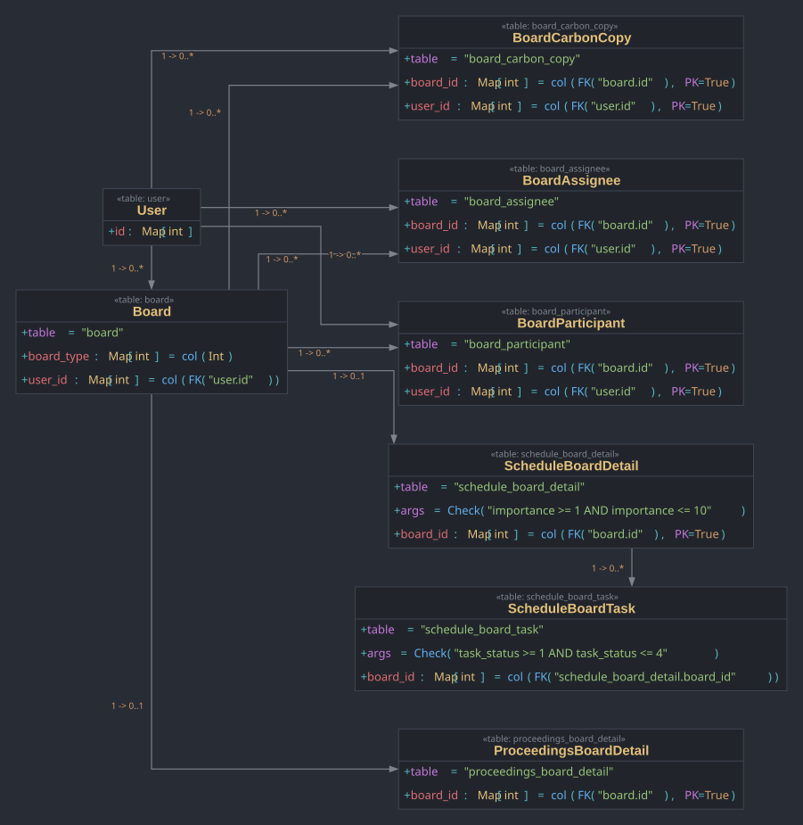
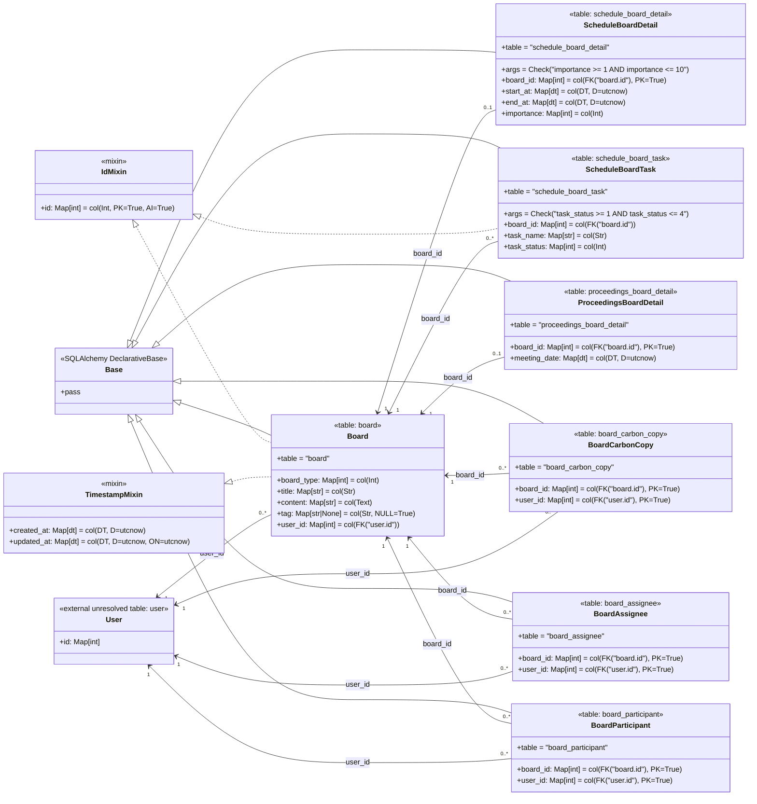

# 민정 Board 클래스 UML

이 UML은 `origin/minjeong`의 현재 구현을 기준으로 한다. 주요 근거 파일은
`backend/app/db/base.py`와 `backend/app/domains/board/model.py`다.
멤버 표기는 실제 SQLAlchemy 문법을 닮은 코드형 축약을 사용한다.
반복적인 `nullable=False`는 타입 힌트가 이미 의도를 보여주는 경우 생략하고,
외래키, 기본키, nullable 예외처럼 구조 이해에 중요한 정보는 남겼다.
반복 토큰은 한 줄 가독성을 위해 UML용 별칭으로 축약했다.

| UML 별칭 | 실제 코드 |
|---|---|
| `Map[T]` | `Mapped[T]` |
| `col(...)` | `mapped_column(...)` |
| `FK("...")` | `ForeignKey("...")` |
| `PK=True` | `primary_key=True` |
| `AI=True` | `autoincrement=True` |
| `NULL=True` | `nullable=True` |
| `D=...` | `default=...` |
| `ON=...` | `onupdate=...` |
| `Check(...)` | `CheckConstraint(...)` |
| `table = "..."` | `__tablename__ = "..."` |
| `args = ...` | `__table_args__ = ...` |
| `Int`, `Str`, `DT`, `dt` | `Integer`, `String`, `DateTime`, `datetime` |
| `utcnow` | `datetime.utcnow` |
| `A|B` | `A | B` union type |

## 클래스/상속 UML


이 그림은 `Base`, mixin, ORM 클래스의 상속/적용 관계만 보여준다.
외래키 관계까지 한 SVG에 넣으면 선이 과하게 교차하므로 테이블 관계는 아래
그림으로 분리했다.

## 테이블 관계 UML



두 SVG는 Graphviz DOT 원본에서 생성한다. DOT는 코드형 라벨의 행간, 박스 폭,
관계선 라우팅을 렌더러가 계산하므로 Mermaid SVG 좌표를 직접 고치는 방식보다
안정적이다.

```bash
dot -Tsvg docs/woonyong/minjeong/assets/class-uml.dot \
  -o docs/woonyong/minjeong/assets/class-uml.svg
dot -Tsvg docs/woonyong/minjeong/assets/table-relations.dot \
  -o docs/woonyong/minjeong/assets/table-relations.svg
python3 docs/woonyong/dev-tools/raise-svg-cardinality-labels.py \
  docs/woonyong/minjeong/assets/table-relations.svg
```

## DOT 원본

- [class-uml.dot](./assets/class-uml.dot)
- [table-relations.dot](./assets/table-relations.dot)

## 논리 원본



## 해석 메모

- `Board`는 모든 게시글의 공통 부모 테이블 역할을 한다. 코드 주석상
  `board_type` 값 `1`은 `ScheduleBoardDetail`, 값 `2`는
  `ProceedingsBoardDetail`로 연결될 의도다. 아직 이 매핑을 강제하는 DB
  제약은 없다.
- `ScheduleBoardDetail`과 `ProceedingsBoardDetail`은 `board_id`를 기본키이자
  외래키로 사용한다. 따라서 한 Board는 각 상세 테이블에 최대 1개의 상세
  row만 가질 수 있다.
- `BoardCarbonCopy`, `BoardAssignee`, `BoardParticipant`는 `(board_id,
  user_id)` 복합 기본키를 가진 Board-User 역할 연결 테이블이다.
- 모델은 `ForeignKey("user.id")`를 참조하지만, `origin/minjeong`에는 아직
  구현된 `User` ORM 클래스나 `user` 테이블 정의가 없다.
- 외래키는 선언되어 있지만 SQLAlchemy `relationship()` 속성은 아직
  정의되어 있지 않다.
