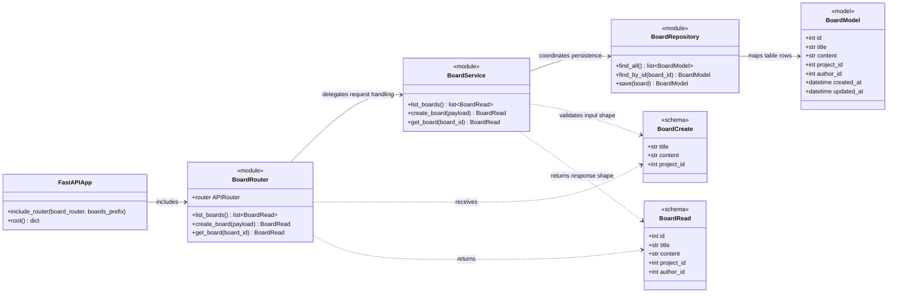

# Minjeong Board Class UML

This UML snapshot reflects the current `minjeong` branch implementation and the
next minimal classes needed to make the scaffold executable.

## Current Implementation Signal

- `backend/app/main.py` includes `board_router` under `/boards`.
- `backend/app/domains/board/router.py` is intended to work like a controller.
- `backend/app/domains/board/service.py` is intended to hold business logic.
- `backend/app/domains/board/repository.py` is intended to hold DB access logic.
- `backend/app/domains/board/model.py` is intended to define the SQLAlchemy table model.
- `backend/app/domains/board/schema.py` already imports `BaseModel`, but DTOs are not defined yet.

## Class UML



## Current Gap

`backend/app/main.py` imports `router` from `backend/app/domains/board/router.py`,
but `router.py` does not define an `APIRouter` instance yet. The next smallest
unblocking step is to add `router = APIRouter()` and one temporary endpoint so the
FastAPI app can boot.

## Recommended Next Step

```python
from fastapi import APIRouter

router = APIRouter()


@router.get("/")
def list_boards():
    return []
```

After that, Minjeong can fill in `BoardCreate`, `BoardRead`, `BoardService`, and
`BoardRepository` one layer at a time.
