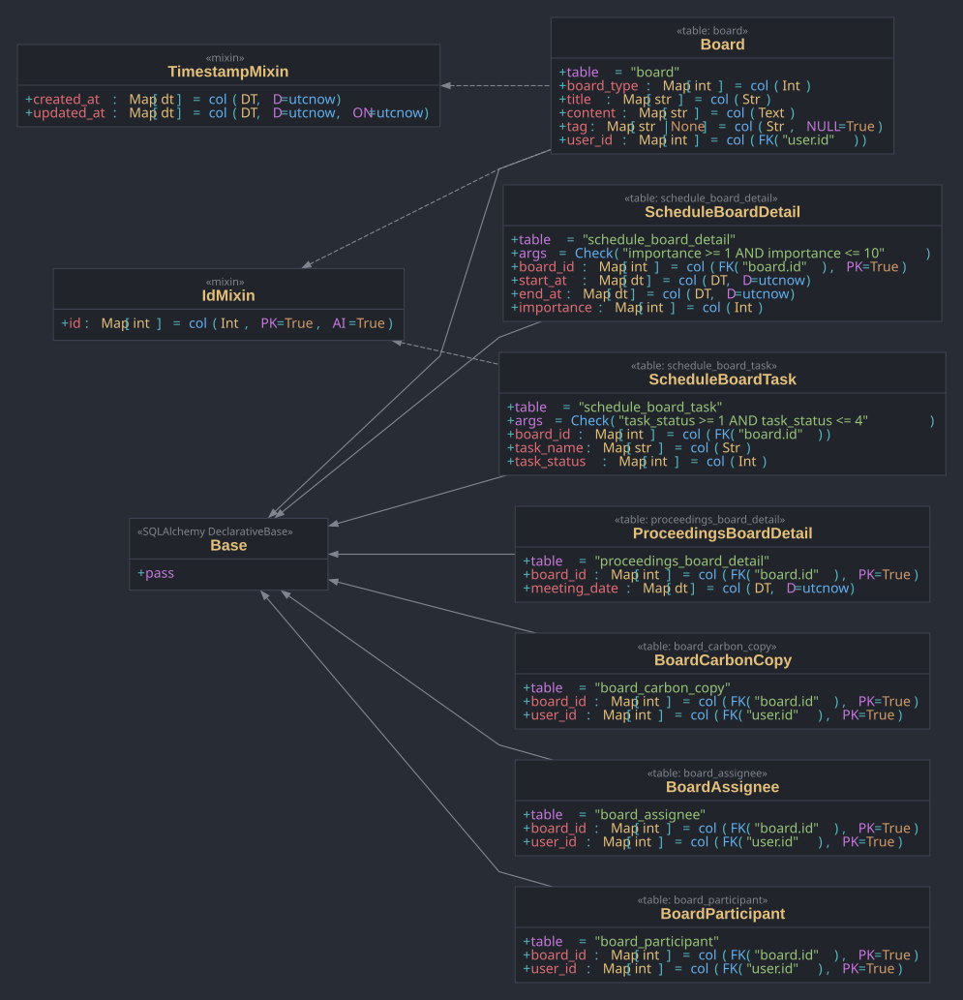
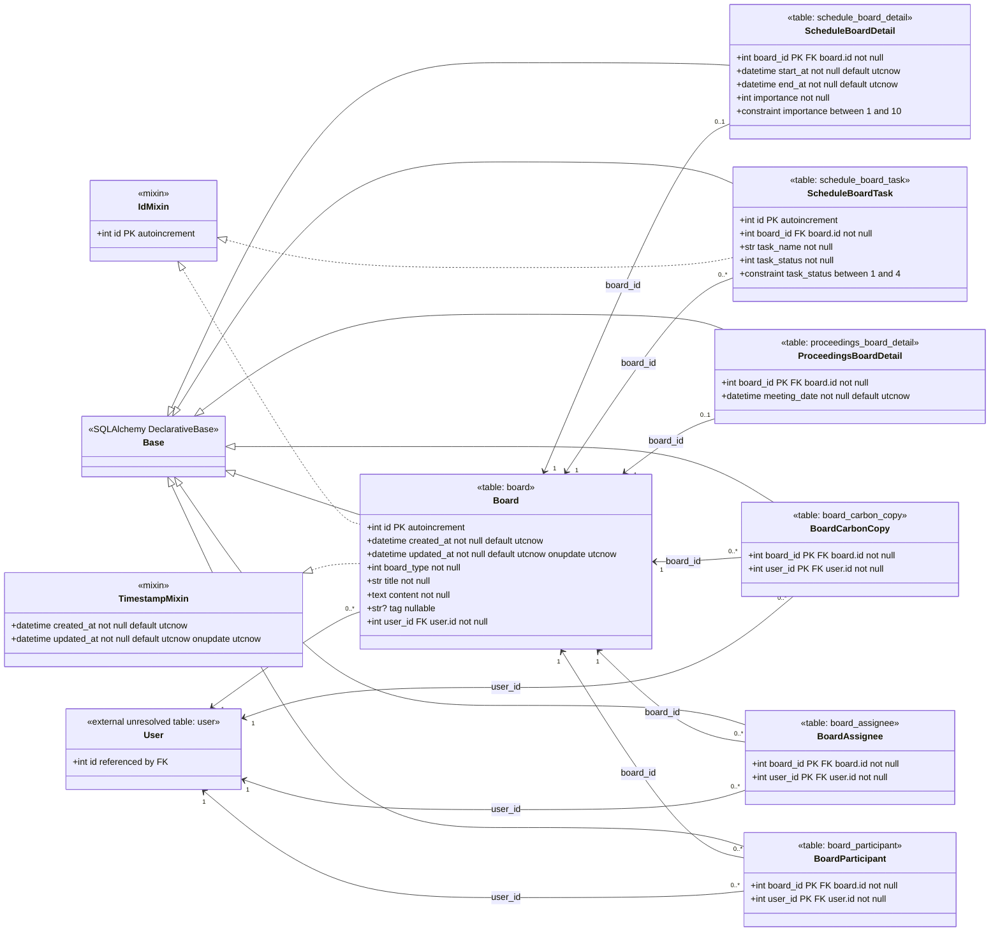

# 민정 Board 클래스 UML

이 UML은 `origin/minjeong`의 현재 구현을 기준으로 한다. 주요 근거 파일은
`backend/app/db/base.py`와 `backend/app/domains/board/model.py`다.

## 클래스 UML

## Mermaid 원본

## 해석 메모

- `Board`는 모든 게시글의 공통 부모 테이블 역할을 한다. 코드 주석상
  `board_type` 값 `1`은 `ScheduleBoardDetail`, 값 `2`는
  `ProceedingsBoardDetail`로 연결될 의도다. 아직 이 매핑을 강제하는 DB
  제약은 없다.
- `ScheduleBoardDetail`과 `ProceedingsBoardDetail`은 `board_id`를 기본키이자
  외래키로 사용한다. 따라서 한 Board는 각 상세 테이블에 최대 1개의 상세
  row만 가질 수 있다.
- `BoardCarbonCopy`, `BoardAssignee`, `BoardParticipant`는 `(board_id,
  user_id)` 복합 기본키를 가진 Board-User 역할 연결 테이블이다.
- 모델은 `ForeignKey("user.id")`를 참조하지만, `origin/minjeong`에는 아직
  구현된 `User` ORM 클래스나 `user` 테이블 정의가 없다.
- 외래키는 선언되어 있지만 SQLAlchemy `relationship()` 속성은 아직
  정의되어 있지 않다.
