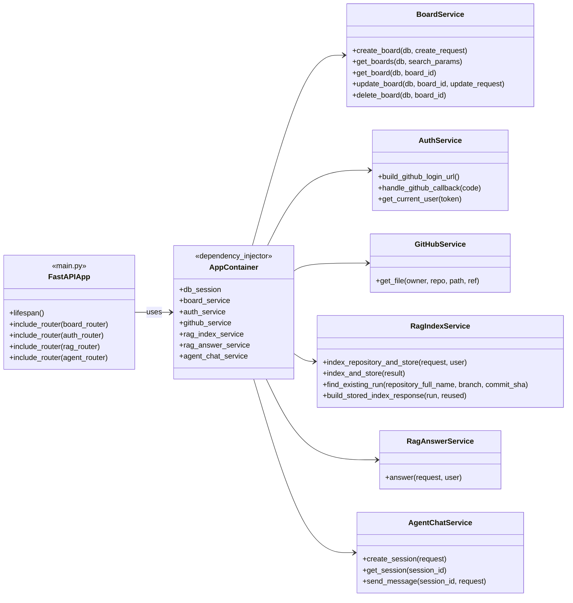
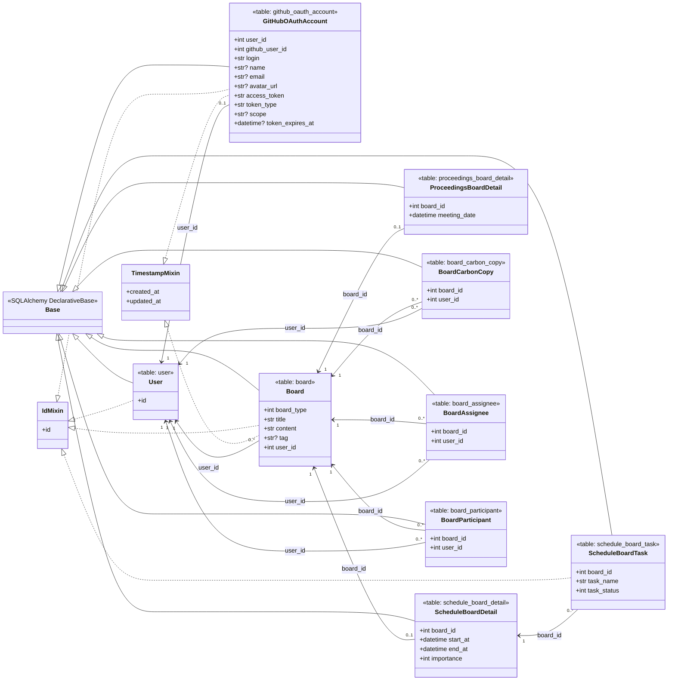
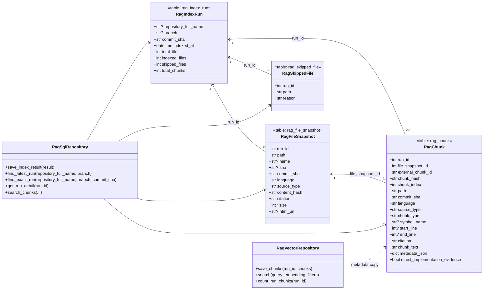
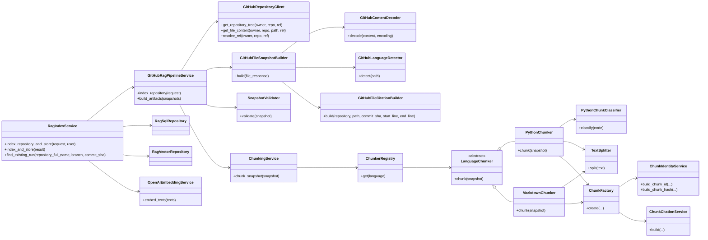
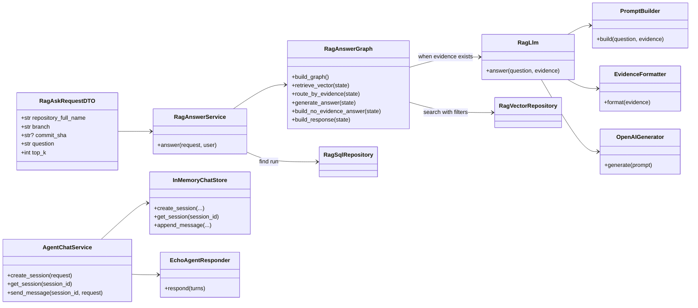

# 민정 warm-up 현재 클래스 UML

이 문서는 `origin/minjeong`의 `842d495 fix: skip duplicate RAG index storage`
기준 클래스 구조를 요약한다. 코드 클래스명과 주요 필드명은 실제 구현명을
유지하고, 해석 문장은 한국어로 적는다.

기준 파일은 `backend/app/container.py`, `backend/app/main.py`,
`backend/app/board`, `backend/app/auth`, `backend/app/github`,
`backend/app/rag`, `backend/app/agent` 하위 구현이다.

## 전체 모듈 조립 구조

해석:

- `main.py`는 router 연결과 startup DB/vector DB 확인을 담당한다.
- `AppContainer`는 service, repository, GitHub client, OpenAI/Chroma adapter를 조립한다.
- 현재 구조는 `domains/*`에서 top-level `board`, `auth`, `github`, `rag`,
  `agent` module로 이동했다.

## Board/Auth SQL 모델

해석:

- Board 모델은 초기 작업의 중심이고, `board_type`에 따라 일정/회의록 detail을 분리한다.
- GitHub OAuth 정보는 `GitHubOAuthAccount`로 `User`와 1:1에 가깝게 묶인다.
- 아직 `relationship()`이 풍부하게 잡힌 구조라기보다는 FK와 repository query 중심 구조다.

## RAG SQL/vector 저장 구조

해석:

- SQL은 인덱싱 실행 이력, 파일 스냅샷, chunk 원문, skip 사유를 보관한다.
- Chroma vector DB는 `RagChunk`의 embedding 검색용 복제 데이터를 가진다.
- 최신 커밋은 `repository_full_name + branch + commit_sha` 기준 기존 run을 찾아
  중복 저장을 건너뛰지만, DB unique constraint는 아직 없다.

## RAG 인덱싱 파이프라인

해석:

- GitHub 파일 수집과 RAG chunk 생성이 별도 service/domain class로 분해됐다.
- Python과 Markdown chunker를 분리한 점은 코드 RAG 품질에서 중요한 결정이다.
- `RagIndexService`가 중복 run 확인, pipeline 실행, SQL/vector 저장을 묶는다.

## RAG 답변 그래프와 Agent scaffold

해석:

- `/rag/ask`는 repository/branch/commit 범위로 SQL run을 찾고, 같은 범위의
  vector evidence를 검색한 뒤 답변한다.
- `RagAnswerGraph`는 evidence가 없을 때 별도 no-evidence 응답을 만들도록 분기한다.
- `AgentChatService`는 현재 echo responder 기반 scaffold라, RAG answer graph와
  같은 수준의 agent runtime으로 보면 안 된다.

## 현재 구조 평가

- 좋은 점: Board, Auth, GitHub, RAG, Agent의 책임을 module 단위로 나누기 시작했다.
- 좋은 점: RAG chunk identity, citation, SQL 저장, vector 저장, commit scope를 모두 고려했다.
- 좋은 점: LangGraph를 통해 evidence 유무 분기를 코드 구조로 드러냈다.
- 위험: RAG indexing, vector 저장, `/rag/ask`, auth callback에 대한 테스트가 부족하다.
- 위험: SQL transaction과 vector DB 저장이 함께 실패/성공해야 하는데 보상 전략이 명확하지 않다.
- 위험: 중복 저장 방지는 application check만으로는 동시 요청 race condition을 막기 어렵다.
- 개선: `repository_full_name + branch + commit_sha` unique constraint, idempotency test,
  SQL/vector partial failure test, `.env.example`, agent/RAG 경계 문서화가 필요하다.
