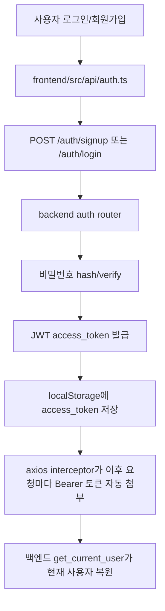
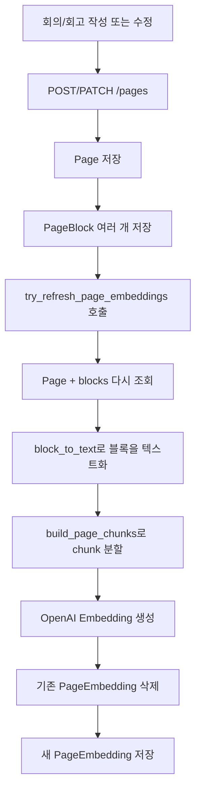
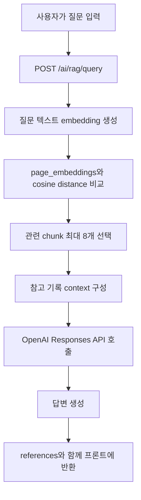
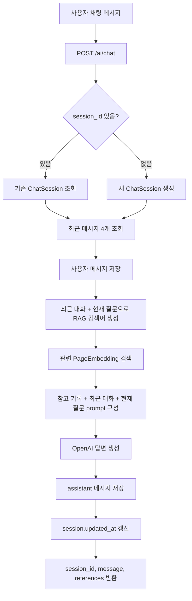
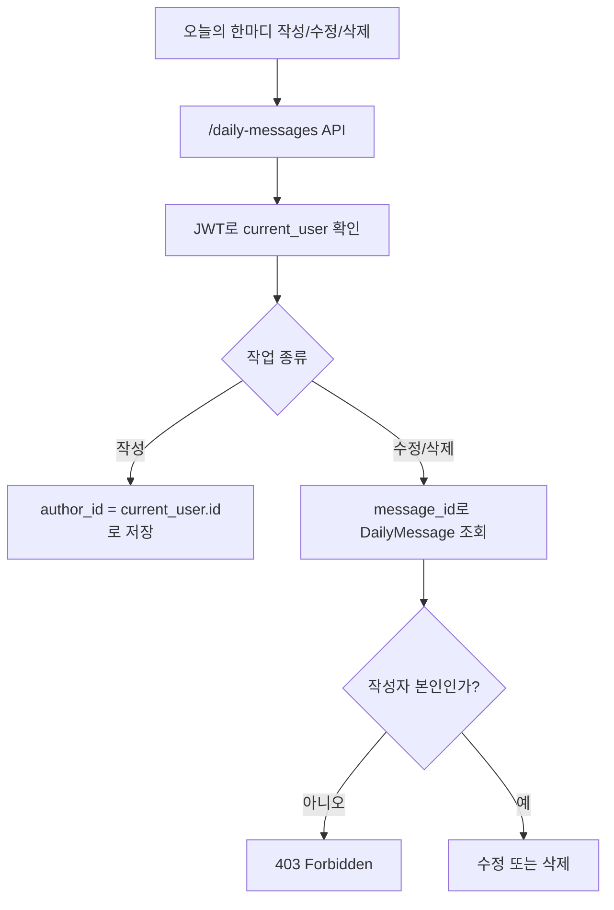
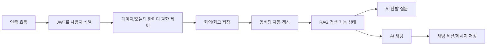

# TeamLog 백엔드 주요 추가 흐름 정리

프론트엔드 → 백엔드 → DB로 이어지는 기본 CRUD 흐름 말고, 코드 기준으로 중요하게 봐야 하는 나머지 흐름은 크게 5개입니다.

1. 인증/토큰 흐름
2. 페이지 저장 이후 RAG 검색 준비 흐름
3. AI 질문/RAG 답변 흐름
4. AI 채팅방 흐름
5. 오늘의 한마디 권한 흐름

마지막에는 이 흐름들을 하나로 묶은 전체 요약 흐름도도 있습니다.

## 1. 인증/토큰 흐름



관련 파일:

- `frontend/src/api/auth.ts`
- `frontend/src/api/client.ts`
- `backend/app/routers/auth.py`
- `backend/app/core/security.py`
- `backend/app/core/deps.py`

로그인 이후에는 프론트가 매번 직접 사용자 정보를 보내지 않습니다.

대신 로그인 성공 시 받은 JWT 토큰을 `localStorage`에 저장하고, 이후 API 요청마다 `Authorization: Bearer <token>` 형태로 자동 첨부합니다.

백엔드는 이 토큰을 `get_current_user()`에서 검증하고, 토큰 안의 `sub` 값을 이용해서 DB에서 현재 사용자를 다시 찾습니다.

즉 흐름은 다음과 같습니다.

```text
로그인 성공
→ JWT 발급
→ 프론트 localStorage 저장
→ API 요청마다 Bearer 토큰 첨부
→ 백엔드가 토큰 검증
→ current_user 복원
```

이렇게 짠 이유는 API마다 사용자 id를 body로 받지 않아도 되고, 요청을 보낸 사용자가 누구인지 백엔드가 직접 검증할 수 있기 때문입니다.

## 2. 페이지 저장 이후 RAG 검색 준비 흐름



관련 파일:

- `backend/app/routers/pages.py`
- `backend/app/services/rag_service.py`
- `backend/app/models/page.py`
- `backend/app/models/page_block.py`
- `backend/app/models/page_embedding.py`

사용자가 회의록이나 회고록을 저장하면 `pages`, `page_blocks`만 저장되는 것이 아닙니다.

AI 검색에 사용할 `page_embeddings`도 함께 갱신됩니다.

여기서 임베딩 갱신이란, 사람이 읽는 회의록 텍스트를 AI가 의미 기반으로 검색할 수 있는 숫자 벡터로 다시 만들어 저장한다는 뜻입니다.

예를 들어 원본 기록이 다음과 같다면:

```text
JWT로 인증하기로 함
axios interceptor에서 토큰을 붙이기로 함
```

이 텍스트는 OpenAI embedding 모델을 통해 다음과 같은 숫자 배열로 변환됩니다.

```text
[0.012, -0.233, 0.891, ...]
```

이 숫자 배열이 `page_embeddings.embedding`에 저장됩니다.

페이지가 수정되면 기존 임베딩은 오래된 내용 기준이 되므로 삭제하고, 최신 내용 기준으로 다시 생성합니다.

```text
페이지 저장값 갱신 = 사람이 보는 데이터 수정
임베딩 갱신 = AI가 검색하는 데이터 수정
```

## 3. AI 질문/RAG 답변 흐름



관련 파일:

- `backend/app/routers/ai.py`
- `backend/app/services/rag_service.py`
- `backend/app/schemas/rag_schema.py`
- `backend/app/models/page_embedding.py`

AI는 DB 전체를 직접 읽고 답하지 않습니다.

먼저 사용자의 질문을 embedding으로 바꾼 뒤, `page_embeddings` 테이블에 저장된 회의/회고 chunk embedding들과 거리를 비교합니다.

현재 코드는 cosine distance를 사용합니다.

```python
distance_expr = PageEmbedding.embedding.cosine_distance(question_embedding)
```

거리가 작을수록 질문과 의미가 가까운 기록입니다.

그중 threshold 이하이면서 가까운 chunk를 최대 8개까지 가져옵니다.

```text
질문
→ 질문 embedding 생성
→ page_embeddings와 의미 거리 비교
→ 관련 chunk 선택
→ 참고 기록 context 생성
→ OpenAI에게 질문 + 참고 기록 전달
→ 답변 생성
```

이렇게 하는 이유는 모든 회의록을 매번 OpenAI에 보내지 않기 위해서입니다.

관련 있는 기록 조각만 골라서 보내면 비용과 속도 면에서 유리하고, 답변도 더 근거 중심으로 만들 수 있습니다.

## 4. AI 채팅방 흐름



관련 파일:

- `frontend/src/api/chat.ts`
- `backend/app/routers/ai.py`
- `backend/app/services/chat_service.py`
- `backend/app/models/chat_session.py`
- `backend/app/models/chat_message.py`

`/ai/rag/query`는 단발성 질문에 가깝고, `/ai/chat`은 대화 맥락을 유지하는 흐름입니다.

채팅에서는 `ChatSession`과 `ChatMessage`를 사용합니다.

```text
ChatSession
└─ ChatMessage 여러 개
```

사용자가 처음 질문하면 `session_id`가 없으므로 새 채팅방을 만듭니다.

이미 이어지는 대화라면 프론트가 기존 `session_id`를 보내고, 백엔드는 해당 사용자의 채팅방인지 확인한 뒤 이어서 처리합니다.

최근 메시지를 같이 보는 이유는 사용자가 다음처럼 말할 수 있기 때문입니다.

```text
그 방식으로 다시 정리해줘.
방금 말한 내용 기준으로 알려줘.
```

이런 질문은 현재 문장만 보면 의미가 부족합니다.

그래서 최근 대화와 현재 질문을 합쳐 RAG 검색어를 만들고, 검색된 회의/회고 참고 기록과 함께 OpenAI에 전달합니다.

## 5. 오늘의 한마디 권한 흐름



관련 파일:

- `frontend/src/api/dailyMessages.ts`
- `backend/app/routers/daily_messages.py`
- `backend/app/models/daily_message.py`
- `backend/app/schemas/daily_message_schema.py`

오늘의 한마디는 단순 CRUD처럼 보이지만, 중요한 포인트는 작성자를 프론트에서 받지 않는다는 점입니다.

작성 시 백엔드는 다음처럼 현재 로그인한 사용자 id를 작성자로 저장합니다.

```python
author_id=current_user.id
```

수정이나 삭제 시에는 먼저 message를 조회한 뒤, 작성자 본인인지 검사합니다.

```python
if message.author_id != current_user.id:
    raise HTTPException(status_code=403)
```

이렇게 짠 이유는 프론트 요청은 조작될 수 있기 때문입니다.

프론트에서 버튼을 숨겨도, 사용자가 직접 API 요청을 보낼 수 있습니다.

그래서 백엔드에서 최종 권한 검사를 반드시 해야 합니다.

## 전체 요약 흐름



## 한 줄 요약

TeamLog 백엔드는 사용자를 JWT로 식별하고, 회의/회고는 저장될 때 AI 검색용 임베딩으로 가공합니다.

이후 AI 질문이나 채팅이 들어오면 전체 DB를 그대로 읽는 것이 아니라, 미리 만들어 둔 임베딩에서 질문과 가까운 기록 조각을 찾아 OpenAI에게 참고 자료로 넘긴 뒤 답변을 생성합니다.

즉 핵심 구조는 다음과 같습니다.

```text
사용자 인증
→ 권한 확인
→ 회의/회고 원본 저장
→ AI 검색용 임베딩 생성
→ 질문 시 관련 기록 검색
→ OpenAI 답변 생성
→ 프론트에 답변과 참고 기록 반환
```
