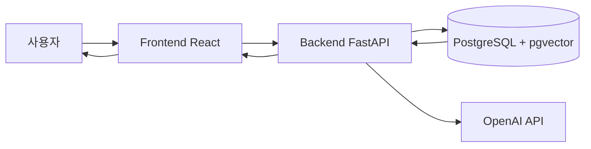
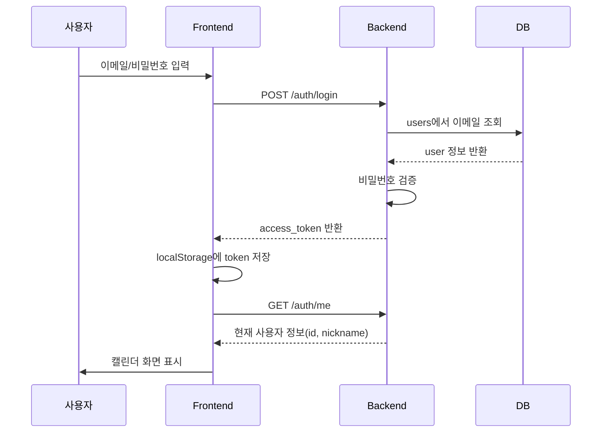
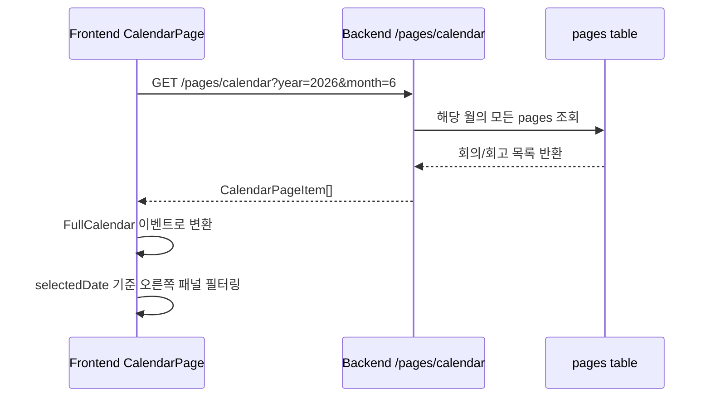
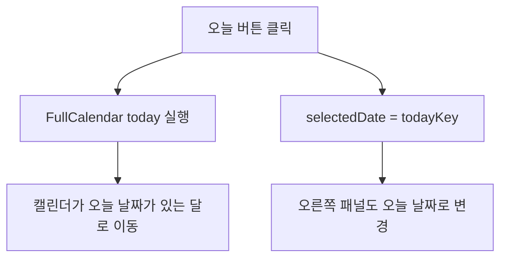
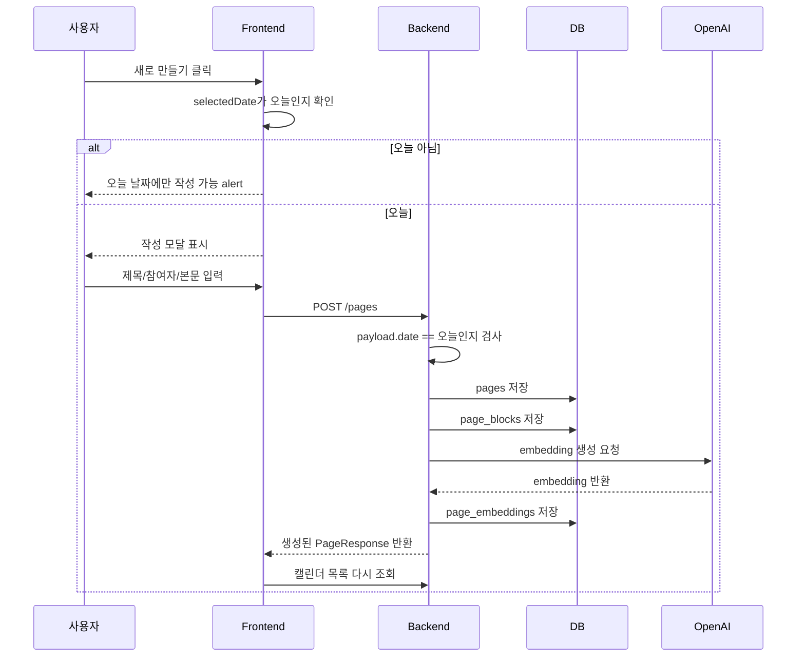
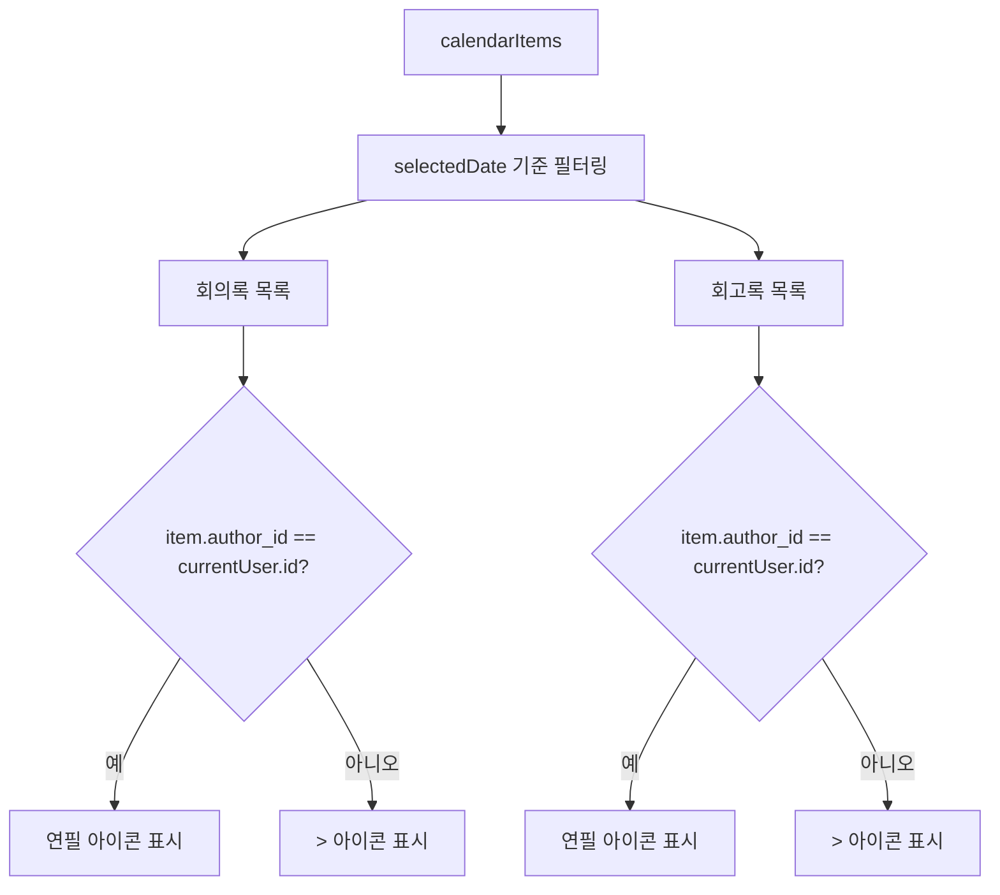
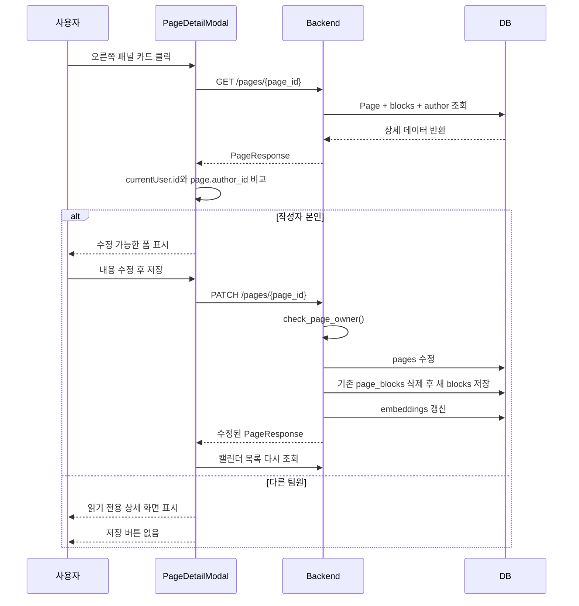
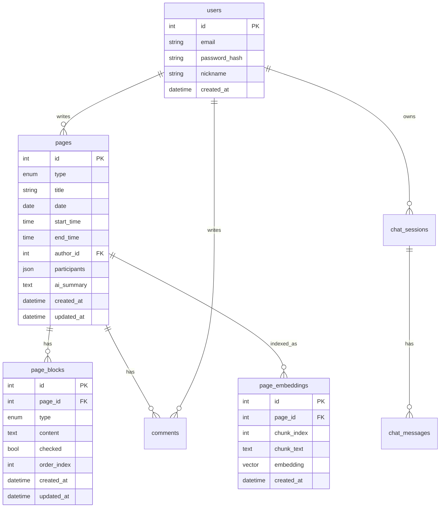
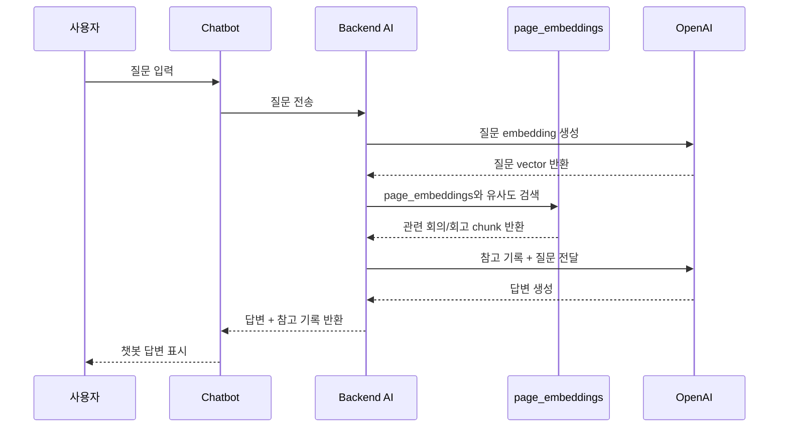

# TeamLog 프론트엔드 / 백엔드 / DB 흐름도

현재 TeamLog는 크게 인증, 캘린더 조회, 회의/회고 생성, 상세 조회/수정, AI 챗봇 RAG 흐름으로 나뉩니다.

## 전체 구조



## 1. 로그인 흐름



프론트는 로그인 후 `currentUser`를 React state에 저장합니다.

```ts
currentUser = {
  id,
  email,
  nickname,
  created_at
}
```

이 값은 상단바 닉네임 표시와 회의/회고 수정 권한 판단에 사용됩니다.

## 2. 캘린더 조회 흐름



현재 캘린더는 팀 전체 기록을 보여줍니다.

```python
# 예전 개인 조회 조건은 제거됨
# .where(Page.author_id == current_user.id)
```

`pages` 테이블은 회의/회고의 기본 정보를 저장합니다.

```text
pages
- id
- type: MEETING / RETROSPECTIVE
- title
- date
- start_time
- end_time
- author_id
- participants
```

오른쪽 패널은 `selectedDate`와 같은 날짜만 보여줍니다.

```ts
calendarItems.filter((item) => item.date === selectedDate)
```

## 3. 오늘 버튼 흐름



오늘 버튼은 캘린더만 이동시키지 않고, 오른쪽 패널의 선택 날짜도 오늘로 바꿉니다.

## 4. 회의/회고 생성 흐름



생성은 오늘 날짜에만 가능합니다.

프론트에서 한 번 막습니다.

```ts
selectedDate === todayKey
```

백엔드에서도 한 번 더 막습니다.

```python
if payload.date != today:
    raise HTTPException(400)
```

그래서 API를 직접 호출해도 오늘이 아닌 날짜로는 생성할 수 없습니다.

## 5. 오른쪽 패널 카드 표시 흐름



오른쪽 패널 카드에서는 다음처럼 보입니다.

```text
내가 쓴 기록: 연필 아이콘
팀원이 쓴 기록: > 아이콘
```

판단 기준은 프론트에서 현재 로그인 사용자와 작성자를 비교하는 것입니다.

```ts
currentUser?.id === item.author_id
```

## 6. 상세 조회 / 수정 흐름



정책은 다음과 같습니다.

```text
조회: 팀원 모두 가능
수정: 작성자만 가능
삭제: 작성자만 가능
```

프론트는 버튼을 숨기지만, 실제 권한은 백엔드가 막습니다.

```python
check_page_owner(page, current_user)
```

다른 사람이 API로 직접 `PATCH`를 보내도 `403`이 됩니다.

## 7. DB 테이블 관계



## 8. AI 챗봇 / RAG 흐름



현재 RAG는 팀 전체 기록을 대상으로 검색합니다.

```python
# 제거됨
# .where(Page.author_id == current_user_id)
```

그래서 팀원이 만든 회의/회고도 AI가 참고할 수 있습니다.

## 현재 정책 요약

```text
로그인
→ JWT 토큰 저장
→ /auth/me로 현재 사용자 확인

캘린더
→ 팀 전체 회의/회고 조회

새로 만들기
→ 오늘 날짜만 가능
→ 작성자는 현재 로그인 사용자

오른쪽 패널
→ 선택 날짜의 회의/회고 표시
→ 내가 쓴 기록은 연필 아이콘
→ 남이 쓴 기록은 > 아이콘

상세/수정
→ 모두 조회 가능
→ 작성자만 수정 가능

AI 챗봇
→ 팀 전체 임베딩 기록 기반 답변
```

한 줄로 말하면, TeamLog는 팀 전체 회의/회고를 함께 보고, 작성자만 수정하며, AI는 팀 전체 기록을 검색해서 답변하는 구조입니다.
